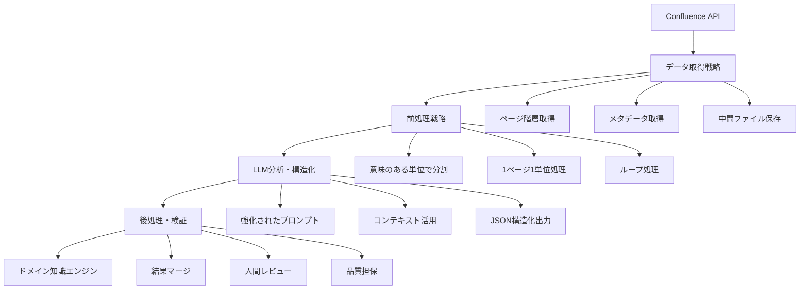

# ドメイン知識抽出・構造化システム - 包括的ガイド

## 概要

Confluence上の仕様書およびGoogle Drive上のドキュメントから構造化されたドメイン知識を自動抽出し、検索システムの精度向上を実現する包括的なシステムです。このツールは、単なるスクリプトではなく、「ConfluenceとGoogle Drive上のドキュメントを知識源とする、継続的に更新可能なドメイン知識エンジン」として位置づけます。

## 特徴

- **大規模データ処理**: 1000ページ以上の仕様書を効率的に処理
- **LLM活用**: Gemini 2.5 Flashを使用した高精度な知識抽出
- **品質担保**: 自動検証と人間レビューによる品質管理
- **継続的更新**: 定期的な知識ベース更新に対応
- **重複削除機能**: ページ内・ページ間の重複キーワードを自動削除

## システムアーキテクチャ

### 全体アーキテクチャ



### 処理フロー

#### Confluenceからの抽出（現在実装済み）

```
Confluence API → データ取得 → LLM分析 → 知識検証 → 統合知識ベース
     ↓              ↓           ↓          ↓           ↓
  ページ情報    構造化データ   機能・キーワード  品質レポート   検索システム
```

#### Google Driveからの抽出（実装予定）

```
Google Drive API → ファイル取得 → テキスト変換 → LLM分析 → 知識検証 → 統合知識ベース
     ↓                ↓              ↓            ↓          ↓           ↓
  ファイル情報    ドキュメント内容  構造化データ  機能・キーワード  品質レポート   検索システム
```

**対応ファイル形式**:
- Google Docs
- Google Spreadsheets（シート名＋内容）
- Google Slides（スライド内容＋メモ）
- PDF
- テキストファイル
- Markdown

## 抽出対象のキーワードカテゴリ

1. **ドメイン名**: システムの主要な機能領域（例：教室管理、求人管理）
2. **機能名**: 具体的な機能名（例：求人情報新規登録機能）
3. **操作名**: 基本操作（例：新規登録、閲覧、編集、削除）
4. **システム項目**: 入力フォームの項目名、データベースフィールド名（例：商品概要、対象サイト）
5. **システム用語**: 技術的な用語、UIコンポーネント名（例：入力フォーム、データベース、ログ）
6. **関連キーワード**: 検索に有効な用語（例：管理者、企業、教室）

## セットアップ

### 1. 環境変数の設定

```bash
# Confluence API設定
export CONFLUENCE_BASE_URL="https://your-domain.atlassian.net"
export CONFLUENCE_USER_EMAIL="your-email@example.com"
export CONFLUENCE_API_TOKEN="your-api-token"
export CONFLUENCE_SPACE_KEY="CLIENTTOMO"

# LLM API設定
export GEMINI_API_KEY="your-gemini-api-key"
```

### 2. 依存関係のインストール

```bash
npm install @google/generative-ai
```

### 3. 設定ファイルの生成

```bash
npx tsx src/scripts/run-domain-knowledge-extraction-v2.ts --generate-config
```

生成された設定ファイル `config/domain-knowledge-config.json` を編集してください。

## 使用方法

### 基本的な実行

#### フル実行（推奨）
```bash
npm run domain-knowledge-extraction-v2
```

#### 段階的な実行
```bash
# Confluenceデータ抽出のみ
SKIP_LLM=true SKIP_VALIDATION=true npx tsx src/scripts/run-domain-knowledge-extraction-v2.ts

# LLM抽出のみ（Confluenceデータが既に存在する場合）
SKIP_CONFLUENCE=true SKIP_VALIDATION=true npx tsx src/scripts/run-domain-knowledge-extraction-v2.ts

# 検証のみ
SKIP_CONFLUENCE=true SKIP_LLM=true npx tsx src/scripts/run-domain-knowledge-extraction-v2.ts
```

#### ステップ別実行
```bash
# Confluenceデータ抽出のみ
npm run domain-knowledge-extraction-v2 -- --steps confluence

# LLM知識抽出のみ
npm run domain-knowledge-extraction-v2 -- --steps llm

# 検証・統合のみ
npm run domain-knowledge-extraction-v2 -- --steps validation
```

### 設定オプション

```bash
# 最大ページ数を制限
CONFLUENCE_MAX_PAGES=100 npx tsx src/scripts/run-domain-knowledge-extraction-v2.ts

# バッチサイズを調整
LLM_BATCH_SIZE=3 npx tsx src/scripts/run-domain-knowledge-extraction-v2.ts
```

### 実行時間の目安

- **全ページ実行**: 約15-20分（1,067ページ）
- **Confluence抽出**: 約3-5分
- **LLM抽出**: 約10-15分
- **重複削除・統合**: 約1-2分

## データ構造

### ConfluencePage インターフェース

```typescript
interface ConfluencePage {
  id: string;
  title: string;
  content: string;
  parentId?: string;
  parentTitle?: string;
  labels: string[];
  url: string;
  spaceKey: string;
  lastModified: string;
  author: string;
}

interface ConfluenceSpace {
  key: string;
  name: string;
  pages: ConfluencePage[];
  hierarchy: PageHierarchy;
}
```

### ExtractedKnowledge インターフェース

```typescript
interface ExtractedKnowledge {
  pageId: string;  // API側では文字列型（変換レイヤーで処理）
  // 注意: データベース側では page_id (int64型) を使用
  pageTitle: string;
  extractedAt: string;
  functions: {
    [functionName: string]: string[];
  };
  confidence: number; // 0-1
  metadata: {
    processingTime: number;
    tokenCount: number;
  };
}
```

### MergedKnowledge インターフェース

```typescript
interface MergedKnowledge {
  functions: {
    [functionName: string]: {
      keywords: string[];
      sources: string[]; // ページIDの配列
      confidence: number;
      lastUpdated: string;
    };
  };
  statistics: {
    totalFunctions: number;
    totalKeywords: number;
    totalPages: number;
    averageConfidence: number;
  };
}
```

## 出力ファイル

### Confluenceデータ抽出結果
```
data/confluence-extraction-v2/
├── confluence-data.json          # メインデータ
├── extraction-stats.json         # 統計情報
└── pages/                        # ページ別ファイル
    ├── page1.json
    └── page2.json
```

### LLM知識抽出結果
```
data/llm-extraction-v2/
├── extracted-knowledge-v2.json      # 抽出された知識
├── extraction-stats-v2.json         # 処理統計
├── merged-knowledge-v2.json         # 統合された知識ベース
└── deduplication-result-v2.json     # 重複削除結果
```

### 検証結果
```
data/validation-v2/
├── quality-report.json           # 詳細レポート
├── problematic-pages.json        # 問題のあるページ
└── summary-report.md            # 人間が読みやすいサマリー
```

### 最終統合結果
```
data/domain-knowledge-v2/
├── final-domain-knowledge-v2.json    # 最終統合結果
└── keyword-lists-v2.json            # キーワード一覧
```

## 設定ファイル

### 基本設定（config/domain-knowledge-config.json）

```json
{
  "confluence": {
    "baseUrl": "${CONFLUENCE_BASE_URL}",
    "email": "${CONFLUENCE_USER_EMAIL}",
    "apiToken": "${CONFLUENCE_API_TOKEN}",
    "spaceKey": "${CONFLUENCE_SPACE_KEY}",
    "maxPages": null,           // null = 全ページ、数値 = 制限
    "batchSize": 5,
    "outputDir": "data/confluence-extraction-v2"
  },
  "llm": {
    "apiKey": "${GEMINI_API_KEY}",
    "model": "gemini-2.5-flash",
    "batchSize": 50,            // 並列処理数
    "outputDir": "data/llm-extraction-v2",
    "maxRetries": 3,
    "delayBetweenRequests": 0   // リクエスト間隔（ms）
  },
  "validation": {
    "outputDir": "data/validation-v2"
  },
  "pipeline": {
    "steps": ["confluence", "llm", "validation"],
    "outputDir": "data/domain-knowledge-v2"
  }
}
```

### デバッグ用設定

```json
{
  "confluence": {
    "maxPages": 10,             // 10ページのみ実行
    "specificPageId": "704774344" // 特定ページのみ実行
  },
  "llm": {
    "batchSize": 1,             // シーケンシャル実行
    "delayBetweenRequests": 1000 // 1秒間隔
  }
}
```

## プロンプト設計

### 強化されたプロンプトテンプレート

```markdown
# Role
あなたは仕様書を分析し、機能とそれに紐づくキーワードを抽出する専門家です。

# Context
これから渡すテキストは、大規模なシステム仕様書の一部です。
- ページタイトル: "{pageTitle}"
- 親ページ: "{parentTitle}"
- ラベル: "{labels}"
- 階層: "{hierarchy}"
- URL: "{url}"

# Task
上記コンテキストを考慮して、このページで説明されている主要機能と、関連する操作キーワードを抽出してください。

# Rules
- 出力は必ずJSON形式にしてください
- フォーマット: { "機能名": ["キーワード1", "キーワード2", ...] }
- 機能名は具体的で分かりやすいものにしてください
- キーワードは検索に有効なものを抽出してください

# Input
---
{pageContent}
---
```

## 品質管理

### 自動検証項目

1. **機能名の品質**
   - 長さ（2-50文字）
   - 具体性（一般的すぎる名前の検出）
   - 一貫性（類似名の検出）

2. **キーワードの品質**
   - 重複の検出
   - 長さの適切性
   - 空のキーワードの検出

3. **信頼度の評価**
   - 低信頼度の検出
   - 抽出失敗の検出

4. **完全性の確認**
   - 期待される機能の抽出確認
   - コンテンツ品質の評価

### 品質スコア

- **90-100点**: 優秀
- **70-89点**: 良好
- **50-69点**: 要改善
- **0-49点**: 要再処理

### 重複削除の検証

実行後、以下を確認：
```bash
npx tsx src/scripts/generate-keyword-lists.ts
```

期待される結果：
- 重複率: 約19-20%（カテゴリ間重複は正常）
- 各カテゴリ内での重複: 0%

### 統計情報の確認

最終結果ファイル（final-domain-knowledge-v2.json）の統計：
- 総ページ数: 1,067
- 総キーワード数: 約9,000-10,000
- ドメイン名数: 約200-300
- システム項目数: 約3,000-4,000
- システム用語数: 約2,000-3,000

## トラブルシューティング

### よくある問題と解決方法

1. **API制限エラー**
   ```
   エラー: Rate limit exceeded
   解決: llm.delayBetweenRequests を増加（例：1000ms）
   ```

2. **メモリ不足エラー**
   ```
   エラー: JavaScript heap out of memory
   解決: llm.batchSize を減少（例：20 → 10）
   ```

3. **Confluence接続エラー**
   ```
   エラー: Authentication failed
   解決: 環境変数の設定を確認
   ```

4. **LLM応答エラー**
   ```
   エラー: JSON parse error
   解決: 自動的にリトライされる（maxRetries: 3）
   ```

### ログ確認

実行中のログで以下を確認：
- 進捗状況（バッチ数/総バッチ数）
- エラー発生時の詳細情報
- 最終統計情報

```bash
# 詳細ログを有効にする
DEBUG=true npx tsx src/scripts/run-domain-knowledge-extraction-v2.ts
```

## 継続的改善

### 1. 定期的な実行

```bash
# 週次実行の例
0 2 * * 1 npx tsx src/scripts/run-domain-knowledge-extraction-v2.ts
```

推奨頻度：月1回または仕様書更新時

### 2. 品質監視

- 品質スコアの推移を監視
- 問題のあるページの特定
- プロンプトの継続的改善

### 3. フィードバック収集

- 抽出結果の人間レビュー
- 検索精度の測定
- ユーザーフィードバックの収集

## パフォーマンス最適化

### 処理時間の短縮

1. **バッチサイズの調整**
   - Confluence: 50-100
   - LLM: 3-10

2. **並列処理の活用**
   - バッチ内での並列処理
   - 適切な遅延設定

3. **キャッシュの活用**
   - 既存データの再利用
   - 増分更新の実装

### コスト最適化

1. **API使用量の削減**
   - 重複処理の回避
   - 効率的なプロンプト設計

2. **処理の最適化**
   - 不要なページの除外
   - 品質フィルタリング

## メンテナンス

### データ更新

新しいConfluenceページが追加された場合：
1. 既存の出力ファイルをバックアップ
2. フル実行を実行
3. 結果を比較・検証

### パフォーマンス最適化

処理時間を短縮したい場合：
1. `llm.batchSize` を増加（50 → 100）
2. `llm.delayBetweenRequests` を0に設定
3. プロンプト長を調整（現在1500文字）

## 実装計画

### Phase 1: 基盤構築
- [x] Confluence APIクライアントの実装
- [x] データ取得スクリプトの作成
- [x] 基本データ構造の定義

### Phase 2: 前処理パイプライン
- [x] ページ分割ロジックの実装
- [x] メタデータ抽出機能の実装
- [x] バッチ処理システムの構築

### Phase 3: LLM分析システム
- [x] プロンプトテンプレートの実装
- [x] LLM API連携の実装
- [x] 結果構造化ロジックの実装

### Phase 4: 後処理・検証
- [x] 結果マージシステムの実装
- [x] 品質担保プロセスの実装
- [x] 人間レビューインターフェースの構築

### Phase 5: 継続的改善
- [x] フィードバック収集システム
- [x] プロンプト最適化機能
- [x] 品質メトリクス監視

## 期待される成果

### 短期的成果
- 1000ページの仕様書から構造化された知識の抽出
- 検索精度の大幅向上
- 開発効率の向上

### 長期的成果
- 継続的に更新可能なドメイン知識エンジン
- 新機能開発時の知識活用
- チーム全体の知識共有促進

## 技術スタック

- **言語**: TypeScript
- **LLM**: Gemini 2.5 Flash
- **データベース**: LanceDB (既存)
- **API**: Confluence REST API
- **ストレージ**: JSON files, Firestore
- **監視**: カスタムメトリクス

## リスク管理

### 技術的リスク
- LLM APIの制限・コスト
- 大量データ処理のパフォーマンス
- データ品質のばらつき

### 対策
- バッチ処理とレート制限の実装
- 段階的な実装とテスト
- 品質チェックポイントの設置

## 成功指標

- **抽出精度**: 95%以上の機能名抽出精度
- **処理速度**: 1000ページを24時間以内に処理
- **検索改善**: 検索精度80%以上、再現率70%以上
- **運用効率**: 月次更新の自動化

## 注意事項

1. **API使用量**: Gemini APIの使用量に注意
2. **データサイズ**: 出力ファイルは約100MB程度
3. **実行環境**: Node.js 18以上推奨
4. **ネットワーク**: 安定したインターネット接続が必要

## サポート

問題が発生した場合：
1. ログファイルを確認
2. 設定ファイルの検証
3. 環境変数の確認
4. 必要に応じてデバッグ用設定で実行

問題が発生した場合は、以下の情報を含めて報告してください：

1. 実行環境（OS、Node.js バージョン）
2. 設定ファイルの内容（機密情報を除く）
3. エラーメッセージの全文
4. ログファイルの内容

## ライセンス

このツールは MIT ライセンスの下で提供されています。
