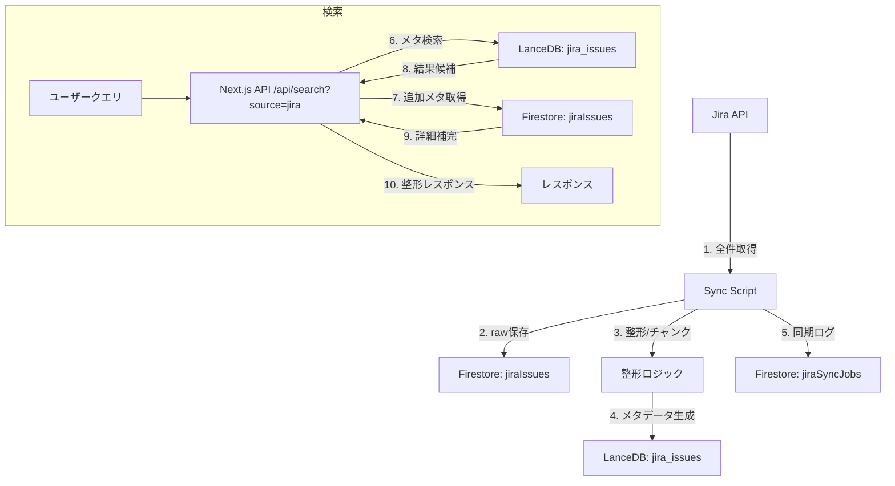

 # Confluence / Jira 統合計画（ドラフト）
 
 **作成日**: 2025-11-09  
 **作成者**: GPT-5 Codex（Cursor AI）  
 **状態**: 検討中（Phase 0）
 
 ---
 
 ## 🎯 目的
 
 Confluenceベースの現行ハイブリッド検索システムに、Jiraプロジェクトの課題データを取り込み、  
 段階的に「ソース別検索」と「横断検索」を提供する。品質・堅牢性・運用性を維持しつつ、  
 プロジェクトの進捗把握を支援するダッシュボード基盤を整備する。
 
 ---
 
 ## 🧱 前提・環境
 
 - `.env` / `.env.local` に `JIRA_PROJECT_KEY=CTJ` を追加済み。  
   今後、Jira APIアクセストークン・ベースURL・ユーザー情報を環境変数として管理する。  
 - 既存構成（Next.js + Firebase + LanceDB + Lunr.js + StructuredLabel）は維持し、  
   スキーマ拡張で Jira のフィールドを吸収する。  
 - データ同期は Firebase Functions もしくは Cloud Run バッチを想定。  
   `operations/data-synchronization-strategy.md` のスケジュール/監視方針に準拠する。  
 - 疎通テスト（`npm run test:confluence`）は **スクリプト欠落により失敗**。  
   Jira向け疎通テストも含め、API検証スクリプトの整備が必要。
 
 ---
 
 ## Phase 1: Confluence / Jira 個別検索対応
 
 ### ✅ 目標
 - Confluence と Jira をソース別に検索できる UI/UX を提供。  
 - データ同期・インデックス・API 層をソース単位で明確に分離。
 
 ### 📦 データ同期・スキーマ
 - Jira REST API から課題を取得し、Firestore / LanceDB に取り込む同期ジョブを新設。  
 - `issue_id` を `page_id` 互換キーとして格納。  
 - `structured_labels` を再利用し、以下をマッピング：  
   - `structured_category`: Issue Type (例: Story, Task, Bug)  
   - `structured_domain`: Jira Project Component / カスタムフィールド  
   - `structured_feature`: Epic / ラベル / カスタムフィールド  
   - `structured_status`: Workflow 状態（例: ToDo, In Progress, Done）  
   - `structured_priority`: Priority フィールド  
 - LanceDB: 既存テーブルを拡張 (`source` カラム追加) もしくは Jira 用テーブルを別途用意。  
   BM25 / Lunr 用のインデックスは Jira 専用を新設。
 
 ### 🔍 検索 API
 - `/api/search` に `source=confluence|jira` パラメータを追加。  
 - キャッシュキーに `source` を含め、TTL/サイズは現行設定を踏襲。  
 - 検索ロジックは既存ハイブリッド（ベクトル + BM25 + タイトル + StructuredLabel）を流用しつつ、  
   Jira 特有メタ情報（Issue Key, Status）をレスポンスに含める。
 
 ### 🖥️ UI/UX
 - チャット画面にソース切替（タブ or セレクトボックス）を追加。  
 - レスポンスカードにソースバッジと Jira Issue へのディープリンク、状態/担当者/更新日を表示。  
 - 会話履歴 Firestore コレクションに `source` を保存し、再実行時のコンテキストとして利用。
 
 ### 🧪 テスト・運用
 - 疎通: Jira API 呼び出し試験スクリプト（Confluence 同等の `test:jira`）を作成。  
 - Unit: データ変換、インデックス生成、API レスポンスを Vitest で検証。  
 - E2E: Playwright でソース切替と結果表示を確認。  
 - モニタリング: シンクジョブの成功/失敗を Cloud Logging と Slack 通知で監視。  
 - SLA: 検索 API P95 < 15 秒、同期ジョブ 10 分以内、失敗時自動リトライ（指数バックオフ）。
 
 ---
 
## Phase 2: Confluence / Jira 横断検索

**📋 詳細実装方針**: [Genkit Flow活用版の実装方針](./06.01.02-hybrid-cross-source-search-with-genkit.md) を参照

### ✅ 目標
- 両ソースの結果をハイブリッドにマージし、1 回のクエリで横断回答。  
- ソース偏り防止とスコア整合性を確保する。
- **Genkit Flowを活用**して、並列検索、スコア正規化、テレメトリーを統一管理。

### 🔢 スコアリング再設計
- `sourceWeight` を導入し、ベクトル距離・BM25・ラベルスコアを共通スケールに正規化。  
- RRF 融合にソースバランスを組み込み、各ソースの上位候補を最低 1 件確保する  
  （Source-aware Diversification）。  
- Jira Issue Key（例: `CTJ-123`）を検知し、ダイレクトヒットを優先するルールを追加。
- **Genkit Flow内でMin-Max正規化**を実装し、ソース間のスコアを公平に比較。
 
 ### 🗃️ スキーマ・ドメイン知識
 - Structured Label の語彙を統一（`config/domain-knowledge-config.json` を更新）。  
 - ドメイン/機能/状態のマッピング表を `docs/implementation` 配下に追加し、  
   Confluence/Jira 双方で再利用できる辞書を整備。  
 - GraphRAG 拡張（将来計画）との整合性を `architecture/hybrid-search-logic-current.md` に追記。
 
 ### 🖥️ UI/UX
 - デフォルトを「横断検索」に設定し、フィルタでソース別リストへ絞込可能にする。  
 - 結果表示は「統合上位」「Confluence」「Jira」のセクション構成を検討。  
 - 重要なメタ情報（Confluence: ページ階層 / ラベル、Jira: 状態 / 期限 / 担当）を  
   カードに表示し、プロジェクト進捗の可視化を支援。

### 🎨 UI/UX プレビュー案
1. **段階1：ソース個別検索**  
   - Segmented Control で `Confluence` / `Jira` を選択し、クエリ送信時に `source` パラメータを付与。  
   - 結果カードにはソースバッジと主要メタ（Confluence: Category/Domain、Jira: Issue Key/Status/Assignee）。  
   
```
┌───────────────────────────────────────────────┐
│  🔍 Search Spec Finder                        │
│                                               │
│  Source: [● Confluence]  ○ Jira               │  ← Segmented Control
│                                               │
│  ┌─────────────────────────────────────────┐  │
│  │ 「Jira 連携の進捗は？」                       │  │
│  └─────────────────────────────────────────┘  │
│           [Search]   [Use Advanced Filters]    │
│                                               │
│  Results (Confluence)                         │
│  ┌─────────────────────────────────────────┐  │
│  │ 📄 仕様ページタイトル                       │  │
│  │  Category: spec | Domain: 教室管理            │
│  │  Updated: 2025-11-01                        │
│  │  [Open in Confluence] →                     │
│  └─────────────────────────────────────────┘  │
└───────────────────────────────────────────────┘
```

2. **段階2：統合検索モード**  
   - Mode Toggle で `Separate` ↔ `Unified` を切替（Feature Flag と連動）。  
   - ハイライト領域で統合スコア上位を提示、下部でソース別セクションを展開。  
   - Saved Filters / Advanced Filters により状態・担当者・カテゴリを絞り込み。  
   
```
┌───────────────────────────────────────────────┐
│  🔍 Search Spec Finder                        │
│                                               │
│  Mode: [● Separate]  ○ Unified                │  ← 段階導線トグル
│  Source: ○ Confluence  ○ Jira  ● Hybrid        │
│                                               │
│  ┌─────────────────────────────────────────┐  │
│  │ 「会員管理のバグ修正状況は？」               │  │
│  └─────────────────────────────────────────┘  │
│           [Search]   [Saved Filters ▼]         │
│                                               │
│  Highlights (Top Combined)                    │
│  ┌─────────────────────────────────────────┐  │
│  │ 🧩 Jira CTJ-123                           │  │
│  │  Status: In Progress | Assignee: Sato      │
│  │  Matched: “会員管理” (Summary)             │
│  └─────────────────────────────────────────┘  │
│  ┌─────────────────────────────────────────┐  │
│  │ 📄 Confluence: 会員管理仕様更新             │ │
│  │  Updated: 2025-10-28                      │ │
│  │  Matched: “修正状況” (Section heading)     │ │
│  └─────────────────────────────────────────┘  │
│                                               │
│  Confluence Results ▼ (5)                     │
│  Jira Results ▼ (4)                           │
└───────────────────────────────────────────────┘
```

3. **共通コンポーネント**  
   - Source Selector, Mode Toggle, Result Card, Analytics Banner を共通UIパターンとして整理。  
   - モバイルではタブ → ドロップダウンへ切替し、カードは縦並びで表示。

---

### 🧪 テスト・評価
- 品質評価クエリセットを整備 (`docs/testing/` 配下に追加) し、  
  以下のケースを自動テスト化：  
   - Confluence のみヒット  
   - Jira のみヒット  
   - 双方ヒット  
   - Issue Key 直接指定  
 - メトリクス: ソース別ヒット率、0件率、Top3/Top10率を Cloud Metrics で監視。  
 - ロールアウトは Feature Flag を用い、段階的に有効化。
 
 ---
 
## 🛡️ Confluence 品質維持戦略

- **独立インデックスの維持**  
  - Confluence/LanceDB と Jira/LanceDB を物理または論理的に分離し、横断検索でも個別ランキングを並列計算。  
  - 検索 API のソース指定時には既存 Confluence ロジックを完全に踏襲し、Jira 統合コード経由を避ける。

- **Feature Flag / Kill Switch**  
  - Jira 関連の機能（同期・検索・表示）は Firebase Remote Config 等で段階的に有効化。  
  - 異常時は即時無効化し、Confluence 単独モードへフォールバックできるようにする。

- **品質モニタリング**  
  - Confluence の Top3/Top10 率、0件率、平均応答時間を既存メトリクスとして継続監視。  
  - Jira 連携リリース後は、ソース別品質を比較ダッシュボードで可視化し、閾値超過時にアラートを送出。

- **回帰テスト強化**  
  - `docs/testing/` 配下の既存ケースを拡張し、Confluence 固有の品質指標を e2e/統合テストに追加。  
  - 横断検索のテストでも Confluence の期待順位を検証し、スコアリング回帰を検知。

- **同期隔離**  
  - Jira 同期バッチは Firestore/LanceDB の Confluence データを更新しない設計とし、  
    共有テーブルの場合も `source` をキーにした Upsert で誤削除を防止。  
  - バックアップ・リストア手順を `operations/backup-management-guide.md` と整合させ、  
    Jira 導入後も Confluence データを安全に復元可能とする。

- **性能劣化対策**  
  - 横断検索経由で Confluence クエリが遅延しないよう、ソース別キャッシュと並列実行を維持。  
  - Jira 統合に伴うメモリ使用量増加はプロファイルし、Confluence 検索のレイテンシを常時測定。

---

## 🧰 デバッグ容易性と独立性確保

- **分離された同期パイプライン**  
  - Confluence と Jira の同期ジョブを別プロセス・別スケジュールで管理し、トラブルシュート範囲を明確化。  
  - それぞれ専用のログ/トレース（構造化ログ）を出力し、Cloud Logging 上でソース別にフィルタ可能にする。

- **API/サービスの境界明確化**  
  - `/api/search` はソースごとのハンドラを内部委譲で分離し、Jira スタックを無効化しても Confluence API が動作。  
  - 共通ライブラリは純粋関数化し、副作用を減らすことでユニットテストしやすくする。

- **Mock/Fixture 充実化**  
  - Confluence/Jira それぞれに独立したモックデータセットとシナリオを `src/tests/fixtures` へ追加し、  
    テスト時に片方のみ読み込めるようにする。  
  - 疎通スクリプトでも `.env` 切替で対象ソースを限定し、失敗箇所をすぐ特定可能にする。

- **観測性の強化**  
  - ソース別の指標（リクエスト数、レスポンス時間、エラー率）を Cloud Monitoring にエクスポートし、  
    ダッシュボードでトグル表示。  
  - Feature Flag 状態・同期ステータスを Firestore 管理にして、UI から即確認できるようにする。

- **フェールセーフ動作**  
  - Jira 統合に不具合が生じた場合は、Remote Config で Jira 関連機能のみ無効化し、Confluence を継続提供。  
  - 横断検索も内部的にソース毎に try/catch を分離しておき、一方の失敗で全体が崩れないようにする。

---

## 🔄 データフローとコンポーネント構成

### コンポーネント図

```mermaid
graph TB
    subgraph "フロントエンド"
        UI[Next.js Chat UI]
        Tabs[Source Tabs (Confluence / Jira)]
        Cards[Jira Result Cards]
    end

    subgraph "バックエンド"
        Api[Next.js API Routes]
        SearchAPI[/api/search (source=jira)]
        SyncCmd[Node.js Sync Scripts]
        Scheduler[Manual/Cloud Run Triggers]
    end

    subgraph "データストア"
        FS[Firestore]
        Issues[jiraIssues]
        SyncJobs[jiraSyncJobs]
        Attachments[jiraAttachments (optional)]
        LDB[LanceDB]
        JiraTable[jira_issues テーブル]
    end

    subgraph "外部サービス"
        JiraAPI[Jira Cloud REST API]
    end

    UI --> Tabs
    Tabs --> Api
    Api --> SearchAPI
    SearchAPI --> LDB
    SearchAPI --> FS

    Scheduler --> SyncCmd
    SyncCmd --> JiraAPI
    SyncCmd --> FS
    SyncCmd --> LDB

    JiraTable -.-> |"検索用メタデータ"| SearchAPI
    Issues -.-> |"raw/整形データ"| SearchAPI
```

### 関係性メモ

- **LanceDB（jira_issues）**: 検索用メタデータと整形済みフィールドを保持。UI からの検索は LanceDB を主要ソースにする。
- **Firestore（jiraIssues）**: Jira から取得した raw JSON と整形データ、`syncedAt` 等の同期メタを保存。LanceDB 再構築時のソースにもなる。
- **Firestore（jiraSyncJobs）**: バッチ実行履歴を記録し、監視とリトライに利用。

### データフロー図



### フロー詳細

1. **同期処理**: 手動 or Scheduler から `Sync Script` を実行し、Jira API から全件取得。
2. Firestore `jiraIssues` に raw データと整形済みフィールドを保存。
3. LanceDB `jira_issues` テーブルに検索用メタデータ（title, content, structured_fields, updated_at 等）を保存。
4. `jiraSyncJobs` に同期履歴を記録。
5. 検索リクエストでは `source=jira` を指定し、LanceDB から候補を、必要に応じ Firestore から補足情報を取得してレスポンスを返す。

### LanceDB / Firestore の関係

- **LanceDB**: 検索に最適化された整形データ（タイトル・説明・ステータス・優先度・影響カテゴリなど）を保持。UI・API は LanceDB を一次ソースとして参照。
- **Firestore**: Jira raw データと同期メタ情報を保持。補足情報や同期履歴、再インデックスのソースとして利用。会話履歴や UI 状態保存など既存 Firestore データとも共存。

---

## 🌍 環境別構成と移行計画

### 環境別主要構成

| 項目 | ローカル環境 | 本番環境 |
|------|--------------|----------|
| アプリ実行 | Next.js Dev Server (`npm run dev`) | Firebase App Hosting (Gen1) |
| データ同期 | 手動実行 (`npm run sync:jira` 予定) | Cloud Functions / Cloud Run バッチ or CLI 手動トリガー |
| Firestore | 開発プロジェクトを直接使用（Emulator非使用） | 本番プロジェクト (asia-northeast1) |
| LanceDB | ローカル `.lancedb/` ディレクトリ | Cloud Storage からダウンロード後、コンテナローカルに配置 |
| 認証 | Firebase Auth (ドメイン制限)、開発用テストユーザー | Firebase Auth (本番ドメイン制限) |
| Jira 認証情報 | `.env.local` で管理 | Firebase Config / Secrets Manager で管理 |
| ログ・監視 | コンソールログ、`tmp/` の JSON 出力 | Cloud Logging, Error Reporting, JiraSyncJobs コレクション |
| データ件数 | サンプル or 全件 | 全件 (プロジェクト CTJ) |

### 環境差分のポイント

1. **データ同期**
   - ローカル: 手動で sync スクリプトを実行。再実行・差分検証に使用。
   - 本番: Cloud Scheduler or 手動トリガーで全件バッチを実行。実行履歴を `jiraSyncJobs` に記録。

2. **データ保管**
   - ローカル: Firestore 開発プロジェクトに直接保存。必要に応じて削除→再同期で検証。
   - 本番: Firestore 本番コレクションと LanceDB バイナリを Cloud Storage に保持し、App Hosting 起動時にダウンロード。

3. **認証情報**
   - ローカル: `.env.local` に Jira API キー、ユーザー、プロジェクトキーを設定。
   - 本番: Firebase Config (`firebase functions:config:set`) または Secrets Manager で安全に管理。App Hosting では `apphosting.yaml` にも設定。

4. **モニタリング**
   - ローカル: CLI／ログ初見で確認。
   - 本番: Cloud Logging, Slack 通知等を利用。`jiraSyncJobs` コレクションで成功/失敗を可視化。

### 移行計画（Phase 1）

#### Step 0: 準備
- [x] Firestore に `jiraIssues`, `jiraSyncJobs`, `jiraAttachments`（任意）を作成。セキュリティルール更新。
- [x] LanceDB に Jira 専用テーブル `jira_issues` を追加。スキーマを Confluence と整合。
- [x] `.env` / `.env.local` に Jira 認証情報 (`JIRA_BASE_URL`, `JIRA_USER_EMAIL`, `JIRA_API_TOKEN`, `JIRA_PROJECT_KEY`) を設定。
- [x] テストスクリプト `npm run test:jira` で疎通確認。

#### Step 1: ローカル同期テスト
- [x] `npm run inspect:jira-issues` / `scripts/search-jira.ts` を用いてサンプルデータの取得・整形確認。
- [x] `jira-data-flow-lancedb.md` に沿って LanceDB へデータ投入。検索 API のレスポンス確認。
- [x] `docs/testing/jira-quality-testcases.md` のケースで回答品質を目視検証。

#### Step 2: 本番同期初回実行
- [x] Cloud Functions / Cloud Run に同期タスクをデプロイ。手動トリガーで全件同期。
- [x] Firestore `jiraIssues` の件数、一部ドキュメントの整形内容を確認。
- [x] LanceDB データが本番環境でも問題なく読み込まれるか確認。
- [x] **本番環境へのアップロード機能実装完了**（`scripts/upload-production-data.ts`）
- [x] **本番環境からのダウンロード機能実装完了**（`scripts/download-production-data.ts`）
- [x] **インデックス作成機能実装完了**（`scripts/create-lancedb-indexes.ts`）

#### Step 3: UI リリース (Phase 1)
- [x] `source=jira` タブを有効化し、Confluence タブと並列動作を確認。
- [x] `docs/architecture/06.01.01-confluence-jira-integration-plan.md` に沿ったレスポンス項目（サマリー・ステータスなど）が表示されるか確認。
- [x] 通知・監視（`jiraSyncJobs` ログ、Cloud Logging）を有効化。

#### Step 4: 移行完了チェック
- [ ] テストケース（CTJ-4714 詳細、求人掲載順位関連課題一覧など）の回答品質を再確認。
- [ ] 本番デプロイ後、1週間程度は同期ジョブの結果を監視し、エラー時のリトライ手順を整備。

### 今後の予定 (Phase 2 以降)

- 統合検索モード（Hybrid）の追加時に、ローカル環境では `source=hybrid` で新 API の検証、本番では Feature Flag を使い段階的にロールアウト。
- ダッシュボード指標の集計は、ローカルでクエリを PoC → 本番の BigQuery or Firestore 集計へ反映。
- Genkit への移行は、既存ロードマップ（`archive/architecture-legacy/genkit-migration-and-expansion-roadmap.md`）に準拠してフェーズ分け予定。

---

## 🔄 データ同期・ストレージ仕様（確定事項）

### Firestore
- コレクション `jiraIssues`
  - ドキュメントID: `issueKey`（例: `CTJ-5437`）
  - フィールド例: `raw`(Jiraレスポンス), `summary`, `description`, `status`, `priority`, `assignee`, `reporter`, `customFields`(id→value), `dates`(created/updated/完了日など), `attachments`, `labels`, `syncedAt`, `syncedBy`
  - 削除済み課題も `status`/`resolution` で判別できるよう保持
- コレクション `jiraSyncJobs`
  - バッチ実行履歴: `jobType`(full/diff/manual), `startedAt`, `finishedAt`, `status`, `processedCount`, `errorCount`, `logRef`
  - 手動実行者のメールなどを `triggeredBy` に記録
- （任意）`jiraAttachments`
  - `<issueKey>_<attachmentId>` をIDに、ファイルメタ情報を保存（必要時 Cloud Storage 連携）

### LanceDB
- Phase 1 は Jira 専用テーブル `jira_issues` を作成。Confluence テーブルと分離し、フェールセーフ性を担保。
- 主なカラム案:
  - `issue_key`(string, primary), `source`=`"jira"`
  - `title`=`summary`
  - `content`=`description` + 影響業務等を整形したテキスト
  - `structured_category`（例: `jira_task`, `jira_bug`）
  - `structured_domain`（`customfield_10291` からマッピング）
  - `structured_status`=`status.name`
  - `structured_priority`=`priority.name`
  - `structured_feature`, `structured_month` 等は `customfield_10276` などから拡張
  - `updated_at`, `completed_at`, `impact_level` などダッシュボード指標リソースを補助
- Phase 2 で統合閲覧を検討する際は、Confluence テーブルとのビュー統合/`source` フィルタ追加を再評価。

### 同期運用
- 対象範囲: プロジェクト CTJ 全件（ステータス/期間フィルタなし）
- 同期方式: バッチ実行（Firebase Functions or Cloud Run）。CLI からの手動実行も可能にし、`jiraSyncJobs` へログ。将来的な差分同期/ウェブフックは別検討。
- 再同期時は `jiraIssues` の `raw` を基準に LanceDB を再構築可能な設計。

---

## 🔍 検索仕様 Phase 1（確定事項）

### UI
- ソース切替は Radix Tabs/セグメントコントロールを想定。
  - タブ: `Confluence`（初期表示）, `Jira`, （将来的に `Hybrid` 追加）
  - シンプルかつフラットなクールデザイン。アクティブタブはアクセントライン＋太字。
- Jira 結果カード（暫定表示項目）
  - サマリー（タイトル表示）
  - ステータス（バッジ表示 + ステータスカテゴリー色）
  - Issueキー + 外部リンク
  - 後続フェーズで優先度/影響業務/検証状況を拡張予定

### API
- エンドポイント: `GET /api/search`
- クエリ例: `/api/search?query=...&source=jira&topK=20`
- パラメータ:
  - `query`: 検索キーワード
  - `source`: `confluence` | `jira` （Phase 2 で `hybrid` 追加）
  - `topK`: 任意（既存デフォルト踏襲）
  - その他既存パラメータ（filters 等）は互換性維持
- レスポンス（例）:
```json
{
  "source": "jira",
  "query": "最低賃金",
  "results": [
    {
      "id": "CTJ-5437",
      "title": "【11月分】最低賃金対応　（賃金データ更新_11月分）",
      "summary": "...",
      "status": { "name": "完了", "category": "Done" },
      "priority": { "name": "Highest" },
      "assignee": { "displayName": "kotake_jin" },
      "updatedAt": "2025-11-04T23:44:08.894Z",
      "url": "https://giginc.atlassian.net/browse/CTJ-5437"
    }
  ],
  "meta": { "total": 12, "topK": 20, "source": "jira" }
}
```
- Confluence レスポンスも `source` フィールドを追加し、共通キー（`title`, `summary`, `status`, `url` 等）を揃える。

---

## 📊 ダッシュボード要件

### 対象ユーザーと目的

- **対象**: 開発メンバー（PdM/EM/開発リード含む）
- **目的**: 何が残り、何が完了したかをソース別・期間別に把握し、リリースや対応優先度を調整する
- **確認したい視点**:
  - 現在の残タスク量（ステータス別件数）
  - 完了件数の推移（週・月）
  - 担当者別の負荷状況
  - 過去実績（任意期間）と比較したトレンド

### 集計範囲と粒度

- **期間切替**: `全件 / 直近1ヶ月 / 直近四半期` を UI から選択可能
  - 将来的に任意期間（From/To）の指定を検討
- **粒度切替**: `週` / `月` をトグルで切替
  - 週: Sprint/短期の進捗確認
  - 月: 中長期の傾向把握

### 集計カテゴリ（必須指標）

| カテゴリ | 主なフィールド | 説明 | 可視化例 |
|----------|----------------|------|----------|
| 進捗ステータス | `status.name`, `status.statusCategory.name` | To Do / In Progress / Done 件数と推移 | 積み上げバー、トレンド線 |
| 完了件数推移 | `customfield_10282`(完了日), `updated` | 週・月ごとの完了件数 | 折れ線グラフ |
| 担当者別 | `assignee.displayName`, `customfield_10277` | 担当者ごとの作業量、未割当検知 | バーチャート、ドーナツ |
| 優先度分布 | `priority.name` | Highest / High / Medium / Low | 円グラフ、分布表 |
| 影響業務（オプション） | `customfield_10291` | 業務カテゴリ別件数 | マトリクス or ヒートマップ |
| 業務影響度（オプション） | `customfield_10292` | 大/中/小/リリースの壁 | スタックバー |
| 検証ステータス（後続検討） | `customfield_10279` / `10280` | dev検証／本番検証の完了状況 | 進捗トラッカー |

> 影響業務・検証状況は Phase 2 以降で詳細設計予定。

### UI コンポーネント案

1. **ヘッダー概要カード**
   - 期間セレクタ + 粒度トグル
   - Total課題数 / 完了数 / 残件数

2. **ステータス推移グラフ**
   - To Do / In Progress / Done を週・月単位で積み上げ表示

3. **担当者別ワークロード**
   - 担当者・業務担当（customfield_10277）単位で件数

4. **完了件数トレンド**
   - 完了日ベースの折れ線グラフ

5. **優先度分布＋影響業務マトリクス（オプション）**
   - 緊急度×業務カテゴリで件数を視覚化

### データ処理方針

- Firestore `jiraIssues` をソースに、BigQuery または集計関数で週/月別統計を生成（必要に応じバッチ）
- Option 型は `value` を採用し、未設定は `(未設定)` と表示
- 日付フィールドは UTC→JST 変換後に `YYYY-MM-DD` へ正規化
- 未完了課題の完了日/検証日は `null` のまま保持し、フィルタで弾く
- 添付あり課題・コメント数などの補助指標は後続タスクで検討

---

これらの仕様に従い、Phase 1 実装を進め、段階2（統合検索/高度な指標）に向けて順次詳細化する。

---

 ## 🚧 リスク・課題
 
 - Jira API レート制限と大規模プロジェクトの同期負荷。  
   → 差分同期・バッチ分割・バックオフ制御を導入。  
 - テキスト混在（日本語/英語）の BM25 スコア品質低下。  
   → 言語判定＋トークナイザ切替、フィールド別ウェイト調整を検討。  
 - 既存 Lunr インデックスのメモリ圧迫。  
   → Jira 用を分離し、必要時にオンデマンドロード。  
 - 疎通テストスクリプト欠落。  
   → Confluence/Jira 両方の疎通スクリプトを早急に整備し、CI に組み込む。
 
 ---
 
 ## ✅ 次のアクション
 
 1. Jira API スキーマ調査と疎通スクリプト (`npm run test:jira`) を作成。  
 2. LanceDB / StructuredLabel スキーマ拡張案を `architecture/hybrid-search-logic-current.md` に追記。  
 3. UI ワイヤーフレームと検索 API 仕様ドラフトを `docs/proposals/` 配下に作成。  
 4. 品質評価クエリセットを定義し、`docs/testing/` に計画書を追加。
 

