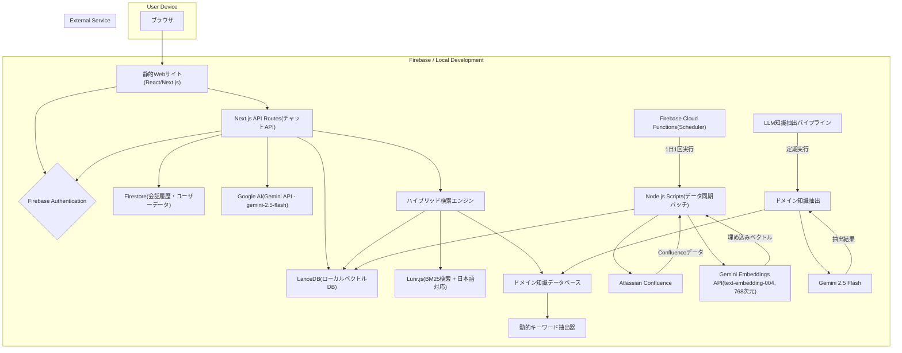

# システム全体仕様書

## 1. 概要

### 1.1 プロダクト名

Confluence仕様書要約チャットボット (仮称: Spec-Finder)

### 1.2 仕様書構成

本システムは、Confluence検索システム、Jira検索システム、Google Drive統合システムの3つのサブシステムで構成されています。各システムの詳細仕様は以下のドキュメントを参照してください。

- **[Confluence検索システム仕様](./02.02-confluence-spec.md)**: Confluenceページの検索・要約機能
- **[Jira検索システム仕様](./02.03-jira-spec.md)**: Jira課題の検索・要約機能
- **[Google Drive統合仕様](./02.04-google-drive-spec.md)**: Google Driveファイルの検索・要約機能

### 1.3 システム全体の特徴

- **マルチソース対応**: Confluence、Jira、Google Driveを統合検索可能
- **統一されたUI**: 同じチャットインターフェースで全ソースを検索
- **ハイブリッド検索**: ベクトル検索 + BM25検索の統合検索システム
- **AI要約**: Gemini APIによる自然言語での回答生成
- **ストリーミング回答**: リアルタイムでの回答生成と表示
- **多形式ファイル対応**: PDF、Google Docs、Spreadsheet、Slides、テキスト、Markdownをサポート

### 1.4 更新履歴

**2025年1月**: Google Drive統合完了
- Google Driveファイルインポート機能の実装完了
- サービスアカウント認証による共有ドライブ対応完了
- 多形式ファイル対応（PDF、Google Docs、Spreadsheet、Slides、テキスト、Markdown）完了
- LanceDBへのインデックス化完了
- 統合検索への組み込み完了

**2025年1月**: Jira検索システム統合完了
- Jira検索機能の統合完了
- LanceDBへのJiraデータ投入完了
- LunrインデックスのJira対応完了（テーブルごとのインデックス管理）
- ハイブリッド検索エンジンのJira対応完了
- Jira特有フィールド（assignee, status, priority, issue_key等）の取得・表示完了
- BM25検索のenrichment処理の修正完了
- LanceDBClientの複数テーブル対応完了
- ソース切替UI（タブ）の実装完了
- 仕様書をConfluenceとJiraに分離

**2025年11月**: 現在の実装に合わせて仕様書を最新化
- pageId → page_id マイグレーション完了: スカラーインデックス対応のためフィールド名を変更
- パフォーマンス最適化: `getAllChunksByPageId`が14秒 → 5msに高速化（99.96%改善）
- スカラーインデックス: `page_id`フィールドにスカラーインデックスを設定
- API互換性: 変換レイヤー（pageid-migration-helper.ts）によりAPIレスポンスでは`pageId`を維持
- アーカイブ整理: 未使用ファイルを`src/lib/archive/`と`scripts/archive/`に移動
- 型チェック・ビルド: すべての型エラーを解消、ビルドが正常に完了

**2025年1月**: 現在の実装に合わせて仕様書を最新化
- ストリーミング機能: リアルタイム回答生成とプログレス表示
- マークダウン表示: 高度な正規化とテーブル表示機能
- Firebase認証: @tomonokai-corp.com ドメイン制限
- 会話履歴: Firestore統合による永続化
- 埋め込みモデル: Gemini Embeddings API (text-embedding-004, 768次元)
- LLM: Gemini API (gemini-2.5-flash)
- ハイブリッド検索: ベクトル検索 + BM25検索 + キーワード検索 + 動的関連性スコアリング
- 日本語対応: Kuromojiトークナイザー使用
- AIフレームワーク: Genkit 1.19.2（部分統合、3つのFlows実装）

**2024年12月**: 初期実装完了
- 基本検索機能の実装
- LanceDB統合
- 基本的なUI/UX実装

## 1.2 背景と目的

社内のConfluenceには、多数のプロダクト仕様書が蓄積されているが、情報が分散しており、目的の仕様を探し出すのに時間がかかるという課題がある。また、仕様の全体像を把握したり、複数の仕様書を横断して確認したりすることが困難である。
本プロダクトは、Atlassian APIを通じてConfluence上の仕様書をAIに学習させ、自然言語による対話形式で仕様の検索・要約・深掘りを可能にすることで、開発者やプロダクトマネージャーの情報検索コストを大幅に削減し、開発効率を向上させることを目的とする。

## 1.3 開発環境

**Firebase Studio**
AIによる開発支援、各種Firebaseサービスとのシームレスな統合、ブラウザベースでの環境構築不要といった利点を活かし、迅速なプロトタイピングと開発を実現する。

# 2. 機能要件

## 2.1 ユーザー向け機能

| ID      | 機能名             | 機能概要                                                                                             | 優先度 | 実装状況 |
| :------ | :----------------- | :--------------------------------------------------------------------------------------------------- | :----- | :------- |
| USR-001 | Googleアカウント認証 | Googleアカウントでログインできる。@tomonokai-corp.com ドメイン制限。                                | 高     | ✅ 完了   |
| USR-002 | チャットインターフェース | ユーザーが自然言語で質問を入力できるUIを提供する。                                                   | 高     | ✅ 完了   |
| USR-003 | 仕様の検索・要約   | 入力された質問に対し、関連する仕様書を検索し、要約した回答を生成して表示する。                         | 高     | ✅ 完了   |
| USR-004 | 参照元リンク表示   | 回答の生成元となったConfluenceのページURLを明記し、ユーザーが一次情報を確認できるようにする。            | 高     | ✅ 完了   |
| USR-005 | 深掘り質問         | 提示された回答に対して、追加の質問を投げかけることで、会話の文脈を維持したまま詳細な情報を引き出せる。 | 中     | ✅ 完了   |
| USR-006 | 会話履歴の表示     | 過去の質疑応答の履歴を一覧で確認し、特定の会話を呼び出すことができる。                                 | 中     | ✅ 完了   |
| USR-007 | 関連ページ表示     | 検索結果に関連する他のConfluenceページを表示し、関連情報へのアクセスを容易にする。                     | 中     | ✅ 完了   |
| USR-008 | ストリーミング回答 | リアルタイムで回答を生成・表示し、プログレス表示で処理状況を可視化する。                               | 高     | ✅ 完了   |
| USR-009 | マークダウン表示   | 見出し、箇条書き、テーブル、コードブロックなどの適切なマークダウン表示。                               | 高     | ✅ 完了   |
| USR-010 | ドメイン制限認証   | @tomonokai-corp.com ドメインのユーザーのみアクセス可能。                                             | 高     | ✅ 完了   |

## 2.2 システム・管理機能

| ID      | 機能名                 | 機能概要                                                                                             | 実装状況 |
| :------ | :--------------------- | :--------------------------------------------------------------------------------------------------- | :------- |
| SYS-001 | Confluenceデータ同期   | Atlassian APIを介して、指定されたConfluenceスペースから仕様書データを定期的に取得する。                | ✅ 完了   |
| SYS-002 | ベクトルデータベース更新 | 取得した仕様書データを分割・ベクトル化し、LanceDBに保存・更新する。この処理は1日1回、夜間に自動実行される。 | ✅ 完了   |
| SYS-003 | メタデータ一元管理     | 検索に必要なメタデータ（タイトル、スペースキー、ラベルなど）をLanceDBに統合して管理する。            | ✅ 完了   |
| SYS-004 | ドメイン知識抽出・管理 | Confluence仕様書からLLMを使用してドメイン知識（ドメイン名、機能名、操作名、システム項目、システム用語、関連キーワード）を自動抽出し、検索精度向上を実現する。 | ✅ 完了   |
| SYS-005 | ハイブリッド検索エンジン | ベクトル検索 + BM25検索 + キーワード検索 + 動的関連性スコアリングの統合検索システム。               | ✅ 完了   |
| SYS-006 | ストリーミング処理     | リアルタイム回答生成とプログレス表示のためのストリーミングAPI。                                       | ✅ 完了   |
| SYS-007 | Firestore統合         | 会話履歴、ユーザーデータ、システムメトリクスのFirestore統合管理。                                     | ✅ 完了   |

# 3. 非機能要件

| 項目         | 要件                                                                                             | 実装状況 |
| :----------- | :----------------------------------------------------------------------------------------------- | :------- |
| パフォーマンス | ユーザーの質問から3秒以内に回答を返すことを目標とする。ハイブリッド検索（ベクトル+キーワード+BM25+タイトル一致）は平均7-23msで完了する。日本語テキスト処理も最適化済み。ストリーミング機能によりリアルタイム回答生成を実現。 | ✅ 達成   |
| セキュリティ | ユーザー認証を行い、@tomonokai-corp.com ドメインの許可されたユーザーのみが利用できるようにする。Firestoreセキュリティルールによる適切なアクセス制御。Atlassian APIキーなどの機密情報は適切に管理する。 | ✅ 完了   |
| 可用性       | Firebaseのインフラに準拠し、安定したサービス稼働を目指す。Firebase Hostingによる高可用性の提供。 | ✅ 達成   |
| 拡張性       | 最大10,000ページのConfluenceコンテンツに対応できるスケーラビリティを確保する。LanceDBによる効率的なベクトル検索。 | ✅ 達成   |
| UI/UX        | ストリーミング回答、マークダウン表示、会話履歴管理、レスポンシブデザインによる優れたユーザーエクスペリエンス。 | ✅ 完了   |

# 4. システムアーキテクチャ

Firebase Studioを開発環境とし、各種FirebaseサービスとLanceDBを連携させて構築する。

# 4.1 使用技術スタック

## 開発環境
- **開発環境**: Firebase Studio + ローカル開発環境
- **パッケージマネージャー**: npm
- **ビルドツール**: Next.js 15.3.3

## フロントエンド
- **フレームワーク**: Next.js 15.3.3 (React 18.3.1)
- **言語**: TypeScript 5.9.2
- **スタイリング**: Tailwind CSS 3.4.1 + @tailwindcss/typography
- **UIコンポーネント**: Radix UI (Headless UI)
- **マークダウン**: ReactMarkdown + remark-gfm
- **状態管理**: React Hooks + Context API

## バックエンド
- **API**: Next.js API Routes
- **スクリプト**: Node.js Scripts (tsx)
- **言語**: TypeScript

## AI・機械学習
- **LLM**: Google AI - Gemini API (gemini-2.5-flash)
- **埋め込みモデル**: Gemini Embeddings API (text-embedding-004)
  - 768次元のベクトル生成
  - API経由での埋め込み生成
  - 簡易メモリキャッシュ実装（TTL 15分、最大1000エントリ）
  - 日本語テキスト対応（Kuromojiトークナイザー使用）
- **AIフレームワーク**: Genkit 1.19.2（部分統合）
  - 実装済みFlows: auto-label-flow, retrieve-relevant-docs-lancedb, streaming-summarize-confluence-docs
  - Dev UI: http://localhost:9004

## データベース・ストレージ
- **認証**: Firebase Authentication 11.9.1
- **NoSQL**: Firestore (会話履歴・ユーザーデータ・システムメトリクス)
- **ベクトルDB**: LanceDB 0.22.0 (ローカルベクトルDB)
  - 高速なローカルベクトル検索
  - ベクトルインデックス（IVF_PQ）自動生成
  - スカラーインデックス（`page_id`）明示的に作成
  - スキーマ: `page_id`フィールド（pageIdから変更、2025年11月）
  - パフォーマンス: `getAllChunksByPageId`が平均5ms（スカラーインデックス使用）
  - 検索時間: 平均7-23ms
  - メモリ効率: 低消費（100回の検索で約0.5MB増加）
  - メタデータ統合管理: 検索結果に必要なメタデータを直接格納

## 検索エンジン
- **ハイブリッド検索システム**:
  - ベクトル検索: LanceDBによる意味的類似性検索
  - キーワード検索: LanceDBのLIKE句による部分一致検索
  - BM25検索: Lunr.js 2.3.9による全文検索（BM25アルゴリズム）
  - タイトル厳格一致検索: 完全一致による高精度検索
  - スコアリング統合: 複数検索結果の重み付け統合
  - ラベルフィルタリング: 議事録、アーカイブ等の除外機能
  - 動的関連性スコアリング: クエリに応じた動的な結果ソート

## ドメイン知識抽出システム
- **LLM知識抽出**: Gemini 2.5 Flashを使用した高精度なドメイン知識抽出
- **キーワードカテゴリ**: ドメイン名、機能名、操作名、システム項目、システム用語、関連キーワード
- **重複削除機能**: ページ内・ページ間の重複キーワードを自動削除
- **動的キーワード抽出**: クエリに応じた動的なキーワード優先度調整
- **知識データベース**: 8,122個のキーワードを管理（1,067ページから抽出）

## 外部API・サービス
- **Atlassian API**: Confluence REST API
- **Google AI API**: Gemini API
- **Firebase Services**: Authentication, Firestore, Hosting

## 開発・テストツール
- **テスト**: Vitest 3.2.4 + Playwright 1.55.0 (E2E)
- **リンター**: ESLint 8
- **型チェック**: TypeScript
- **自動化**: Node.jsスクリプト + cron

# 4.2 データフロー

1. **データ取得・処理フロー**
   - Confluenceからページデータを取得
   - HTMLからテキストを抽出
   - テキストをチャンク分割（1800文字、オーバーラップなし）
   - Gemini Embeddings API (text-embedding-004) による埋め込みベクトル生成（768次元）
   - LanceDBにベクトルとメタデータを保存

2. **ハイブリッド検索フロー**
   - ユーザークエリをGemini Embeddings API (text-embedding-004) で埋め込みベクトルに変換（768次元）
   - 並列実行による複数検索ソースの組み合わせ：
     - **ベクトル検索**: LanceDBで類似ベクトル検索（意味的類似性）
     - **キーワード検索**: LanceDBのLIKE句によるタイトル・コンテンツ検索
     - **BM25検索**: Lunr.jsによる全文検索（BM25アルゴリズム）
     - **タイトル厳格一致検索**: タイトルがクエリに完全一致する検索
   - 早期ラベルフィルタリング（議事録、アーカイブ等の除外）
   - 動的キーワード抽出（ドメイン知識データベースから関連キーワードを抽出）
   - スコアリング統合（キーワードスコア、ラベルスコア、ハイブリッドスコア）
   - 動的関連性スコアリング（クエリに応じた結果ソート）
   - 重複除去と結果統合
   - 関連ページの特定と表示
   - Gemini APIで回答生成

3. **ストリーミング回答フロー**
   - ユーザーの質問をAPIエンドポイントに送信
   - ストリーミングレスポンスの開始
   - 段階的なプログレス表示：
     - ステップ1: 関連ドキュメント検索中
     - ステップ2: 検索結果の分析・整理中
     - ステップ3: AI回答生成中
   - リアルタイムでの回答生成と表示
   - マークダウン正規化とテーブル表示の最適化
   - 会話履歴のFirestore保存

4. **ユーザーデータフロー**
   - Firebase Authenticationでユーザー認証（@tomonokai-corp.com ドメイン制限）
   - Firestoreでユーザー情報と会話履歴を管理
   - セキュリティルールによる適切なアクセス制御

5. **ドメイン知識抽出フロー**
   - ConfluenceページデータをLLMに送信
   - Gemini 2.5 Flashでドメイン知識を自動抽出
   - 抽出結果を重複削除・統合
   - ドメイン知識データベースに保存
   - 検索時の動的キーワード抽出に活用

---

## 6. 関連ドキュメント

### 6.1 詳細仕様書

- **[Confluence検索システム仕様](./02.02-confluence-spec.md)**: Confluenceページの検索・要約機能の詳細仕様
- **[Jira検索システム仕様](./02.03-jira-spec.md)**: Jira課題の検索・要約機能の詳細仕様
- **[Google Drive統合仕様](./02.04-google-drive-spec.md)**: Google Driveファイルの検索・要約機能の詳細仕様
- **[LanceDB統合ガイド](../01-architecture/01.02.04-lancedb-integration-guide.md)**: LanceDBの統合方法と使用方法

### 6.2 アーキテクチャドキュメント

- [ハイブリッド検索システム仕様](../01-architecture/02.01.02-hybrid-search-specification.md)
- [Google Drive統合設計](../01-architecture/01.02.05-google-drive-integration-design.md)
- [データ同期戦略](../04-operations/04.03-data-synchronization-strategy.md)
- [Jira統合計画](../01-architecture/06.01.01-confluence-jira-integration-plan.md)

### 6.3 テストドキュメント

- [テストドキュメント](../05-testing/README.md): テスト戦略と実行ガイド
  - [データ関連テスト](../05-testing/05.01-data-validation.md): データ整合性、インデックス、ラベルのテスト
  - [主要機能関連テスト](../05-testing/05.02-feature-tests.md): 検索、要約、ストリーミングのテスト
  - [デプロイ・整合性テスト](../05-testing/05.03-deployment-integration.md): デプロイ、型チェック、データ整合性のテスト
  - [パフォーマンステスト](../05-testing/05.04-performance-tests.md): 応答速度、スループットのテスト