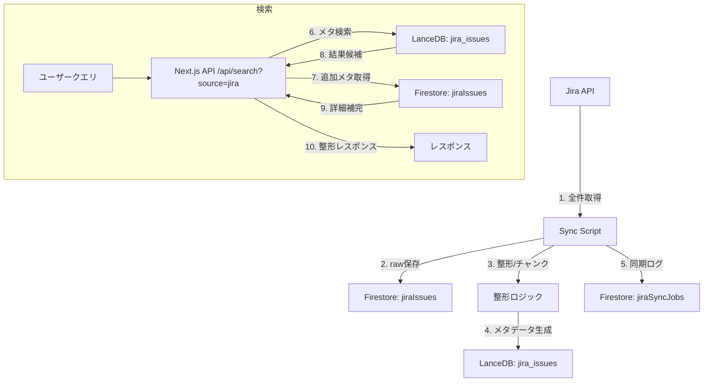
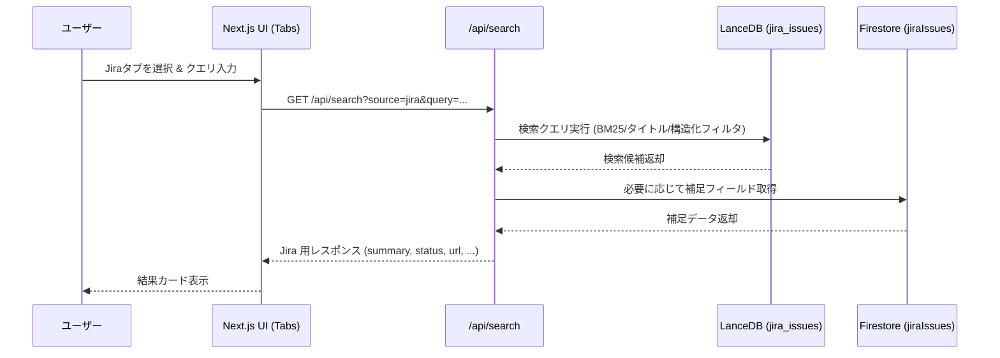

# Jira Integration LanceDB Data Flow

**作成日**: 2025-11-09  
**作成者**: GPT-5 Codex  
**ステータス**: Draft（Jira 個別検索 Phase 1 設計）

---

## 概要

本ドキュメントは、Jira 課題データを LanceDB と Firestore に同期し、検索 UI から参照するまでのコンポーネント構成とデータフローを示します。既存の Confluence Vector Search アーキテクチャと整合性を保ちながら、Jira 用の専用テーブル・API・バッチを追加する構成です。

---

## コンポーネント図

```mermaid
graph TB
    subgraph "フロントエンド"
        UI[Next.js Chat UI]
        Tabs[Source Tabs (Confluence / Jira)]
        Cards[Jira Result Cards]
    end

    subgraph "バックエンド"
        Api[Next.js API Routes]
        SearchAPI[/api/search (source=jira)]
        SyncCmd[Node.js Sync Scripts]
        Scheduler[Manual/Cloud Run Triggers]
    end

    subgraph "データストア"
        FS[Firestore]
        Issues[jiraIssues]
        SyncJobs[jiraSyncJobs]
        Attachments[jiraAttachments (optional)]
        LDB[LanceDB]
        JiraTable[jira_issues テーブル]
    end

    subgraph "外部サービス"
        JiraAPI[Jira Cloud REST API]
    end

    UI --> Tabs
    Tabs --> Api
    Api --> SearchAPI
    SearchAPI --> LDB
    SearchAPI --> FS

    Scheduler --> SyncCmd
    SyncCmd --> JiraAPI
    SyncCmd --> FS
    SyncCmd --> LDB

    JiraTable -.-> |"検索用メタデータ"| SearchAPI
    Issues -.-> |"raw/整形データ"| SearchAPI
```

### 関係性メモ
- **LanceDB（jira_issues）**: 検索用メタデータと整形済みフィールドを保持。UI からの検索は LanceDB を主要ソースにする。
- **Firestore（jiraIssues）**: Jira から取得した raw JSON と整形データ、`syncedAt` 等の同期メタを保存。LanceDB 再構築時のソースにもなる。
- **Firestore（jiraSyncJobs）**: バッチ実行履歴を記録し、監視とリトライに利用。

---

## データフロー図



### フロー詳細
1. **同期処理**: 手動 or Scheduler から `Sync Script` を実行し、Jira API から全件取得。
2. Firestore `jiraIssues` に raw データと整形済みフィールドを保存。
3. LanceDB `jira_issues` テーブルに検索用メタデータ（title, content, structured_fields, updated_at 等）を保存。
4. `jiraSyncJobs` に同期履歴を記録。
5. 検索リクエストでは `source=jira` を指定し、LanceDB から候補を、必要に応じ Firestore から補足情報を取得してレスポンスを返す。

---

## シーケンス図



---

## LanceDB / Firestore の関係
- **LanceDB**: 検索に最適化された整形データ（タイトル・説明・ステータス・優先度・影響カテゴリなど）を保持。UI・API は LanceDB を一次ソースとして参照。
- **Firestore**: Jira raw データと同期メタ情報を保持。補足情報や同期履歴、再インデックスのソースとして利用。会話履歴や UI 状態保存など既存 Firestore データとも共存。

---

## 今後の拡張ポイント
- Phase 2（統合検索）時に `jira_issues` と `confluence_chunks` を跨ぐビュー/インタフェースを追加。
- ダッシュボード指標集計のため、Firestore データを BigQuery／集計ジョブに連携。
- 影響業務・検証状況など StructuredLabel とのマッピングを Firestore 同期時に適用。
