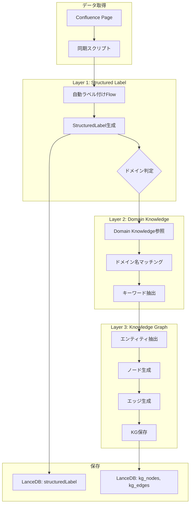
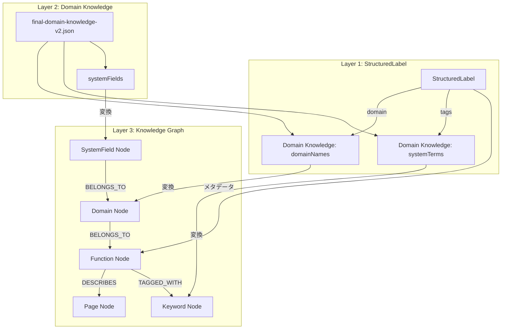

# ラベル・ドメイン知識・Knowledge Graph 統合設計

**バージョン**: 1.0  
**作成日**: 2025年10月14日  
**Phase**: Phase 0A  
**ステータス**: 設計中

---

## 📋 概要

Phase 0Aでは、3つのレイヤーを統合して、高精度な検索システムを構築します：

```
Layer 3: Knowledge Graph（関係性）
    ↑
Layer 2: Domain Knowledge（キーワード・用語）
    ↑
Layer 1: Structured Label（分類・メタデータ）
    ↑
Data Source: Confluence Pages（生データ）
```

---

## 🏗️ 3層アーキテクチャ

### Layer 1: Structured Label（構造化ラベル）

**役割**: ページの**分類とメタデータ管理**

```typescript
{
  category: 'spec',        // 仕様書
  domain: '教室管理',      // ドメイン
  feature: '教室コピー機能', // 機能名
  status: 'approved',      // ステータス
  priority: 'high',        // 優先度
  version: '168',
  tags: ['コピー', '管理画面']
}
```

**活用方法:**
- ✅ フィルタリング（カテゴリ、ドメイン、ステータス別）
- ✅ スコアリング（優先度による重み付け）
- ✅ UI表示（構造化された情報）

---

### Layer 2: Domain Knowledge（ドメイン知識）

**役割**: **キーワード・用語の体系化**

**既存データ:**
```json
{
  "domainNames": [
    "教室管理", "求人管理", "会員管理", ...  // 203種類
  ],
  "systemFields": [
    "教室ID", "求人タイトル", ...  // 3,153種類
  ],
  "systemTerms": [
    "ログイン", "応募", "オファー", ...  // 1,856種類
  ]
}
```

**活用方法:**
- ✅ キーワード抽出（検索クエリの理解）
- ✅ エンティティ認識（「教室管理」などの固有名詞）
- ✅ 同義語展開（「会員」=「エンドユーザー」）

---

### Layer 3: Knowledge Graph（知識グラフ）

**役割**: **エンティティ間の関係性**

**ノード例:**
```typescript
{
  id: 'function-classroom-copy',
  type: 'Function',
  name: '教室コピー機能',
  properties: {
    domain: '教室管理',
    status: 'approved'
  }
}

{
  id: 'page-168',
  type: 'Page',
  name: '168_【FIX】教室コピー機能',
  properties: {
    url: 'https://...'
  }
}

{
  id: 'domain-classroom-management',
  type: 'Domain',
  name: '教室管理'
}
```

**エッジ例:**
```typescript
{
  source: 'page-168',
  target: 'function-classroom-copy',
  type: 'DESCRIBES'
}

{
  source: 'function-classroom-copy',
  target: 'domain-classroom-management',
  type: 'BELONGS_TO'
}

{
  source: 'function-classroom-copy',
  target: 'function-classroom-edit',
  type: 'RELATES_TO'
}
```

---

## 🔗 3層の連動設計

### 統合フロー



---

## 🎯 具体的な連動方法

### 1. StructuredLabel生成時にDomain Knowledgeを活用

```typescript
// src/ai/flows/auto-label-flow.ts

async function generateStructuredLabel(page: ConfluencePage): Promise<StructuredLabel> {
  // 1. Domain Knowledgeを読み込み
  const domainKnowledge = await loadDomainKnowledge();
  
  // 2. タイトル・内容からドメインを推測
  const matchedDomains = domainKnowledge.domainNames.filter(domain => 
    page.title.includes(domain) || page.content.includes(domain)
  );
  
  // 3. LLMでStructuredLabelを生成（ドメイン候補を提示）
  const prompt = `
以下のConfluenceページを分析し、StructuredLabelを生成してください。

タイトル: ${page.title}
内容: ${page.content.substring(0, 500)}
既存ラベル: ${page.labels.join(', ')}

【参考】このページに関連するドメイン候補:
${matchedDomains.slice(0, 5).join(', ')}

【参考】ドメイン一覧（上位20件）:
${domainKnowledge.domainNames.slice(0, 20).join(', ')}

JSON形式で出力:
{
  "category": "spec|data|template|workflow|meeting|other",
  "domain": "上記のドメイン一覧から選択、または新規",
  "feature": "具体的な機能名",
  "priority": "high|medium|low",
  "status": "draft|review|approved|deprecated",
  "tags": ["タグ1", "タグ2"],
  "confidence": 0.0-1.0
}
`;
  
  const result = await callGemini(prompt);
  return result;
}
```

**効果:**
- ✅ ドメイン名の**一貫性**が保たれる（203種類から選択）
- ✅ LLMの**hallucination（幻覚）**を防ぐ
- ✅ 既存のドメイン知識を**活用**

---

### 2. Knowledge Graph構築時にStructuredLabelを活用

```typescript
// functions/src/kg-builder.ts

async function buildKnowledgeGraph(pages: Page[]): Promise<{ nodes: KgNode[], edges: KgEdge[] }> {
  const nodes: KgNode[] = [];
  const edges: KgEdge[] = [];
  
  for (const page of pages) {
    const label = page.structuredLabel;
    
    // 1. Pageノード作成
    nodes.push({
      id: `page-${page.id}`,
      type: 'Page',
      name: label.feature,  // StructuredLabelのfeatureを使用
      properties: {
        url: page.url,
        status: label.status,
        category: label.category
      }
    });
    
    // 2. Domainノード作成（存在しない場合）
    const domainId = `domain-${label.domain}`;
    if (!nodes.find(n => n.id === domainId)) {
      nodes.push({
        id: domainId,
        type: 'Domain',
        name: label.domain,  // StructuredLabelのdomainを使用
        properties: {}
      });
    }
    
    // 3. Functionノード作成
    const functionId = `function-${label.feature}`;
    if (!nodes.find(n => n.id === functionId)) {
      nodes.push({
        id: functionId,
        type: 'Function',
        name: label.feature,
        properties: {
          priority: label.priority
        }
      });
    }
    
    // 4. エッジ作成
    edges.push({
      source: `page-${page.id}`,
      target: functionId,
      type: 'DESCRIBES'
    });
    
    edges.push({
      source: functionId,
      target: domainId,
      type: 'BELONGS_TO'
    });
    
    // 5. タグからKeywordノードを作成
    if (label.tags) {
      for (const tag of label.tags) {
        const keywordId = `keyword-${tag}`;
        if (!nodes.find(n => n.id === keywordId)) {
          nodes.push({
            id: keywordId,
            type: 'Keyword',
            name: tag,
            properties: {}
          });
        }
        
        edges.push({
          source: functionId,
          target: keywordId,
          type: 'TAGGED_WITH'
        });
      }
    }
  }
  
  return { nodes, edges };
}
```

**効果:**
- ✅ StructuredLabelから**自動的にKGを構築**
- ✅ ドメイン階層構造を作成
- ✅ 機能間の関係性を管理

---

### 3. 検索時の3層統合活用

```typescript
// src/lib/search-orchestrator.ts (Phase 0A-3で実装)

async function orchestrateSearch(query: string): Promise<SearchResult[]> {
  // Step 1: Domain Knowledgeでクエリを理解
  const keywords = await extractKeywordsFromDomainKnowledge(query);
  // → "教室コピー機能" から ["教室管理", "コピー機能", "教室"] を抽出
  
  // Step 2: Knowledge Graphでエンティティを特定
  const entities = await findEntitiesInGraph(keywords);
  // → "教室管理" ドメインノード、"教室コピー機能" 機能ノードを発見
  
  // Step 3: StructuredLabelでフィルタリング
  const filters: StructuredLabelFilterOptions = {
    domains: [entities.domain],     // "教室管理"
    categories: ['spec', 'data'],   // 仕様書とデータ定義のみ
    statuses: ['approved', 'review'] // 確定版とレビュー中のみ
  };
  
  // Step 4: ハイブリッド検索実行
  const results = await searchLanceDB({
    query,
    structuredLabelFilters: filters,  // ★StructuredLabelでフィルタ
    // ...
  });
  
  // Step 5: Knowledge Graphで関連ページをブースト
  const relatedPages = await getRelatedPagesFromGraph(entities);
  // → "教室コピー機能"に関連する他のページを取得
  
  // Step 6: スコアリング統合
  const finalResults = combineScores(results, relatedPages, {
    vectorWeight: 0.3,
    bm25Weight: 0.2,
    labelWeight: 0.2,    // ★StructuredLabelスコア
    graphWeight: 0.3     // ★KGスコア
  });
  
  return finalResults;
}
```

---

## 🔄 データフローの全体像

### 同期・構築フロー

```
1. Confluence同期（毎日）
   ↓
2. StructuredLabel生成（同期時）
   ├─ ルールベース（80%）: タイトルパターンマッチ
   ├─ Domain Knowledge参照: ドメイン名の統一
   └─ LLM補完（20%）: 複雑なケース
   ↓
3. Knowledge Graph構築（週次）
   ├─ StructuredLabelからノード生成
   ├─ ドメイン階層構造の作成
   └─ ページ間リンク解析でエッジ追加
   ↓
4. LanceDB保存
   ├─ confluence テーブル: vector + structuredLabel
   ├─ kg_nodes テーブル: ノード一覧
   └─ kg_edges テーブル: エッジ一覧
```

---

## 📊 具体例: 「教室コピー機能」

### Layer 1: StructuredLabel

```json
{
  "category": "spec",
  "domain": "教室管理",           // ← Domain Knowledgeから選択
  "feature": "教室コピー機能",
  "status": "approved",
  "priority": "high",
  "version": "168",
  "tags": ["コピー", "一括処理"], // ← Domain KnowledgeのsystemTermsから抽出
  "confidence": 0.95
}
```

**ドメイン知識との連動:**
```typescript
// domain-knowledge-v2.json から
"domainNames": [..., "教室管理", ...]  // ← ここから選択

// LLMプロンプトに含める
"【参考】ドメイン候補: 教室管理, 求人管理, 会員管理"
```

---

### Layer 2: Domain Knowledge（既存データ活用）

```json
{
  "domainNames": ["教室管理", ...],
  "systemTerms": ["コピー", "一括処理", "管理画面", ...],
  
  // ★新規追加: StructuredLabelとの紐付け
  "domainMapping": {
    "教室管理": {
      "relatedDomains": ["教室グループ管理", "契約管理"],
      "commonFeatures": ["教室コピー機能", "教室削除機能", ...],
      "commonTags": ["管理画面", "一括処理"]
    }
  }
}
```

**拡張内容:**
- `domainMapping`: ドメインごとのメタ情報
- StructuredLabelの`domain`フィールドと連動

---

### Layer 3: Knowledge Graph

```typescript
// ノード
[
  {
    id: 'domain-classroom-management',
    type: 'Domain',
    name: '教室管理',
    properties: {
      relatedDomains: ['教室グループ管理', '契約管理'],
      pageCount: 42
    }
  },
  {
    id: 'function-classroom-copy',
    type: 'Function',
    name: '教室コピー機能',
    properties: {
      priority: 'high',
      status: 'approved',
      version: '168'
    }
  },
  {
    id: 'page-168',
    type: 'Page',
    name: '168_【FIX】教室コピー機能',
    properties: {
      url: 'https://giginc.atlassian.net/...',
      lastUpdated: '2025-09-15'
    }
  },
  {
    id: 'keyword-copy',
    type: 'Keyword',
    name: 'コピー',
    properties: {
      frequency: 156  // Domain Knowledgeから
    }
  }
]

// エッジ
[
  { source: 'page-168', target: 'function-classroom-copy', type: 'DESCRIBES' },
  { source: 'function-classroom-copy', target: 'domain-classroom-management', type: 'BELONGS_TO' },
  { source: 'function-classroom-copy', target: 'keyword-copy', type: 'TAGGED_WITH' },
  { source: 'function-classroom-copy', target: 'function-classroom-edit', type: 'RELATES_TO' }
]
```

---

## 🔧 実装の詳細

### Phase 0A-1: StructuredLabel + Domain Knowledge連動

#### **1.2 自動ラベル付けFlow実装**

```typescript
// src/ai/flows/auto-label-flow.ts

import { ai } from '@/lib/genkit-client';
import { z } from 'zod';
import type { StructuredLabel } from '@/types/structured-label';

// ドメイン知識を読み込む
const domainKnowledge = await loadDomainKnowledge();

export const autoLabelFlow = ai.defineFlow(
  {
    name: 'autoLabelFlow',
    inputSchema: z.object({
      title: z.string(),
      content: z.string(),
      labels: z.array(z.string()),
    }),
    outputSchema: z.object({
      category: z.enum(['spec', 'data', 'template', 'workflow', 'meeting', 'manual', 'other']),
      domain: z.string(),
      feature: z.string(),
      priority: z.enum(['critical', 'high', 'medium', 'low', 'unknown']),
      status: z.enum(['draft', 'review', 'approved', 'deprecated', 'unknown']),
      version: z.string().optional(),
      tags: z.array(z.string()).optional(),
      confidence: z.number().optional(),
    }),
  },
  async (input) => {
    // Domain Knowledgeからドメイン候補を抽出
    const domainCandidates = domainKnowledge.domainNames.filter(domain =>
      input.title.includes(domain) || input.content.includes(domain)
    ).slice(0, 5);
    
    // プロンプト生成
    const prompt = `
以下のConfluenceページを分析し、StructuredLabelを生成してJSON形式で出力してください。

【ページ情報】
タイトル: ${input.title}
内容: ${input.content.substring(0, 800)}
既存ラベル: ${input.labels.join(', ')}

【参考: ドメイン候補】
${domainCandidates.join(', ')}

【参考: ドメイン一覧（上位30件）】
${domainKnowledge.domainNames.slice(0, 30).join(', ')}

【出力形式】
{
  "category": "spec|data|template|workflow|meeting|other",
  "domain": "上記のドメイン一覧から選択（できるだけ既存のものを使用）",
  "feature": "クリーンな機能名（バージョン番号やステータスマーカーを除く）",
  "priority": "high|medium|low",
  "status": "draft|review|approved|deprecated",
  "version": "タイトルから抽出（例: 168_【FIX】... → 168）",
  "tags": ["関連キーワード"],
  "confidence": 0.0-1.0
}

【判定基準】
- category: タイトルに「機能」→spec, 「帳票」→data, 「メール」→template
- status: 【FIX】→approved, 【作成中】→draft, 【レビュー中】→review
- priority: category=spec & status=approved → high
`;
    
    // Gemini実行
    const { text } = await ai.generate({
      model: 'googleai/gemini-1.5-flash',
      prompt,
      config: {
        temperature: 0.1,  // 低温度で一貫性を重視
      },
    });
    
    return JSON.parse(text);
  }
);
```

---

### Phase 0A-2: Knowledge Graph構築でDomain Knowledgeを統合

#### **2.1 KGスキーマ拡張**

```typescript
// src/types/knowledge-graph.ts

export type NodeType = 
  | 'Function'      // 機能（例: 教室コピー機能）
  | 'Domain'        // ドメイン（例: 教室管理）← Domain Knowledgeから
  | 'Keyword'       // キーワード（例: コピー）← Domain Knowledgeから
  | 'Page'          // Confluenceページ
  | 'Label'         // ラベル（例: spec, data）
  | 'SystemField'   // システム項目（例: 教室ID）← Domain Knowledgeから
  | 'SystemTerm';   // システム用語（例: ログイン）← Domain Knowledgeから

export interface KgNode {
  id: string;
  type: NodeType;
  name: string;
  properties?: {
    frequency?: number;        // Domain Knowledgeの出現頻度
    relatedDomains?: string[]; // 関連ドメイン
    priority?: string;          // StructuredLabelから
    status?: string;            // StructuredLabelから
    [key: string]: any;
  };
}
```

#### **2.2 Domain Knowledge → KG変換**

```typescript
// scripts/import-domain-knowledge-to-kg.ts

async function importDomainKnowledgeToKG() {
  const domainKnowledge = await loadDomainKnowledge();
  const nodes: KgNode[] = [];
  const edges: KgEdge[] = [];
  
  // 1. Domainノード作成
  for (const domainName of domainKnowledge.domainNames) {
    nodes.push({
      id: `domain-${domainName}`,
      type: 'Domain',
      name: domainName,
      properties: {
        frequency: calculateFrequency(domainName),  // 出現頻度
      }
    });
  }
  
  // 2. SystemFieldノード作成
  for (const field of domainKnowledge.systemFields) {
    nodes.push({
      id: `field-${field}`,
      type: 'SystemField',
      name: field,
      properties: {}
    });
    
    // Domainとの関連付け
    const relatedDomain = inferDomainFromField(field);
    if (relatedDomain) {
      edges.push({
        source: `field-${field}`,
        target: `domain-${relatedDomain}`,
        type: 'BELONGS_TO'
      });
    }
  }
  
  // 3. SystemTermノード作成
  for (const term of domainKnowledge.systemTerms) {
    nodes.push({
      id: `term-${term}`,
      type: 'SystemTerm',
      name: term,
      properties: {}
    });
  }
  
  // KGに保存
  await saveToKnowledgeGraph(nodes, edges);
}
```

---

## 🎯 検索品質向上のシナリオ

### クエリ: 「教室コピー機能でコピー可能な項目は？」

#### **現在の問題**
```
検索結果:
1. 【FIX】バッチエラー時通知先 (BM25: 0.0359)  ← 無関係
2. 【作成中】会員登録兼応募完了メール (BM25: 0.0354)  ← 無関係
3. 515_【作成中】教室管理-教室コピー機能 (hybrid: 0.4837)  ← 関連だが3位
```

#### **Phase 0A完了後（3層統合）**

```
Step 1: Domain Knowledge解析
  → キーワード: ["教室管理", "コピー", "機能"]
  → エンティティ候補: "教室管理" ドメイン

Step 2: Knowledge Graph検索
  → "教室管理" ドメインノードを発見
  → 関連機能: "教室コピー機能", "教室削除機能", "教室編集機能"
  → 関連ページ: page-168, page-515

Step 3: StructuredLabelフィルタ
  domain='教室管理' AND category='spec' AND status IN ('approved', 'draft')
  → 168_【FIX】教室コピー機能（approved）
  → 515_【作成中】教室管理-教室コピー機能（draft）
  → バッチエラー、メールは除外

Step 4: 統合スコアリング
  168_【FIX】教室コピー機能:
    - ベクトルスコア: 0.603
    - BM25スコア: 低い
    - ラベルスコア: 30点（domain完全一致+feature一致+approved）
    - KGスコア: 25点（直接関連+高優先度）
    → 総合スコア: 0.82 ★1位

  515_【作成中】教室管理-教室コピー機能:
    - ベクトルスコア: 0.484
    - BM25スコア: 低い
    - ラベルスコア: 28点（domain完全一致+feature一致+draft）
    - KGスコア: 20点（直接関連）
    → 総合スコア: 0.71 ★2位

最終結果:
1. 168_【FIX】教室コピー機能 (82%)  ← 正しい！
2. 515_【作成中】教室管理-教室コピー機能 (71%)
```

---

## 📝 実装の段階的アプローチ

### Phase 0A-1（現在）: StructuredLabel + Domain Knowledge

```
Week 1-2:
✅ StructuredLabelスキーマ設計完了
📋 自動ラベル付けFlow実装
   ├─ Domain Knowledgeからドメイン候補を提示
   ├─ LLMでStructuredLabel生成
   └─ domain-knowledge-v2.jsonを活用

📋 データモデル更新
   ├─ LanceDB: structuredLabelカラム追加
   └─ Firestore: structuredLabelフィールド追加

📋 ラベル移行スクリプト
   └─ 1,207ページを一括変換
```

### Phase 0A-2: Knowledge Graph統合

```
Week 3-6:
📋 KGスキーマ設計
   ├─ Domain, Function, Keyword, Page, SystemField, SystemTermノード
   └─ BELONGS_TO, DESCRIBES, RELATES_TO, TAGGED_WITHエッジ

📋 Domain Knowledge → KG変換
   ├─ domainNames → Domainノード
   ├─ systemFields → SystemFieldノード
   ├─ systemTerms → SystemTermノード
   └─ 階層関係の構築

📋 StructuredLabel → KG変換
   ├─ 各ページからFunctionノード生成
   ├─ structuredLabel.domainとDomainノードを紐付け
   └─ structuredLabel.tagsとKeywordノードを紐付け

📋 グラフ検索API実装
```

### Phase 0A-3: 統合検索最適化

```
Week 7-8:
📋 SearchOrchestrator実装
   ├─ 3層統合検索パイプライン
   └─ 統合スコアリング

📋 評価データセット作成
   └─ 検索品質の定量評価

📋 重み付け調整
   └─ vectorWeight, bm25Weight, labelWeight, graphWeight最適化
```

---

## 🔗 データ構造の関係性



---

## 💡 メリット

### 1. **一貫性の確保**
```
ドメイン名がすべて統一される:
- StructuredLabel.domain: "教室管理"
- Domain Knowledge: "教室管理"
- Knowledge Graph Domain Node: "教室管理"
→ すべて同じ語彙を使用
```

### 2. **相互補完**
```
Domain Knowledge:
  - キーワードリスト（8,122個）
  - ドメイン名（203個）
  
StructuredLabel:
  - メタデータ（category, status, priority）
  - 構造化された分類
  
Knowledge Graph:
  - 関係性（RELATES_TO, BELONGS_TO）
  - エンティティ間の距離
  
→ 3層が補い合って高精度検索を実現
```

### 3. **段階的な実装**
```
Phase 0A-1: StructuredLabel
  └─ Domain Knowledgeを活用して生成

Phase 0A-2: Knowledge Graph
  └─ StructuredLabelとDomain Knowledgeを統合してKG構築

Phase 0A-3: 統合検索
  └─ 3層すべてを活用した最適化
```

---

## 🚀 次のステップ

この統合設計に基づいて、以下を実装します：

1. **auto-label-flow.ts**: Domain Knowledgeを参照してStructuredLabel生成
2. **domain-knowledge拡張**: `domainMapping`を追加
3. **KGスキーマ**: Domain Knowledgeとの連動を考慮

この方向性で進めてよろしいですか？🎯
