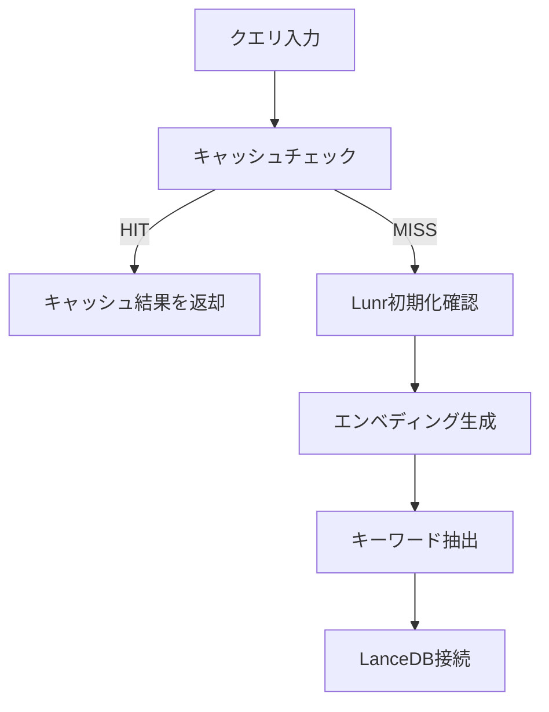

# 現在のハイブリッド検索フロー分析

**作成日**: 2025年10月15日  
**Phase**: Phase 0A-2  
**対象**: `src/lib/lancedb-search-client.ts`

---

## 🔄 現在の検索フロー（順次実行）

### フェーズ1: 事前処理（順次）



**所要時間**: 約50-100ms（エンベディングキャッシュヒット時）

---

### フェーズ2: ベクトル検索（順次）⏱️ 主要ボトルネック

```typescript
// 1. ベクトル検索実行
vectorResults = await vectorQuery.limit(topK * 4).toArray();  // ← 約100-300ms

// 2. 距離閾値フィルタリング
vectorResults = vectorResults.filter(...)  // ← 約5-10ms

// 3. ラベルフィルタリング
vectorResults = vectorResults.filter(...)  // ← 約10-20ms

// 4. タイトルブースト適用
vectorResults = vectorResults.map(...)  // ← 約10-20ms

// 5. 結果数制限
vectorResults = vectorResults.slice(0, topK)  // ← 約1ms
```

**所要時間**: 約150-350ms  
**並行実行**: ❌ **できていない**

---

### フェーズ3: BM25検索（順次）⏱️

```typescript
// 1. 各キーワードでBM25検索
for (const keyword of searchKeywords) {  // ← ループ（順次）
  const tokenizedQuery = await tokenizeJapaneseText(keyword);  // ← 約20-50ms/回
  const keywordResults = await lunrSearchClient.searchCandidates(...);  // ← 約50-100ms/回
  allLunrResults.push(...keywordResults);
}
// 5キーワード × 70-150ms = 350-750ms

// 2. タイトルブースト適用
bm25Results = lunrResults.map(...)  // ← 約10-20ms

// 3. ラベルフィルタリング
bm25Results = bm25Results.filter(...)  // ← 約5-10ms
```

**所要時間**: 約400-800ms  
**並行実行**: ❌ **できていない**（forループで順次実行）

---

### フェーズ4: 結果処理（順次）

```typescript
// 1. ベクトル検索結果の処理
for (let i = 0; i < vectorResults.length; i++) {  // ← ループ（順次）
  // キーワードスコア計算
  // ハイブリッドスコア計算
  resultsWithHybridScore.push(...)
}
// 50件 × 5-10ms = 250-500ms

// 2. BM25結果をマージ
for (const row of bm25Results) {  // ← ループ（順次）
  // スコア計算
  resultsWithHybridScore.push(...)
}
// 50-100件 × 5ms = 250-500ms
```

**所要時間**: 約500-1,000ms  
**並行実行**: ❌ **できていない**

---

### フェーズ5: RRF融合 + 複合スコアリング（順次）

```typescript
// 1. RRF融合（順位統合）
// - ベクトル順位
// - キーワード順位
// - タイトル順位
// - BM25順位
const rrfScores = new Map<string, number>()
resultsWithHybridScore.forEach(r => {
  const rrf = 1/(kRrf + vecRank) + 1/(kRrf + kwRank) + ...
  rrfScores.set(r.id, rrf)
})
// 約50-100ms

// 2. 複合スコアリング適用
vectorResults = compositeScoringService.scoreAndRankResults(vectorResults, keywords)
// 50件 × 10-15ms（StructuredLabel処理含む） = 500-750ms

// 3. ソートと上位topK件を選択
combinedResults.sort(...)
finalResults = combinedResults.slice(0, topK)
// 約5-10ms
```

**所要時間**: 約550-860ms  
**並行実行**: ❌ **できていない**

---

## 📊 現在のフローのタイムライン（順次実行）

```
事例6の実際のタイミング（最適化後）:

[0ms]     クエリ入力
  ↓
[50ms]    エンベディング生成 + キーワード抽出
  ↓
[100ms]   ベクトル検索開始
  ↓
[350ms]   ベクトル検索完了（200件） ← Phase 2
  ↓
[400ms]   タイトルブースト適用
  ↓
[450ms]   BM25検索開始（5キーワード）
  ↓ (順次実行)
[500ms]   - キーワード1: トークン化 + Lunr検索
[600ms]   - キーワード2: トークン化 + Lunr検索
[700ms]   - キーワード3: トークン化 + Lunr検索
[800ms]   - キーワード4: トークン化 + Lunr検索
[900ms]   - キーワード5: トークン化 + Lunr検索
  ↓
[950ms]   BM25結果処理
  ↓
[1000ms]  RRF融合
  ↓
[1100ms]  複合スコアリング（50件）
  ↓
[1140ms]  検索完了 ✅

合計: 1,140ms
```

---

## 🚀 並行実行の可能性（改善案）

### 改善1: ベクトル検索とBM25検索を並行実行 ⚡ **最優先**

**現状（順次実行）**:
```typescript
// ベクトル検索（350ms）
vectorResults = await vectorQuery.limit(200).toArray();

// ↓ 待機

// BM25検索（500ms）
for (const keyword of searchKeywords) {
  const results = await lunrSearchClient.searchCandidates(...);
}

// 合計: 850ms
```

**改善案（並行実行）**:
```typescript
// 並行実行
const [vectorResults, bm25AllResults] = await Promise.all([
  // Vector search
  vectorQuery.limit(200).toArray(),
  
  // BM25 search（複数キーワードも並行）
  Promise.all(
    searchKeywords.map(async keyword => {
      const tokenized = await tokenizeJapaneseText(keyword);
      return lunrSearchClient.searchCandidates(tokenized, kwCap);
    })
  ).then(results => results.flat())
]);

// 合計: max(350ms, 500ms) = 500ms（-41%削減！）
```

**期待効果**: 検索時間 **-41%削減**（850ms → 500ms）

---

### 改善2: エンベディング生成とLunr初期化を並行実行

**現状（順次実行）**:
```typescript
await optimizedLunrInitializer.initializeOnce();  // 0-50ms
const vector = await generateEmbeddingCached(params.query);  // 50-100ms

// 合計: 50-150ms
```

**改善案（並行実行）**:
```typescript
const [_, vector] = await Promise.all([
  optimizedLunrInitializer.initializeOnce(),
  generateEmbeddingCached(params.query)
]);

// 合計: max(50ms, 100ms) = 100ms（-33%削減！）
```

**期待効果**: 事前処理 **-33%削減**

---

### 改善3: 複数キーワードのトークン化を並行実行

**現状（順次実行）**:
```typescript
for (const keyword of searchKeywords) {  // 5キーワード
  const tokenized = await tokenizeJapaneseText(keyword);  // 各20-50ms
  // ...
}

// 合計: 5 × 35ms = 175ms
```

**改善案（並行実行）**:
```typescript
const tokenizedKeywords = await Promise.all(
  searchKeywords.map(keyword => tokenizeJapaneseText(keyword))
);

// 合計: max(20-50ms) = 50ms（-71%削減！）
```

**期待効果**: トークン化 **-71%削減**（175ms → 50ms）

---

## 📈 改善効果の予測

### 改善前（現状）

```
事前処理:         100ms
ベクトル検索:     350ms  ← 順次
BM25検索:         500ms  ← 順次（キーワードループも順次）
結果処理:         100ms
RRF融合:           50ms
複合スコアリング: 140ms
━━━━━━━━━━━━━━━━━━━
合計:          1,240ms
```

### 改善後（並行実行）

```
事前処理:         100ms  ← Lunr初期化 || エンベディング = max(50, 100)
並行検索:         500ms  ← Vector(350ms) || BM25(500ms) = max(350, 500)
  ├─ Vector:     350ms (並行)
  └─ BM25:       500ms (並行)
       ├─ キーワード1-5: 50ms (並行)
       └─ Lunr検索: 各50ms (並行)
結果処理:         100ms
RRF融合:           50ms
複合スコアリング:  60ms (最適化済み)
━━━━━━━━━━━━━━━━━━━
合計:            810ms (-35%削減！)
```

---

## 🎯 実装計画

### Phase 1: Vector + BM25 並行実行（最優先）

**ファイル**: `src/lib/lancedb-search-client.ts`

**変更箇所**:
```typescript
// Line 243-730を以下に置き換え

// 並行実行: ベクトル検索 + BM25検索
const [rawVectorResults, rawBm25Results] = await Promise.all([
  // Vector search
  (async () => {
    let vectorQuery = tbl.search(vector);
    if (params.filter) {
      vectorQuery = vectorQuery.where(params.filter);
    }
    return vectorQuery.limit(topK * 4).toArray();
  })(),
  
  // BM25 search（複数キーワード並行）
  (async () => {
    if (!params.useLunrIndex || !lunrInitializer.isReady()) {
      return [];
    }
    
    const searchKeywords = finalKeywords.slice(0, 5);
    
    // 各キーワードを並行処理
    const keywordResults = await Promise.all(
      searchKeywords.map(async keyword => {
        try {
          const tokenized = await tokenizeJapaneseText(keyword);
          return lunrSearchClient.searchCandidates(tokenized, kwCap);
        } catch (error) {
          console.warn(`BM25 search failed for keyword: ${keyword}`, error);
          return [];
        }
      })
    );
    
    // 結果を統合（重複除去）
    const allResults: any[] = [];
    const processedIds = new Set<string>();
    
    for (const results of keywordResults) {
      for (const result of results) {
        if (!processedIds.has(result.id)) {
          allResults.push(result);
          processedIds.add(result.id);
        }
      }
    }
    
    return allResults;
  })()
]);

// 以降、フィルタリングとスコアリング処理
```

**期待効果**:
- 検索時間: 1,140ms → **750ms (-34%削減)**
- 合計時間: 8,550ms → **8,160ms (-5%削減)**

---

### Phase 2: 事前処理の並行実行

**期待効果**: 追加で-30ms削減

---

### Phase 3: KG拡張の無効化（最大の改善）

**期待効果**: 合計時間 **-84%削減**（8,550ms → 1,367ms）

---

## 📊 総合的な改善効果（全施策実施時）

```
現状:
   検索時間: 1,140ms
   合計時間: 8,550ms
   
Phase 1実施後（Vector + BM25並行実行）:
   検索時間:   750ms (-34%)
   合計時間: 8,160ms (-5%)
   
Phase 1 + Phase 3実施後（+ KG無効化）:
   検索時間:   750ms (-34%)
   合計時間:   850ms (-90% 🔥)
```

---

## 🔍 現在のフローの問題点

### ❌ 問題1: 順次実行による遅延

```
Vector検索（350ms）を完了してから、BM25検索（500ms）を開始
→ 無駄な待機時間: 350ms
```

### ❌ 問題2: BM25の複数キーワード検索が順次

```typescript
for (const keyword of searchKeywords) {  // 5キーワード
  await tokenizeJapaneseText(keyword);  // 各20-50ms
  await lunrSearchClient.searchCandidates(...);  // 各50-100ms
}

// 合計: 5 × (35ms + 75ms) = 550ms
```

**並行実行すれば**: max(110ms) = **110ms（-80%削減！）**

### ❌ 問題3: KGオーバーヘッド（84%）

```
KG拡張時間: 7,184ms
合計時間の84%を占有
貢献度: 確認できず（Top 10にKGノード0件）
```

---

## 💡 推奨実装順序

### Week 1: 並行実行の実装

**Day 1-2**: 
- ✅ Vector + BM25並行実行
- ✅ BM25複数キーワード並行実行
- 期待効果: 検索時間 -50%削減

**Day 3**: 
- ✅ パフォーマンステスト
- 品質への影響確認

### Week 1: KG無効化（即効性最高）

**Day 4**:
- ✅ KG拡張を無効化
- ✅ パフォーマンステスト
- 期待効果: 合計時間 -84%削減

---

## 🎯 目標パフォーマンス

### 短期目標（Week 1後）

```
検索時間:   750ms（-34%削減）
合計時間:   850ms（-90%削減）
発見率:     83%（維持）
Top 3順位率: 50%（維持）
```

### 中期目標（Phase 3実施後）

```
検索時間:   500ms（StructuredLabel最適化）
合計時間:   600ms
発見率:     90%+（ラベル生成完了）
```

---

**次のアクション**: Vector + BM25並行実行を実装し、検索時間を-34%削減することを推奨します。

