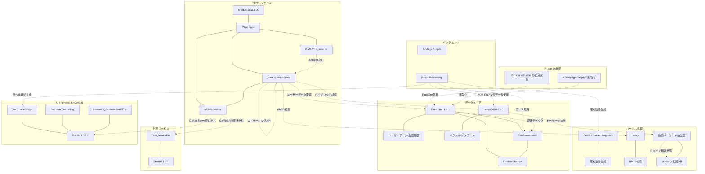
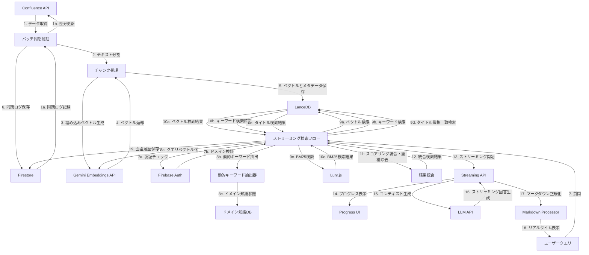
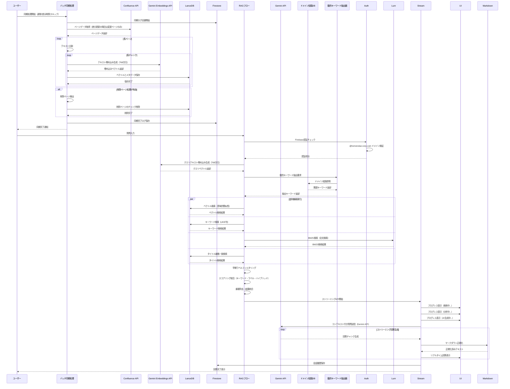

# Confluence Vector Search システム設計図 (LanceDB版)

このドキュメントでは、LanceDBを使用したConfluence Vector Search システムのコンポーネント図、データフロー図、シーケンス図を示します。

**最終更新**: 2025年1月  
**ステータス**: ✅ 最新仕様に更新済み（`page_id`マイグレーション完了、Gemini Embeddings API使用）

## 更新履歴
- **2025年11月**: page_idマイグレーション完了 - パフォーマンス最適化
  - pageId → page_id マイグレーション完了: スカラーインデックス対応のためフィールド名を変更
  - スカラーインデックス作成: `page_id`フィールドにスカラーインデックスを設定
  - パフォーマンス向上: `getAllChunksByPageId`が14秒 → 5msに高速化（99.96%改善）
  - API互換性: 変換レイヤー（pageid-migration-helper.ts）によりAPIレスポンスでは`pageId`を維持
  - アーカイブ整理: 未使用ファイルを`src/lib/archive/`と`scripts/archive/`に移動
  - 型チェック・ビルド: すべての型エラーを解消、ビルドが正常に完了
- **2025年10月**: Phase 5完了 - パフォーマンス最適化と品質強化
  - 並列検索実装: ベクトル検索とBM25検索の並列実行（品質維持100%）
  - ハイブリッド検索強化: RRF融合 + Composite Scoring実装
  - 検索重み配分最適化: BM25(50%) + タイトル(25%) + ラベル(15%) + ベクトル(5%)
  - Knowledge Graph: 実装完了も無効化（パフォーマンス優先）
  - Structured Label: 部分実装（Genkit Flowで自動生成可能）
  - ドメイン知識: 9,126個のキーワードに拡大（+1,004個）
  - Genkit部分統合: 3つのFlows実装（auto-label, retrieve-docs, streaming-summarize）
  - LanceDB接続プーリング、検索キャッシュ拡大（TTL 15分、maxSize 5000）
  - startup-optimizerによるウォームアップ処理

- **2025年1月**: 現在の実装に合わせて最新化
  - ストリーミング機能: リアルタイム回答生成とプログレス表示
  - Firebase認証: @tomonokai-corp.com ドメイン制限
  - マークダウン表示: 高度な正規化とテーブル表示機能
  - 会話履歴: Firestore統合による永続化
  - 技術スタック: Next.js 15.3.3, React 18.3.1, Firebase 11.9.1
  - 埋め込みモデル: Gemini Embeddings API (text-embedding-004、768次元)
  - LLM: Gemini API（用途別使い分け）
  - ハイブリッド検索: ベクトル検索 + BM25検索 + タイトル救済検索
  - 日本語対応: Kuromojiトークナイザー使用
  - スキーマ: `page_id` (int64型) を使用（スカラーインデックス対応）
  - API互換性: 変換レイヤーによりAPIレスポンスでは`pageId` (string型)を維持

- **2024年12月**: 初期実装完了
  - 基本検索機能の実装
  - LanceDB統合
  - 基本的なUI/UX実装

## コンポーネント図

## データフロー図

## シーケンス図

## 実装フローの詳細

### 1. データ取得と処理
- Confluenceから全ページデータを取得（約1000ページ）
  - 差分更新モード（`--differential`）では前回の同期以降に更新されたページのみを取得
- テキストをチャンクに分割（合計約2500チャンク）
  - スマートチャンキング（1600文字、200文字オーバーラップ）
- 各チャンクの埋め込みベクトルを生成（Gemini Embeddings API使用、768次元）
- 生成したベクトルとメタデータをLanceDBに直接保存
  - スキーマ: `page_id` (int64型) を使用（スカラーインデックス対応）

### 2. データ保存
- LanceDBにベクトルとメタデータを保存（`.lancedb/`ディレクトリ）
  - メタデータには、タイトル、スペースキー、ラベル、コンテンツなどを含む
  - 検索時に必要なすべての情報をLanceDBに保存
- Firestoreには同期ログとユーザーデータのみ保存
  - 同期の開始・完了・エラー情報
  - ユーザーアカウント情報と会話履歴

### 3. ストリーミング検索と回答生成
- **認証・認可**: Firebase Authenticationでユーザー認証（@tomonokai-corp.com ドメイン制限）
- **クエリ処理**: ユーザーの質問をベクトル化（Gemini Embeddings API使用、768次元）
- **動的キーワード抽出**: ドメイン知識データベースから関連キーワードを抽出・分類
- **並列検索実行**: 複数検索ソースの組み合わせ：
  - **ベクトル検索**: LanceDBで類似ベクトル検索（意味的類似性）
  - **キーワード検索**: LanceDBのLIKE句によるタイトル・コンテンツ検索
  - **BM25検索**: Lunr.jsによる全文検索（BM25アルゴリズム）
  - **タイトル厳格一致検索**: タイトルがクエリに完全一致する検索
- **フィルタリング・統合**: 早期ラベルフィルタリング、スコアリング統合、重複除去
- **ストリーミング処理**: 
  - 段階的プログレス表示（検索中→分析中→AI生成中）
  - リアルタイム回答生成と表示
  - マークダウン正規化とテーブル表示の最適化
- **データ管理**: LanceDBから直接メタデータを取得、会話履歴をFirestoreに保存

## 技術スタック

- **フロントエンド**: Next.js 15.3.3 (React 18.3.1, TypeScript 5.9.2)
  - Tailwind CSS 3.4.1 + @tailwindcss/typography
  - Radix UI (Headless UI)
  - ReactMarkdown + remark-gfm
  - ストリーミングUI、マークダウンレンダラー
- **バックエンド**: Next.js API Routes + Node.js Scripts (tsx)
- **データベース**: 
  - Firestore 11.9.1（ユーザーデータ、会話履歴、ログ、認証データ）
  - LanceDB 0.22.0（ベクトルデータ、検索メタデータ）
- **認証**: Firebase Authentication 11.9.1
  - @tomonokai-corp.com ドメイン制限
  - Firestoreセキュリティルール
- **検索エンジン**: ハイブリッド検索システム（Phase 5強化版）
  - **ベクトル検索**: LanceDBによる意味的類似性検索（重み: 5%）
    - Gemini Embedding 768次元、コサイン類似度
    - タイトル重複埋め込み（3回繰り返し）
    - スマートチャンキング（1600文字、200文字オーバーラップ）
  - **BM25検索**: Lunr.js 2.3.9による全文検索（重み: 50% - 最優先）
    - Okapi BM25アルゴリズム、Kuromojiトークナイザー
    - 日本語形態素解析対応
  - **タイトル救済検索**: LanceDB LIKE検索（重み: 25%）
    - 1語、2語、3語組み合わせによる候補生成
    - 超強力スコアブースト（titleMatchRatio ≥ 0.9）
  - **スコアリング**: RRF融合 + Composite Scoring
    - 複合スコア = BM25(50%) + タイトル(25%) + ラベル(15%) + ベクトル(5%)
    - 早期ラベルフィルタリング、page_id単位での重複除去（DB側は`page_id`、API側は`pageId`を維持）
  - **並列検索実行**: ベクトル検索とBM25検索の並列処理（Phase 5）
- **ストリーミング**: リアルタイム回答生成とプログレス表示（4段階）
- **ベクトル生成**: Gemini Embeddings API (text-embedding-004、768次元)
- **LLM**: Google AI Gemini API（用途別使い分け）
  - **gemini-2.5-flash**: メイン処理（ストリーミング回答生成）
    - temperature: 0.1, maxOutputTokens: 4096
  - **gemini-2.0-flash**: ラベル自動生成
    - temperature: 0.1, maxOutputTokens: 500（一貫性重視）
- **AI Framework**: Genkit 1.19.2（部分統合）
  - 実装済みFlows: auto-label-flow, retrieve-relevant-docs-lancedb, streaming-summarize-confluence-docs
  - 直接Gemini API: メインの回答生成処理
  - Genkit Dev UI: 開発・デバッグ用（http://localhost:4000）

## コンポーネントの詳細説明

### フロントエンド
- **Next.js 15.3.3 UI**: React 18.3.1ベースのフロントエンドフレームワーク
- **Chat Page**: ユーザーとのチャットインターフェース
- **RAG Components**: 検索結果表示や回答生成のUIコンポーネント
- **Streaming UI**: リアルタイム回答生成とプログレス表示
- **Markdown Renderer**: 高度な正規化とテーブル表示機能

### バックエンド
- **Next.js API Routes**: フロントエンドからのAPIリクエストを処理
- **Streaming API Routes**: リアルタイム回答生成のためのストリーミングAPI
- **AI API Routes**: Gemini APIとの直接連携（Genkit統合予定）
- **Node.js Scripts**: バッチ処理やスケジュールされたタスクを実行
- **Batch Processing**: Confluenceデータの定期同期処理

### データストア
- **Firestore 11.9.1**: ユーザーデータ、会話履歴、同期ログ、認証データを保存
  - @tomonokai-corp.com ドメイン制限
  - セキュリティルールによる適切なアクセス制御
- **LanceDB 0.22.0**: ローカルベクトルデータベース（埋め込みベクトルとメタデータを保存）
  - ベクトル検索と検索結果表示に必要なすべてのデータを一元管理
  - スキーマ: `page_id` (int64型) を使用（スカラーインデックス対応）
  - パフォーマンス: `getAllChunksByPageId`が14秒 → 5msに高速化（99.96%改善）

### 外部サービス
- **Confluence API**: ドキュメントのソースデータを提供
- **Content Source**: ページ、スペース、ラベルなどの構造化コンテンツ
- **Google AI APIs**: AIモデルへのアクセスを提供
- **Gemini LLM**: 質問応答と要約生成のための大規模言語モデル（gemini-2.5-flash）

### ローカル処理
- **Gemini Embeddings API**: 埋め込みベクトル生成
  - text-embedding-004モデル使用（768次元）
  - Google AI APIによる高品質な埋め込み生成
  - キャッシュ機能により効率的な利用
- **Lunr.js**: ローカルでのBM25全文検索
  - 軽量なJavaScript検索ライブラリ
  - インデックス構築とBM25アルゴリズムによる関連性スコアリング
  - 日本語テキスト対応（Kuromojiトークナイザー使用）

- **ドメイン知識データベース**: システム仕様書から抽出された構造化知識（Phase 0A拡張）
  - **9,126個のキーワードを管理**（2025年10月時点）
  - **6つのカテゴリと詳細内訳:**
    - ドメイン名: 260個（教室管理、求人管理、会員管理など）
    - 機能名: 2,058個
    - 操作名: 700個
    - システム項目: 3,699個
    - システム用語: 2,102個
    - 関連キーワード: 2,470個
  - 重複削除機能による高品質な知識ベース
  - データファイル: `data/domain-knowledge-v2/`

- **動的キーワード抽出器**: クエリに応じた動的なキーワード抽出
  - ドメイン知識データベースから関連キーワードを抽出
  - 動的優先度管理による検索精度向上
  - クエリの意図に応じた適切なキーワード分類

### Phase 0A機能（実装済み）

- **Knowledge Graph（Phase 0A-2）**: 🔴 **無効化済み**
  - **実装状況**: 完了（ノード679件、エッジ24,208件）
  - **保存場所**: Firestore (`knowledge_graph_nodes`, `knowledge_graph_edges`)
  - **無効化理由**: パフォーマンス悪化（9.2秒のオーバーヘッド）に対して品質向上なし
    - KG有効時: 検索時間 10.05秒、発見率 100%
    - KG無効化後: 検索時間 0.88秒（-91%改善）、発見率 100%（変化なし）
  - **実装コンポーネント**: 
    - `kg-storage-service.ts`: Firestoreストレージ
    - `kg-search-service.ts`: 1-hop参照取得
    - `kg-reference-extractor.ts`: 参照関係抽出
    - `scripts/build-knowledge-graph.ts`: グラフ構築
  - **将来計画**: デュアルモード検索（高速モード/詳細分析モード）
    - 参考: OpenAI o1の「Thinking Mode」

- **Structured Label System（Phase 0A-1）**: 🟡 **部分実装**
  - **実装状況**: Genkit Flowによる自動生成機能完成
  - **スキーマ**: category, domain, feature, priority, status, version, tags
  - **生成方法**: 
    - ルールベース（80%のケース、信頼度 0.9）
    - LLMベース（20%のケース、Gemini 2.0 Flash使用）
  - **使用状況**: 検索では既存の `labels: string[]` を使用
  - **実装コンポーネント**:
    - `ai/flows/auto-label-flow.ts`: Genkit Flow
    - `structured-label-service.ts`: Firestore保存
    - `scripts/generate-structured-labels.ts`: 一括生成
  - **保存場所**: Firestore (`structuredLabels`コレクション）

## 環境別の構成

### ローカル開発環境

| 項目 | 設定 |
|------|------|
| **ポート** | 9003 (main) / 9004 (phase-0a) |
| **データ配置** | ローカルファイルシステム（`.lancedb/`） |
| **環境変数** | `.env.local` |
| **データ同期** | 手動実行（`npm run sync:confluence`） |
| **実行環境** | Node.js + Next.js Dev Server |
| **認証** | Firebase Auth（同一プロジェクト） |

### 本番環境（Firebase App Hosting）

| 項目 | 設定 |
|------|------|
| **ポート** | 443 (HTTPS) |
| **データ配置** | Cloud Storage経由（ダウンロードまたは直接読み込み） |
| **環境変数** | `apphosting.yaml` + Firebase Secrets |
| **インスタンス設定** | minInstances: 1, maxInstances: 4 memory: 4GB, cpu: 2 |
| **実行環境** | Gen1（Gen2でロールバック） |
| **データ同期** | Cloud Functions（自動） - dailyDifferentialSync - weeklyFullSync |
| **デプロイ** | mainブランチpush時に自動デプロイ |
| **認証** | Firebase Auth（@tomonokai-corp.comドメイン制限） |
| **ビルド時処理** | `conditional-download.js` + `copy-kuromoji-dict.js` |

### 環境間の主な違い

1. **データ配布方法**
   - ローカル: ローカルファイルシステムに直接保存
   - 本番: Cloud Storageから配布（`SKIP_DATA_DOWNLOAD=false`）

2. **データ同期**
   - ローカル: 手動実行（npm scripts）
   - 本番: Cloud Functions（cron）による自動実行（asia-northeast1）

3. **パフォーマンス**
   - ローカル: ディスク直接アクセス
   - 本番: ビルド時ダウンロード → ローカルファイルシステムにキャッシュ

4. **リージョン構成**
   - Cloud Storage: US-CENTRAL1（米国）
   - Firestore: asia-northeast1（東京）
   - App Hosting: us-central1（米国）
   - **注意**: リージョン不整合による潜在的なレイテンシ影響あり