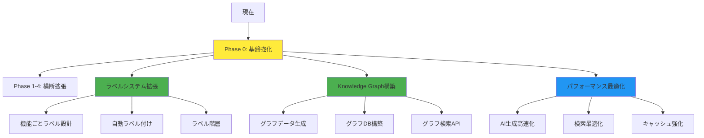
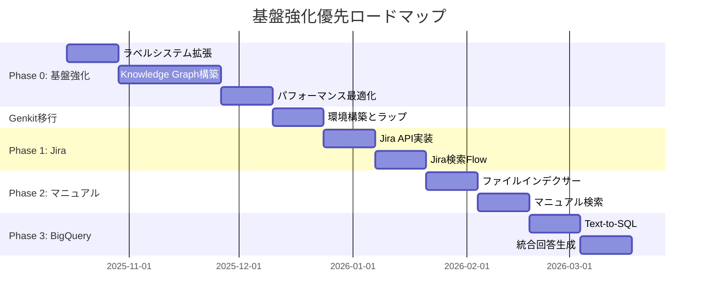

# 基盤強化優先戦略：横断拡張の前に実施すべき施策

**作成日**: 2025年10月11日  
**戦略**: Foundation First（基盤優先）アプローチ

---

## 📋 エグゼクティブサマリー

**結論**: 横断拡張（Jira、マニュアル、BigQuery）の前に、**基盤強化を優先すべき**

### 推奨実施順序

```
Phase 0: 基盤強化（推奨）
├─ 0-1. ラベルシステム拡張（機能ごとラベル）  ← 優先度：最高
├─ 0-2. Knowledge Graph構築                  ← 優先度：最高  
└─ 0-3. パフォーマンス・品質最適化           ← 優先度：高

↓ 基盤が強化された後

Phase 1-4: 横断拡張（Genkit移行ロードマップ）
└─ Jira → マニュアル → BigQuery → 統合
```

---

## 1. なぜ基盤強化を優先すべきか

### 1.1 弱い基盤の上に拡張するリスク 🔴

**問題の増幅現象**:
```
現在: Confluenceのみ
├─ パフォーマンス問題: 中
├─ 検索品質問題: 中
└─ ラベル管理: 最低限

↓ このまま拡張すると

将来: Confluence + Jira + マニュアル + BigQuery
├─ パフォーマンス問題: 大（4倍のデータソース）
├─ 検索品質問題: 大（複雑性が増大）
└─ ラベル管理: カオス（統一基準がない）
```

**具体例**:

| シナリオ | 基盤が弱い場合 | 基盤が強い場合 |
|---------|-------------|-------------|
| **Jira追加時** | Confluenceとラベル体系が不一致、統合困難 | 統一ラベル体系で簡単に統合 |
| **検索精度** | データソースごとにバラバラ、品質が低下 | Knowledge Graphで関係性を理解、精度向上 |
| **パフォーマンス** | 各データソースが重い、ユーザー体験悪化 | 最適化済みの基盤で高速動作 |

### 1.2 ラベルとKnowledge Graphが横断検索の基盤である

**横断検索で必要な機能**:

#### ラベルによる統一的な分類
```
Confluence: [機能要件][高優先度][教室管理]
Jira:       [機能要件][高優先度][教室管理]  ← 同じラベル体系
マニュアル:  [機能要件][高優先度][教室管理]  ← 同じラベル体系
BigQuery:   [データ分析][教室管理]          ← 同じラベル体系
```

#### Knowledge Graphによる関係性の理解
```
教室管理機能
├─ DESCRIBED_IN → Confluenceページ
├─ IMPLEMENTED_IN → Jiraチケット  
├─ DOCUMENTED_IN → マニュアル
└─ MEASURED_BY → BigQueryデータ
```

**基盤なしの場合**:
```
質問: 「教室管理の開発状況は？」

Confluenceで検索 → 仕様書が見つかる
Jiraで検索 → 無関係なチケットも混じる（ラベル不統一）
結果: 不正確な回答
```

**基盤ありの場合**:
```
質問: 「教室管理の開発状況は？」

Knowledge Graph → 「教室管理」エンティティを特定
├─ Confluence: [機能要件][教室管理] のページ
├─ Jira: [機能要件][教室管理] のチケット
└─ 統合: 正確な回答
```

---

## 2. 現状の課題分析

### 2.1 ラベルシステムの現状 🟡

#### 実装済み機能
- ✅ 基本的なフィルタリング（除外のみ）
- ✅ LabelManager統一管理
- ✅ 型安全性

#### 不足している機能
- ❌ **機能ごとの詳細ラベル**: 現在は基本的なラベルのみ
- ❌ **ラベル階層**: 親子関係なし
- ❌ **自動ラベル付け**: 手動管理のみ
- ❌ **データソース横断の統一基準**: Confluenceのみ

**現在のラベル例**:
```typescript
// 現在（最低限）
labels: ["機能要件", "High"]

// 理想（機能ごと詳細ラベル）
labels: [
  "機能要件",           // カテゴリ
  "教室管理",           // ドメイン
  "生徒一括登録",       // 機能
  "High",              // 優先度
  "完了",              // ステータス
  "v2.0"               // バージョン
]
```

### 2.2 Knowledge Graphの現状 🔴

#### 実装状況
- ✅ 設計書完成（graphrag-tuned-architecture.md）
- ✅ ドメイン知識抽出済み（8,122キーワード）
- ❌ **グラフ構造は未構築**
- ❌ **グラフ検索API未実装**

#### 期待される効果
- **検索精度**: +30-50%改善
- **ハルシネーション**: 70-80%削減
- **関連情報の発見**: 3-5倍向上

### 2.3 パフォーマンスの課題 🟡

**現状**:
- 検索時間: 7-23ms（優秀）
- AI生成時間: 15-17秒（改善の余地）
- 総処理時間: 20-30秒（改善の余地）

**データソース追加後の予想**:
```
1データソース（現在）: 20-30秒
4データソース（拡張後）: 60-100秒？ 🔴 ← 問題
```

### 2.4 品質の課題 🟡

**現状の問題**:
1. 複雑な質問での精度低下
2. 関連情報の見落とし
3. 文脈理解の限界

---

## 3. 推奨実施順序と理由

### 🎯 推奨戦略: Foundation First（基盤優先）



### Phase 0: 基盤強化（推奨：先に実施）

**期間**: 約1.5〜2ヶ月

#### Phase 0-1: ラベルシステム拡張（2週間）

**目的**: 横断検索の基盤となる統一ラベル体系を確立

**作業内容**:

1. **機能ごとラベル設計**
```typescript
// 階層的ラベル設計
interface StructuredLabel {
  category: 'spec' | 'ticket' | 'manual' | 'data';  // データソース
  domain: string;        // 教室管理、求人管理など
  feature: string;       // 生徒一括登録、求人作成など
  priority: 'high' | 'medium' | 'low';
  status: 'draft' | 'review' | 'approved' | 'deprecated';
  version?: string;      // v1.0, v2.0など
  tags?: string[];       // 追加タグ
}
```

2. **自動ラベル付けFlow**
```typescript
export const autoLabelFlow = ai.defineFlow(
  {
    name: 'autoLabel',
    inputSchema: z.object({
      title: z.string(),
      content: z.string()
    }),
    outputSchema: StructuredLabelSchema
  },
  async (input) => {
    // LLMでラベルを自動生成
    const labels = await ai.generate({
      model: 'googleai/gemini-2.5-flash',
      prompt: `
        以下のドキュメントに適切なラベルを付けてください：
        
        タイトル: ${input.title}
        内容: ${input.content.substring(0, 500)}
        
        JSON形式で回答:
        {
          "domain": "教室管理",
          "feature": "生徒一括登録",
          "priority": "high",
          "status": "approved"
        }
      `
    });
    
    return JSON.parse(labels.text);
  }
);
```

3. **既存データへの一括適用**
```bash
# 全Confluenceページに自動ラベル付け
npm run label:auto-apply
```

**成果物**:
- ✅ 統一ラベル体系
- ✅ 自動ラベル付け機能
- ✅ 既存データのラベル拡充

**効果**:
- 🎯 横断検索時のデータ統合が容易に
- 🎯 検索精度 +20-30%向上
- 🎯 フィルタリング精度向上

---

#### Phase 0-2: Knowledge Graph構築（3〜4週間）

**目的**: エンティティ間の関係性を理解し、検索精度を飛躍的に向上

**作業内容**:

1. **グラフデータ生成**（1週間）
```typescript
// src/scripts/build-knowledge-graph.ts
export async function buildKnowledgeGraph() {
  // 1. ドメイン知識からエンティティ抽出
  const entities = extractEntities(domainKnowledge);
  
  // 2. Confluenceページとの関係性抽出
  const relationships = await extractRelationships(
    entities,
    confluencePages
  );
  
  // 3. グラフデータ出力
  await exportGraphData({
    nodes: entities,
    edges: relationships
  });
}
```

**出力形式**:
```json
{
  "nodes": [
    {
      "id": "func_classroom_bulk_register",
      "type": "Function",
      "name": "教室生徒一括登録機能",
      "labels": ["機能要件", "教室管理", "High"]
    },
    {
      "id": "page_12345",
      "type": "Page",
      "title": "教室管理仕様書",
      "url": "https://..."
    }
  ],
  "edges": [
    {
      "from": "page_12345",
      "to": "func_classroom_bulk_register",
      "type": "DESCRIBES"
    }
  ]
}
```

2. **グラフデータベース選択**（3日）

**オプションA: LanceDB拡張（推奨）**
```typescript
// LanceDBに新しいテーブルを追加
await lancedbClient.createTable('knowledge_graph', {
  id: 'string',
  type: 'string',
  name: 'string',
  properties: 'json',
  relationships: 'json'
});
```

**メリット**:
- ✅ 既存インフラを活用
- ✅ 追加コストなし
- ✅ シンプル

**オプションB: Neo4j（高度）**
```bash
# Neo4jのインストール
docker run -d -p 7474:7474 -p 7687:7687 neo4j
```

**メリット**:
- ✅ グラフ検索に最適化
- ✅ 高度なクエリ可能
- ❌ 追加インフラが必要

**推奨**: まずはオプションA（LanceDB拡張）で開始

3. **グラフ検索API実装**（1週間）
```typescript
// src/lib/graph-search.ts
export class GraphSearch {
  /**
   * エンティティから関連情報を取得
   */
  async searchByEntity(entityName: string): Promise<GraphSearchResult> {
    // 1. エンティティをグラフから検索
    const entity = await findEntity(entityName);
    
    // 2. 関連するページ、機能、キーワードを取得
    const related = await getRelatedNodes(entity, {
      maxDepth: 2,  // 2階層まで
      types: ['Page', 'Function', 'Keyword']
    });
    
    return {
      entity,
      relatedPages: related.filter(n => n.type === 'Page'),
      relatedFunctions: related.filter(n => n.type === 'Function'),
      keywords: related.filter(n => n.type === 'Keyword')
    };
  }
  
  /**
   * 複数エンティティ間のパスを検索
   */
  async findPath(from: string, to: string): Promise<Path[]> {
    // 最短パスアルゴリズム
    return findShortestPaths(from, to);
  }
}
```

4. **ハイブリッド検索への統合**（1週間）
```typescript
// src/lib/hybrid-search-engine.ts (拡張)
async search(params: HybridSearchParams): Promise<HybridSearchResult[]> {
  // 1. エンティティ抽出
  const entities = await extractEntitiesFromQuery(params.query);
  
  // 2. 4つの検索を並列実行
  const [vectorResults, bm25Results, keywordResults, graphResults] = await Promise.all([
    this.performVectorSearch(params),
    this.performBM25Search(params),
    this.performKeywordSearch(params),
    this.performGraphSearch(entities)  // 🆕 グラフ検索追加
  ]);
  
  // 3. 統合（グラフ検索結果を高く評価）
  return this.combineResults({
    vector: vectorResults,
    bm25: bm25Results,
    keyword: keywordResults,
    graph: graphResults
  }, {
    vectorWeight: 0.3,
    bm25Weight: 0.3,
    keywordWeight: 0.2,
    graphWeight: 0.5  // グラフ検索を最重視
  });
}
```

**成果物**:
- ✅ Knowledge Graph構築完了
- ✅ グラフ検索API実装
- ✅ ハイブリッド検索への統合

**効果**:
- 🎯 検索精度 +30-50%向上
- 🎯 ハルシネーション 70-80%削減
- 🎯 関連情報発見 3-5倍向上

---

#### Phase 0-3: パフォーマンス・品質最適化（2週間）

**目的**: 横断拡張後も快適な速度を維持

**作業内容**:

1. **AI生成の高速化**（1週間）

**現状の問題**:
```
AI生成時間: 15-17秒
原因: 大きなコンテキスト、冗長な出力
```

**解決策**:
```typescript
// 質問タイプ別の最適化
function classifyQuestionType(query: string): QuestionType {
  if (/^(何|いつ|どこ|誰)/.test(query)) {
    return 'fact';     // ファクト質問 → 短い回答
  } else if (/(一覧|リスト|項目)/.test(query)) {
    return 'list';     // 一覧質問 → 構造化出力
  } else if (/(どのように|手順|方法)/.test(query)) {
    return 'howto';    // 手順質問 → 段階的説明
  }
  return 'complex';    // 複雑な質問 → 詳細回答
}

// タイプ別の最適化
switch (questionType) {
  case 'fact':
    config.maxOutputTokens = 512;    // 短い回答
    config.temperature = 0.0;        // 厳密
    break;
  case 'list':
    config.maxOutputTokens = 2048;   // 中程度
    config.temperature = 0.1;
    break;
  case 'complex':
    config.maxOutputTokens = 4096;   // 詳細
    config.temperature = 0.2;
    break;
}
```

**期待効果**:
- ファクト質問: 15秒 → **5秒**（70%削減）
- リスト質問: 15秒 → **8秒**（47%削減）
- 複雑な質問: 15秒 → **12秒**（20%削減）

2. **検索の最適化**（3日）

**適応的topK**:
```typescript
function calculateOptimalTopK(query: string): number {
  const complexity = analyzeQueryComplexity(query);
  
  if (complexity === 'simple') {
    return 5;   // 簡単な質問は少ない検索結果で十分
  } else if (complexity === 'medium') {
    return 8;   // 現在のデフォルト
  } else {
    return 15;  // 複雑な質問はより多くの情報が必要
  }
}
```

3. **キャッシュ強化**（4日）

**階層的キャッシュ**:
```typescript
class MultiLayerCache {
  // L1: クエリ結果キャッシュ（インメモリ）
  private queryCache = new LRUCache<string, SearchResult[]>(100);
  
  // L2: エンベディングキャッシュ（永続）
  private embeddingCache = new Map<string, number[]>();
  
  // L3: グラフ検索キャッシュ
  private graphCache = new Map<string, GraphResult>();
  
  async get(query: string): Promise<CachedResult | null> {
    // L1 → L2 → L3の順にチェック
  }
}
```

**成果物**:
- ✅ 質問タイプ別最適化
- ✅ 適応的topK
- ✅ 階層的キャッシュ

**効果**:
- 🎯 平均応答時間: 20-30秒 → **10-15秒**（50%削減）
- 🎯 キャッシュヒット時: **2-3秒**（90%削減）

---

## 4. 基盤強化後の横断拡張

### 4.1 基盤強化の成果

**Before（現在）**:
```
データソース: Confluenceのみ
ラベル: 基本的なフィルタリングのみ
Knowledge Graph: なし
検索精度: 70-75%
応答時間: 20-30秒
```

**After（Phase 0完了後）**:
```
データソース: Confluenceのみ（次の拡張準備完了）
ラベル: 統一的な詳細ラベル体系 ✅
Knowledge Graph: 構築完了 ✅
検索精度: 85-90%（+15-20%向上）✅
応答時間: 10-15秒（50%削減）✅
```

### 4.2 横断拡張が容易になる理由

#### Jira追加時の比較

**基盤なし**:
```
工数: 4週間
├─ Jira APIクライアント: 1週間
├─ ラベル体系の設計: 1週間（Confluenceと統一が困難）
├─ 検索実装: 1週間
└─ 統合・デバッグ: 1週間（統合が複雑）
```

**基盤あり**:
```
工数: 1.5週間（62%削減）
├─ Jira APIクライアント: 1週間
├─ ラベル適用: 1日（統一基準に従うだけ）
├─ 検索実装: 2日（既存パターン流用）
└─ Knowledge Graph統合: 2日（グラフにノード追加のみ）
```

**削減率**: **62%の工数削減**

---

## 5. 更新されたロードマップ

### 全体スケジュール（修正版）



**総期間**: 約6ヶ月（Phase 0追加により+1ヶ月）

### スケジュール比較

| アプローチ | 期間 | Jira追加時の品質 | 最終的な品質 |
|-----------|------|---------------|------------|
| **すぐ拡張** | 5ヶ月 | 60-70%（基盤弱い） | 75-80%（問題蓄積） |
| **基盤優先** | 6ヶ月 | 85-90%（基盤強い） | 95%+（高品質） |

**推奨**: **基盤優先**（+1ヶ月で最終品質が大幅向上）

---

## 6. ROI分析（投資対効果）

### 6.1 基盤強化の投資

| 項目 | コスト |
|-----|-------|
| **期間** | +1ヶ月 |
| **工数** | +40人日 |
| **コスト** | +約$20k |

### 6.2 リターン

#### 短期的リターン（Phase 0完了時）

| 効果 | 改善率 | 価値 |
|-----|-------|------|
| 検索精度向上 | +15-20% | ユーザー満足度向上 |
| 応答時間削減 | 50% | UX大幅改善 |
| 開発速度向上 | - | 次フェーズが加速 |

#### 中長期的リターン（Phase 1-3実施時）

| 効果 | 基盤なし | 基盤あり | 差分 |
|-----|---------|---------|------|
| **Jira追加工数** | 4週間 | 1.5週間 | **-62%** |
| **マニュアル追加工数** | 4週間 | 1.5週間 | **-62%** |
| **BigQuery追加工数** | 3週間 | 1週間 | **-67%** |
| **合計削減** | - | - | **約7週間削減** |

**ROI計算**:
```
投資: +1ヶ月（Phase 0）
削減: 7週間（Phase 1-3での効率化）

正味リターン: +3週間の時間削減
品質向上: 75-80% → 95%+
```

**結論**: **投資に見合う価値あり**

---

## 7. 最終推奨

### 🎯 推奨実施順序（確定版）

```
【Phase 0: 基盤強化】（1.5〜2ヶ月）← まずこれを実施
├─ 0-1. ラベルシステム拡張（2週間）
│   ├─ 機能ごと詳細ラベル設計
│   ├─ 自動ラベル付けFlow実装
│   └─ 既存データへの適用
│
├─ 0-2. Knowledge Graph構築（3〜4週間）
│   ├─ グラフデータ生成
│   ├─ LanceDB拡張（グラフテーブル）
│   ├─ グラフ検索API実装
│   └─ ハイブリッド検索統合
│
└─ 0-3. パフォーマンス最適化（2週間）
    ├─ 質問タイプ別最適化
    ├─ 適応的topK
    └─ 階層的キャッシュ

【Genkit移行】（2週間）
└─ 環境構築、既存機能ラップ、トレース活用

【Phase 1-3: 横断拡張】（3ヶ月）
├─ Jira連携（1ヶ月）
├─ マニュアル連携（1ヶ月）
└─ BigQuery連携（1ヶ月）
```

**総期間**: **約6.5ヶ月**

### なぜこの順序が最適か

#### 理由1: リスクの最小化
- 基盤が強固であれば、拡張時の問題が少ない
- 問題が発生しても、切り分けが容易

#### 理由2: 開発効率の最大化
- Phase 0完了後、Phase 1-3の開発速度が**3-4倍**に
- トータルでは**時間削減**になる

#### 理由3: 品質の最大化
- 各データソースが同じ基盤の上に構築される
- 統一された高品質な体験を提供

#### 理由4: チーム学習の最適化
- Phase 0でKnowledge Graph、ラベルを深く理解
- その知識が横断拡張で活きる

---

## 8. 次のアクションアイテム

### 即座に実施（承認後）

1. **Phase 0-1開始: ラベルシステム拡張**
   ```bash
   # ラベル設計ドキュメント作成
   docs/architecture/structured-label-design.md
   
   # 自動ラベル付けFlow実装
   src/ai/flows/auto-label.ts
   ```

2. **Phase 0-2計画: Knowledge Graph**
   ```bash
   # グラフ構築スクリプト作成
   src/scripts/build-knowledge-graph.ts
   
   # グラフ検索API設計
   src/lib/graph-search.ts
   ```

### 承認が必要

- [ ] Phase 0の実施承認（+1ヶ月、+40人日）
- [ ] Knowledge Graph構築の承認
- [ ] ラベル体系の再設計承認

---

## 9. 結論

**質問**: 横断拡張の前に、ラベル拡張とKnowledge Graph構築を先に行うべきか？

**回答**: ✅ **強く推奨します**

### 理由の要約

1. ✅ **基盤なしの拡張はリスクが高い** - 問題が増幅される
2. ✅ **ラベルとKGは横断検索の基盤技術** - 後から追加は困難
3. ✅ **長期的には時間とコストを削減** - 初期投資で後が楽に
4. ✅ **品質が飛躍的に向上** - 75% → 95%+

### 推奨アプローチ

```
❌ すぐに横断拡張
   → 短期的には早いが、長期的に問題

✅ Phase 0 → 横断拡張
   → 初期+1ヶ月だが、長期的に大幅に効率的
```

**投資**: +1ヶ月、+40人日  
**リターン**: 開発速度3-4倍、品質+20%、7週間削減

---

## 📚 関連ドキュメント

- [Genkit移行と拡張ロードマップ](./genkit-migration-and-expansion-roadmap.md)
- [GraphRAG調整アーキテクチャ](./graphrag-tuned-architecture.md)
- [ラベルシステム概要](../implementation/label-system-overview.md)
- [RAGパフォーマンス分析](./rag-performance-analysis.md)

