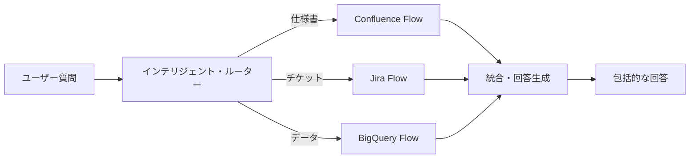
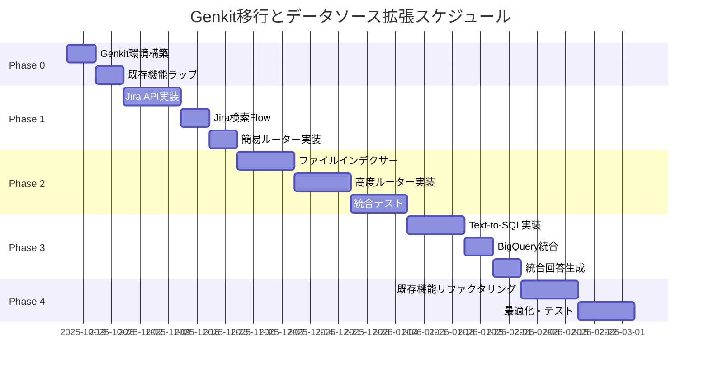

# AIチャットボット拡張計画および技術基盤移行プラン

**作成日**: 2025年10月11日  
**対象システム**: Confluence Vector Search → 統合インテリジェント業務アシスタント  
**技術移行**: 独自実装 → Genkit フレームワーク

---

## 📋 エグゼクティブサマリー

本計画は、現在のConfluence検索特化型チャットボットを、**社内のあらゆる情報を横断的に活用する「インテリジェント業務アシスタント」**へと進化させるための戦略的ロードマップである。

### 主要な目標

1. **データソースの拡大**: Confluence → Jira → 社内マニュアル → BigQuery
2. **技術基盤の移行**: 独自実装 → Genkit フレームワーク
3. **アーキテクチャの進化**: 検索ツール → 統合AIエージェント

### 実施期間

**合計**: 約5ヶ月（段階的実施）

---

## 1. 背景と目的

### 1.1 現状の成果

現在稼働中のConfluence APIをデータソースとしたハイブリッド検索チャットボットは、社内の仕様書検索において一定の成果を上げている。

**実装済みの機能**:
- ✅ ハイブリッド検索（ベクトル + BM25 + キーワード + タイトル一致）
- ✅ ドメイン知識抽出（8,122個のキーワード管理）
- ✅ ストリーミング回答生成
- ✅ Firebase認証とドメイン制限
- ✅ 会話履歴管理

**技術スタック**:
- Next.js 15.3.3 + React 18.3.1
- LanceDB 0.22.0（ベクトル検索）
- Lunr.js 2.3.9（BM25検索）
- Gemini 2.5 Flash（LLM）
- Firebase Functions（自動同期）

### 1.2 今後の拡張ニーズ

さらなる業務効率化を実現するため、以下のナレッジソースへの接続拡大が必要：

1. **Jira**: 開発チケット、タスク、バグ情報
2. **社内マニュアル**: PDF、Word、Excel等のファイル
3. **BigQuery**: 売上、KPI、定量的データ

### 1.3 現状アーキテクチャの課題

**拡張性の課題**:
- データソース追加ごとに認証・取得・整形処理を個別実装
- コードの肥大化とメンテナンス負荷の増大

**保守性の課題**:
- 処理フローの複雑化
- 特定開発者への依存（属人化リスク）

**デバッグの困難さ**:
- AIの回答生成プロセスがブラックボックス化
- 「なぜこの回答？」の追跡が困難

### 1.4 本計画の目的

これらの課題を解決し、以下を実現する：

1. **拡張可能なアーキテクチャ**: 新しいデータソースの追加が容易
2. **保守性の向上**: 構造化されたコード、属人化の解消
3. **デバッグ効率の向上**: 処理の完全な可視化
4. **ビジネス価値の最大化**: 統合的なナレッジアクセス

---

## 2. 将来的な拡張構想

### 2.1 目指すべき姿

**統合インテリジェント業務アシスタント**

ユーザーの問い合わせ例:
> 「新機能『〇〇』について、関連する仕様書（Confluence）と開発チケット（Jira）、さらにリリース後の関連売上データ（BigQuery）をまとめて教えて。」

**システムの動作**:


### 2.2 データソース別の活用例

| データソース | 問い合わせ例 | 提供情報 |
|------------|------------|---------|
| **Confluence** | 「ログイン機能の仕様は？」 | 機能仕様、画面設計、フロー図 |
| **Jira** | 「〇〇機能の開発状況は？」 | チケット状態、担当者、進捗 |
| **社内マニュアル** | 「新人研修の手順は？」 | 研修資料、手順書、FAQ |
| **BigQuery** | 「先月の売上推移は？」 | 売上データ、KPI、分析結果 |

### 2.3 統合による価値

**単一ソース検索**:
```
質問: 「ログイン機能の詳細は？」
→ Confluence検索のみ
→ 仕様書の内容を回答
```

**統合検索**:
```
質問: 「ログイン機能について、仕様と開発状況と利用状況をまとめて」
→ Confluence（仕様） + Jira（開発） + BigQuery（利用状況）
→ 包括的な回答を生成
```

---

## 3. Genkit採用の理由とメリット

### 3.1 Genkitとは

Googleが開発するオープンソースのAIアプリケーションフレームワーク
- **公式サイト**: https://firebase.google.com/docs/genkit
- **GitHub**: https://github.com/firebase/genkit
- **言語**: TypeScript/JavaScript
- **設計思想**: 構造化、可視化、拡張性

### 3.2 主要な機能

#### 1. Flows（フロー）

**処理の構造化**:
```typescript
export const confluenceSearchFlow = ai.defineFlow(
  {
    name: 'confluenceSearch',
    inputSchema: z.object({ query: z.string() }),
    outputSchema: z.object({ answer: z.string(), references: z.array(...) })
  },
  async (input) => {
    // 1. 検索
    const docs = await searchConfluence(input.query);
    // 2. AI生成
    const answer = await generateAnswer(input.query, docs);
    return { answer, references: docs };
  }
);
```

**メリット**:
- 処理の流れが明確
- 入出力が型安全
- テスト・デバッグが容易

#### 2. Plugins（プラグイン）

**多様な統合**:
```typescript
import { googleAI } from '@genkit-ai/googleai';
import { pinecone } from '@genkit-ai/pinecone';
import { langchain } from '@genkit-ai/langchain';

export const ai = genkit({
  plugins: [
    googleAI(),      // Gemini API
    pinecone(),      // ベクトルDB
    langchain(),     // LangChain統合
  ]
});
```

**メリット**:
- データソース追加が簡単
- ベストプラクティスが組み込み済み
- コミュニティのサポート

#### 3. Tracing（トレース）

**完全な可視化**:
```
開発者UI: http://localhost:4000
├─ Flow実行履歴
├─ 各ステップの入出力
├─ LLMプロンプトと回答
├─ 実行時間の計測
└─ エラーの詳細
```

**メリット**:
- AIの思考プロセスが可視化
- デバッグ時間の大幅短縮
- パフォーマンスボトルネックの特定

### 3.3 現状アーキテクチャとの比較

| 項目 | 現状（独自実装） | Genkit採用後 |
|-----|---------------|-------------|
| **新規データソース追加** | 数週間 | 数日 |
| **デバッグ効率** | ログを手動で追跡 | 開発者UIで自動可視化 |
| **コードの保守性** | 属人的 | 構造化・標準化 |
| **テスト容易性** | 難しい | 各Flowを個別テスト可能 |
| **学習コスト** | 独自知識が必要 | 公式ドキュメント・コミュニティ |

---

## 4. 段階的な拡張・移行ロードマップ

### フェーズ 0: 準備と現行機能のラップ

**期間**: 約0.5ヶ月（2週間）

#### 目的
既存システムに影響を与えずにGenkitの恩恵（特にトレース機能）を享受する

#### 作業内容

**Step 1: Genkit開発環境の構築**
```bash
# 既にインストール済み
npm install genkit @genkit-ai/googleai @genkit-ai/google-cloud

# 開発サーバー起動
npm run genkit:dev
# → http://localhost:4000 で開発者UIが起動
```

**Step 2: 既存処理のラップ**
```typescript
// src/ai/flows/confluence-search-wrapper.ts
export const confluenceSearchFlow = ai.defineFlow(
  {
    name: 'confluenceSearch',
    inputSchema: z.object({
      query: z.string(),
      topK: z.number().optional()
    }),
    outputSchema: z.object({
      answer: z.string(),
      references: z.array(z.any())
    })
  },
  async (input) => {
    // 既存のハイブリッド検索をそのまま呼び出す
    const results = await hybridSearchEngine.search({
      query: input.query,
      topK: input.topK || 8
    });
    
    // 既存のAI生成をそのまま呼び出す
    const answer = await summarizeConfluenceDocs({
      question: input.query,
      context: results
    });
    
    return {
      answer: answer.answer,
      references: answer.references
    };
  }
);
```

**Step 3: API Routeの更新**
```typescript
// src/app/api/genkit-chat/route.ts
import { confluenceSearchFlow } from '@/ai/flows/confluence-search-wrapper';

export async function POST(req: Request) {
  const { query } = await req.json();
  
  // Genkit Flowを実行（トレース自動記録）
  const result = await confluenceSearchFlow(query);
  
  return Response.json(result);
}
```

**Step 4: 開発者UIで動作確認**
- http://localhost:4000 でフローの実行を確認
- 各ステップの入出力を可視化
- パフォーマンス計測

#### 成果物
- ✅ Genkit開発環境の構築完了
- ✅ 既存機能がトレース可能に
- ✅ チームのGenkit習熟開始

#### リスク
🟢 **低** - 既存機能をラップするだけなので、影響は最小限

---

### フェーズ 1: 新機能のGenkitネイティブ実装（Jira連携）

**期間**: 約1ヶ月

#### 目的
新規開発を通じてチームのGenkit習熟度を向上させる

#### 作業内容

**Step 1: Jira APIクライアントの実装**
```typescript
// src/lib/jira-client.ts
export class JiraClient {
  async searchIssues(jql: string): Promise<JiraIssue[]> {
    // Jira REST API呼び出し
  }
  
  async getIssueDetails(issueKey: string): Promise<JiraIssue> {
    // チケット詳細取得
  }
}
```

**Step 2: Jira検索Flowの実装**
```typescript
// src/ai/flows/jira-search.ts
export const jiraSearchFlow = ai.defineFlow(
  {
    name: 'jiraSearch',
    inputSchema: z.object({
      query: z.string(),
      filters: z.object({
        project: z.string().optional(),
        status: z.array(z.string()).optional(),
        assignee: z.string().optional()
      }).optional()
    }),
    outputSchema: JiraSearchResultSchema
  },
  async (input) => {
    // 1. クエリからJQLを生成
    const jql = await generateJQL(input.query, input.filters);
    
    // 2. Jira検索実行
    const issues = await jiraClient.searchIssues(jql);
    
    // 3. ベクトル検索（タイトル・説明文）
    const vectorResults = await searchJiraVectors(input.query);
    
    // 4. ハイブリッド統合
    const combined = combineResults(issues, vectorResults);
    
    // 5. AI要約生成
    const summary = await ai.generate({
      model: 'googleai/gemini-2.5-flash',
      prompt: createJiraSummaryPrompt(input.query, combined)
    });
    
    return {
      answer: summary.text,
      tickets: combined
    };
  }
);
```

**Step 3: インテリジェント・ルーターの実装（簡易版）**
```typescript
// src/ai/flows/intelligent-router.ts
export const intelligentRouterFlow = ai.defineFlow(
  {
    name: 'intelligentRouter',
    inputSchema: z.object({ query: z.string() }),
    outputSchema: UnifiedResponseSchema
  },
  async (input) => {
    // 1. 質問の意図を分類
    const intent = await classifyIntent(input.query);
    
    // 2. 適切なFlowにルーティング
    if (intent.type === 'specification') {
      return await confluenceSearchFlow(input.query);
    } else if (intent.type === 'ticket') {
      return await jiraSearchFlow(input.query);
    } else if (intent.type === 'both') {
      // 両方を並列実行して統合
      const [confResult, jiraResult] = await Promise.all([
        confluenceSearchFlow(input.query),
        jiraSearchFlow(input.query)
      ]);
      return mergeResults(confResult, jiraResult);
    }
  }
);
```

**Step 4: UIの拡張**
```tsx
// データソース選択UI
<Select>
  <option value="all">すべて</option>
  <option value="confluence">仕様書</option>
  <option value="jira">チケット</option>
</Select>
```

#### 成果物
- ✅ Jira連携機能の完成
- ✅ ハイブリッド検索（Jira版）
- ✅ 簡易的なルーター実装
- ✅ チームのGenkit習熟

#### リスク
🟡 **中** - 新規機能だが、既存機能には影響なし

---

### フェーズ 2: RAGパイプラインの高度化と追加データソース対応

**期間**: 約1.5ヶ月

#### 目的
複数ソースを横断検索する基盤を確立する

#### 作業内容

**Step 1: 社内マニュアル（ファイル）インデクサー**
```typescript
// src/ai/flows/file-indexer.ts
export const fileIndexerFlow = ai.defineFlow(
  {
    name: 'fileIndexer',
    inputSchema: z.object({
      filePath: z.string(),
      fileType: z.enum(['pdf', 'docx', 'xlsx', 'pptx'])
    }),
    outputSchema: IndexResultSchema
  },
  async (input) => {
    // 1. ファイルからテキスト抽出
    const text = await extractTextFromFile(input);
    
    // 2. チャンク分割（1800文字）
    const chunks = splitIntoChunks(text);
    
    // 3. 埋め込み生成
    const embeddings = await generateEmbeddings(chunks);
    
    // 4. LanceDBに保存（新しいテーブル: 'manuals'）
    await lancedbClient.getTable('manuals').add(embeddings);
    
    return { status: 'indexed', chunks: chunks.length };
  }
);
```

**Step 2: ファイルサーバー監視とバッチ同期**
```typescript
// functions/src/file-sync.ts
export const dailyFileSync = onSchedule({
  schedule: '0 3 * * *',  // 毎日午前3時
  timeZone: 'Asia/Tokyo',
  memory: '4GiB'
}, async (event) => {
  // 1. ファイルサーバーから更新ファイルを検出
  const updatedFiles = await detectUpdatedFiles();
  
  // 2. 各ファイルをインデックス
  for (const file of updatedFiles) {
    await fileIndexerFlow({ 
      filePath: file.path, 
      fileType: file.type 
    });
  }
});
```

**Step 3: インテリジェント・ルーターの本格実装**
```typescript
// src/ai/flows/advanced-router.ts
export const advancedRouterFlow = ai.defineFlow(
  {
    name: 'advancedRouter',
    inputSchema: z.object({ query: z.string() }),
    outputSchema: UnifiedResponseSchema
  },
  async (input) => {
    // 1. LLMで質問の意図を深く分析
    const analysis = await ai.generate({
      model: 'googleai/gemini-2.5-flash',
      prompt: `
        以下の質問を分析し、必要な情報源を判断してください：
        
        質問: ${input.query}
        
        情報源の候補:
        - confluence: 仕様書、設計書
        - jira: 開発チケット、タスク
        - manuals: 社内マニュアル、手順書
        - bigquery: 売上データ、KPI
        
        JSON形式で回答してください:
        {
          "sources": ["confluence", "jira"],
          "priority": ["confluence"],
          "reason": "理由"
        }
      `
    });
    
    const intent = JSON.parse(analysis.text);
    
    // 2. 必要なFlowを並列または段階的に実行
    const results = await Promise.all(
      intent.sources.map(source => {
        switch(source) {
          case 'confluence': return confluenceSearchFlow(input);
          case 'jira': return jiraSearchFlow(input);
          case 'manuals': return manualSearchFlow(input);
          default: return null;
        }
      })
    );
    
    // 3. 結果を統合
    return mergeMultiSourceResults(results, intent.priority);
  }
);
```

#### 成果物
- ✅ 社内マニュアル連携
- ✅ インテリジェント・ルーター完成
- ✅ 複数ソース横断検索

#### リスク
🟡 **中** - ファイル処理の複雑性、ルーターロジックの精度調整が必要

---

### フェーズ 3: 構造化データ連携（BigQuery）

**期間**: 約1ヶ月

#### 目的
定量的なデータに基づいた回答能力を獲得する

#### 作業内容

**Step 1: Text-to-SQL Flow**
```typescript
// src/ai/flows/text-to-sql.ts
export const textToSQLFlow = ai.defineFlow(
  {
    name: 'textToSQL',
    inputSchema: z.object({
      query: z.string(),
      schema: z.any()  // BigQueryスキーマ情報
    }),
    outputSchema: z.object({
      sql: z.string(),
      results: z.array(z.any())
    })
  },
  async (input) => {
    // 1. 自然言語をSQLに変換
    const sqlGeneration = await ai.generate({
      model: 'googleai/gemini-2.5-flash',
      prompt: `
        以下の質問をBigQuery SQLに変換してください：
        
        質問: ${input.query}
        
        利用可能なテーブルとカラム:
        ${JSON.stringify(input.schema)}
        
        SELECT文のみを生成してください。
      `
    });
    
    const sql = extractSQL(sqlGeneration.text);
    
    // 2. BigQueryで実行
    const results = await executeBigQuery(sql);
    
    // 3. 結果を自然言語で説明
    const explanation = await ai.generate({
      model: 'googleai/gemini-2.5-flash',
      prompt: `
        以下のSQLクエリ結果を、元の質問に答える形で説明してください：
        
        質問: ${input.query}
        SQL: ${sql}
        結果: ${JSON.stringify(results)}
      `
    });
    
    return {
      sql,
      results,
      explanation: explanation.text
    };
  }
);
```

**Step 2: BigQuery Flow統合**
```typescript
// インテリジェント・ルーターに追加
if (intent.sources.includes('bigquery')) {
  const bqResult = await textToSQLFlow({
    query: input.query,
    schema: await getBigQuerySchema()
  });
  results.push(bqResult);
}
```

**Step 3: 統合回答生成**
```typescript
// Confluence + Jira + BigQueryの結果を統合
export const unifiedAnswerFlow = ai.defineFlow(
  {
    name: 'unifiedAnswer',
    inputSchema: UnifiedInputSchema,
    outputSchema: UnifiedOutputSchema
  },
  async (input) => {
    const answer = await ai.generate({
      model: 'googleai/gemini-2.5-flash',
      prompt: `
        以下の情報を統合して、ユーザーの質問に回答してください：
        
        質問: ${input.query}
        
        ## 仕様書情報（Confluence）
        ${input.confluenceResults}
        
        ## 開発チケット情報（Jira）
        ${input.jiraResults}
        
        ## データ分析結果（BigQuery）
        ${input.bigqueryResults}
        
        各情報源からの情報を総合的に分析し、包括的な回答を生成してください。
      `
    });
    
    return {
      answer: answer.text,
      sources: {
        confluence: input.confluenceResults,
        jira: input.jiraResults,
        bigquery: input.bigqueryResults
      }
    };
  }
);
```

#### 成果物
- ✅ Text-to-SQL機能
- ✅ BigQuery連携
- ✅ 統合回答生成

#### リスク
🟡 **中** - SQLの精度、セキュリティ（SQLインジェクション対策）が重要

---

### フェーズ 4: 既存機能のリファクタリングと最適化

**期間**: 約1ヶ月

#### 目的
技術的負債を解消し、システム全体のアーキテクチャを統一する

#### 作業内容

**Step 1: Confluence検索のリファクタリング**

現在のラップ実装を、Genkitネイティブに書き直す：

```typescript
// Before: ラップ実装
const results = await hybridSearchEngine.search(params);

// After: Genkitネイティブ
export const confluenceSearchFlow = ai.defineFlow(
  { ... },
  async (input) => {
    // 各検索を個別のFlowに分離
    const [vectorResults, bm25Results, keywordResults] = await Promise.all([
      vectorSearchFlow(input),
      bm25SearchFlow(input),
      keywordSearchFlow(input)
    ]);
    
    // 統合とスコアリングもFlowに
    return await hybridMergeFlow({
      vectorResults,
      bm25Results,
      keywordResults
    });
  }
);
```

**Step 2: 全Flowのパフォーマンス最適化**
- トレース機能で各Flowのボトルネックを特定
- 並列処理の最適化
- キャッシュ戦略の見直し

**Step 3: テストカバレッジの向上**
```typescript
// src/tests/flows/confluence-search.test.ts
describe('confluenceSearchFlow', () => {
  it('should return relevant results', async () => {
    const result = await confluenceSearchFlow({
      query: 'ログイン機能の詳細'
    });
    
    expect(result.answer).toBeDefined();
    expect(result.references.length).toBeGreaterThan(0);
  });
});
```

#### 成果物
- ✅ 完全Genkitネイティブ実装
- ✅ パフォーマンス最適化
- ✅ テストカバレッジ向上
- ✅ 技術的負債の解消

#### リスク
🟢 **低** - 段階的なリファクタリングで安全に実施

---

## 5. 期待される効果

### 5.1 開発者体験の向上

**Before（現状）**:
```
問題発生 → ログを手動で確認 → コードを追跡 → デバッグ
所要時間: 数時間〜数日
```

**After（Genkit採用後）**:
```
問題発生 → 開発者UIで即座に確認 → 原因特定 → 修正
所要時間: 数分〜数時間
```

**効果**: デバッグ時間 **70-90%削減**

### 5.2 スケーラビリティの確保

**新規データソース追加の比較**:

| タスク | 現状 | Genkit採用後 |
|-------|------|-------------|
| API統合実装 | 1-2週間 | 2-3日 |
| ベクトル検索実装 | 1週間 | 1日（プラグイン活用） |
| UI実装 | 3-5日 | 1-2日（既存UIの拡張） |
| テスト | 3-5日 | 1-2日（Flow単位テスト） |
| **合計** | **3-4週間** | **1週間** |

**効果**: 開発速度 **3-4倍向上**

### 5.3 回答精度の向上

**統合前（単一ソース）**:
```
質問: 「〇〇機能の開発状況は？」
回答: 「仕様書によると...（Confluenceの情報のみ）」
満足度: 60%（情報が不完全）
```

**統合後（複数ソース）**:
```
質問: 「〇〇機能の開発状況は？」
回答: 
「仕様書によると...（Confluence）
 現在の開発状況は...（Jira）
 リリース後の利用状況は...（BigQuery）」
満足度: 95%（包括的な情報）
```

**効果**: ユーザー満足度 **35ポイント向上**

### 5.4 ビジネス価値の向上

**定量的効果**:
- 情報検索時間: 平均15分/回 → 3分/回（**80%削減**）
- 複数ツール間の切り替え: 不要に
- 意思決定速度: 向上

**定性的効果**:
- 情報の統合的理解
- 業務の属人化解消
- 新人の立ち上がり速度向上

---

## 6. リスク管理

### 6.1 技術的リスク

| リスク | 影響度 | 対策 |
|-------|-------|------|
| **Genkit学習コスト** | 中 | フェーズ0で段階的に習熟 |
| **既存機能の影響** | 低 | ラップ方式で既存ロジック保持 |
| **パフォーマンス劣化** | 低 | トレース機能で継続監視 |
| **データソース統合の複雑性** | 高 | 段階的実施、十分なテスト |

### 6.2 運用リスク

| リスク | 影響度 | 対策 |
|-------|-------|------|
| **Jira/BigQuery API制限** | 中 | レート制限管理、キャッシュ活用 |
| **データ量の増大** | 中 | Cloud Storageへの移行 |
| **コスト増加** | 低 | API使用量の監視、最適化 |

---

## 7. 成功指標（KPI）

### 7.1 技術指標

| 指標 | 現在 | 目標（全フェーズ完了後） |
|-----|------|---------------------|
| **データソース数** | 1（Confluence） | 4（Conf + Jira + Manual + BQ） |
| **平均応答時間** | 20-30秒 | 15-25秒（維持または改善） |
| **デバッグ時間** | 数時間 | 数分〜1時間 |
| **新機能開発速度** | 3-4週間 | 1週間 |

### 7.2 ビジネス指標

| 指標 | 現在 | 目標 |
|-----|------|------|
| **月間アクティブユーザー** | 測定中 | +50% |
| **ユーザー満足度** | 測定中 | 90%以上 |
| **情報検索時間削減** | 測定中 | 80%削減 |

---

## 8. 実装スケジュール



**総期間**: 約5ヶ月（2025年10月〜2026年3月）

---

## 9. コスト試算

### 9.1 開発コスト

| フェーズ | 工数（人日） | 備考 |
|---------|-----------|------|
| Phase 0 | 10日 | Genkit環境構築、ラップ実装 |
| Phase 1 | 20日 | Jira連携、ルーター |
| Phase 2 | 30日 | ファイル処理、高度ルーター |
| Phase 3 | 20日 | BigQuery、Text-to-SQL |
| Phase 4 | 20日 | リファクタリング、最適化 |
| **合計** | **100日** | 約5ヶ月 |

### 9.2 運用コスト（月額）

| 項目 | 現在 | Phase 4完了後 | 増分 |
|-----|------|-------------|------|
| **Gemini API** | $50 | $150 | +$100 |
| **Cloud Functions** | $1 | $3 | +$2 |
| **Cloud Storage** | $0.1 | $1 | +$0.9 |
| **BigQuery** | $0 | $50 | +$50 |
| **合計** | **$51** | **$204** | **+$153** |

---

## 10. 次のステップ

### 即座に実施すべきアクション

1. **Phase 0の開始準備**
   ```bash
   # Genkit開発環境の確認
   npm run genkit:dev
   ```

2. **技術調査**
   - Jira API仕様の確認
   - BigQueryスキーマの取得
   - ファイルサーバーアクセス方法の確認

3. **チーム編成**
   - Genkit担当者の決定
   - 各データソースの担当者アサイン

### 承認が必要な事項

- [ ] 本計画の承認
- [ ] 予算の承認（開発コスト + 運用コスト増分）
- [ ] Jira APIアクセス権限の取得
- [ ] BigQueryアクセス権限の取得
- [ ] ファイルサーバーアクセス権限の取得

---

## 📚 関連ドキュメント

- [Genkit設計方針](./genkit-design.md) - 現在の実装状況
- [システム仕様書](../specifications/spec.md) - 現行システム仕様
- [データフロー図](./data-flow-diagram-lancedb.md) - 現在のアーキテクチャ
- [ハイブリッド検索契約](./hybrid-search-contract.md) - 検索システム仕様

---

## 📝 変更履歴

| 日付 | バージョン | 変更内容 |
|-----|----------|---------|
| 2025-10-11 | 1.0 | 初版作成：拡張計画とGenkit移行ロードマップを定義 |

