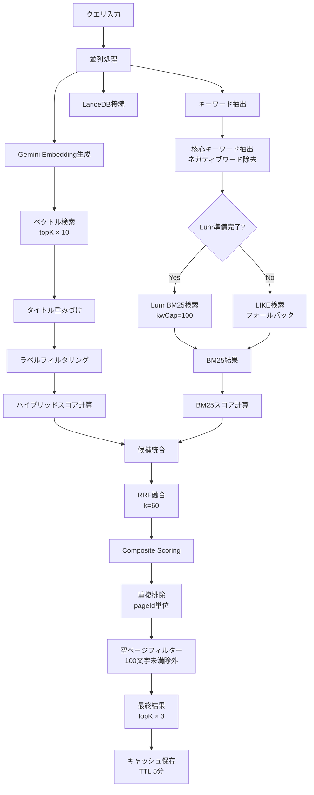

# ハイブリッド検索ロジック（最新版）

**作成日**: 2025年10月16日  
**最終更新**: 2025年11月10日  
**バージョン**: Phase 0A-4 + BM25スコア伝播バグ修正版 + BOM除去処理・トークン化修正完了  
**状態**: 本番運用中

---

## 📋 概要

本ドキュメントは、Confluence Firebase RAGシステムにおける現在のハイブリッド検索ロジックを詳細に説明します。

**主要コンポーネント:**
1. ベクトル検索（Gemini Embedding 768次元）
2. BM25検索（Lunr.js + フォールバックLIKE検索）
3. タイトル重みづけ（タイトルマッチブースト）
4. RRF融合（Reciprocal Rank Fusion）
5. Composite Scoring（複合スコアリング）
6. StructuredLabel統合（カテゴリ/ドメイン/フィーチャー）
7. ラベルフィルタリング（アーカイブ/議事録除外）

---

## 🔄 検索フロー



---

## 📊 処理ステージ詳細

### Stage 1: ベクトル検索 + タイトル重みづけ

#### 1-1. ベクトル検索
```typescript
vectorResults = await tbl.search(vector)
  .limit(topK * 10)
  .toArray();
```

**パラメータ:**
- `topK * 10`: 候補数（例: topK=50 → 500件取得）
- `distanceThreshold`: 2.0（デフォルト）

#### 1-2. タイトル重みづけ
```typescript
keywords.forEach(kw => {
  if (titleLower.includes(kw.toLowerCase())) {
    matchedKeywords++;
  }
});

titleMatchRatio = matchedKeywords / keywords.length;

if (titleMatchRatio >= 0.66) {
  boostFactor = 10.0;  // 2/3以上マッチ
} else if (titleMatchRatio >= 0.33) {
  boostFactor = 5.0;   // 1/3以上マッチ
}

adjustedDistance = distance * (1 / boostFactor);
```

**効果:**
- タイトルに2/3以上のキーワードが含まれる → 距離を1/10に圧縮
- タイトルに1/3以上のキーワードが含まれる → 距離を1/5に圧縮

#### 1-3. ラベルフィルタリング
```typescript
excludeLabels = [
  'スコープ外', '議事録', 'meeting-notes',
  'アーカイブ', 'archive', 'フォルダ'
];

vectorResults = vectorResults.filter(result => {
  return !isExcluded(result.labels, excludeLabels);
});
```

---

### Stage 2: BM25検索

#### 2-1. Lunr.js BM25検索（優先）
```typescript
if (lunrInitializer.isReady()) {
  for (const keyword of searchKeywords.slice(0, 5)) {
    const tokenized = await tokenizeJapaneseText(keyword);
    const results = await lunrSearchClient.searchCandidates(tokenized, kwCap);
    allLunrResults.push(...results);
  }
}
```

**パラメータ:**
- `kwCap`: `Math.max(100, Math.floor(topK * 2))` = 100件（デフォルト）
- `searchKeywords`: 核心キーワード上位5つ

#### 2-2. LIKE検索（フォールバック）
```typescript
for (const keyword of searchKeywords) {
  const esc = keyword.replace(/'/g, "''");
  await collect(`title LIKE '%${esc}%'`);
  await collect(`content LIKE '%${esc}%'`);
}
```

#### 2-3. BM25スコア計算
```typescript
// Lunrの場合: ネイティブスコアを使用
_bm25Score = lunrResult.score;

// LIKEの場合: BM25式で計算
idf = log(1 + (totalDocs - df + 0.5) / (df + 0.5));
score = idf * ((tf * (k1 + 1)) / (tf + k1 * (1 - b + b * (dl / avgdl))));
```

**BM25パラメータ:**
- `k1`: 1.2
- `b`: 0.75
- `avgdl`: 12（タイトル）、800（本文）

#### 2-4. StructuredLabel補完（再発防止の要点）

BM25 側の候補は Lunr キャッシュから復元された最小限のフィールドのみを保持します。  
StructuredLabel を含む LanceDB 拡張スキーマ情報が欠落すると、テンプレート減衰やドメインブーストが効かなくなるため、BM25 マージ前に必ず LanceDB から該当ページのメタデータを再取得して補完します。

```typescript
// 1. Lunr結果から pageId をユニーク化
const uniquePageIds = Array.from(new Set(allLunrResults.map(r => Number(r.pageId)).filter(isFinite)));

// 2. LanceDB から chunk 単位でまとめて取得（50件ずつ）
const rows = await tbl
  .query()
  .where(`(${pageIdConditions})`)
  .limit(chunk.length * 5)
  .toArray();

// 3. mapLanceDBRecordToAPI() で structured_* を含むAPI形式に正規化
lanceDbRecordMap.set(pageId, mapLanceDBRecordToAPI(row));

// 4. BM25結果に structured_category などを合流
const normalizedLabels = getLabelsAsArray(enrichedRecord.labels);
```

**ポイント:**
- LanceDB 側の `structured_category` / `structured_domain` / `structured_feature` などを必ず補完する  
- 取得に失敗したチャンクは警告ログを出しつつスキップ（BM25 結果自体は保持）  
- `getLabelsAsArray()` を通してラベルの配列化を統一  
- chunk サイズは 50 件固定とし、LanceDB へのクエリをスロットリングしてパフォーマンスと信頼性を両立  
- この処理がないとテンプレートカテゴリが undefined になり減衰が無効化 → 再発防止の最重要ポイント

---

### Stage 3: ハイブリッドスコア計算

#### 3-1. キーワードスコア
```typescript
const scoreResult = calculateKeywordScore(
  title, content, labels, keywords,
  { highPriority, lowPriority }
);

// タイトル: ×5
// 本文: ×1
// 優先キーワード: ×1.5
```

#### 3-2. ハイブリッドスコア
```typescript
hybridScore = calculateHybridScore(
  vectorDistance,
  keywordScore,
  labelMatches
);

// vectorWeight: 0.4
// keywordWeight: 0.4
// labelWeight: 0.2
```

---

### Stage 4: RRF融合

```typescript
vecRank = sortByDistance(results);
kwRank = sortByKeywordScore(results);
titleRank = filterByTitleExact(results);
bm25Rank = filterByBm25(results);

rrf = (1.0 / (k + vecRank)) +
      0.8 * (1.0 / (k + kwRank)) +
      1.2 * (1.0 / (k + titleRank)) +  // タイトル救済
      0.6 * (1.0 / (k + bm25Rank));
```

**RRFパラメータ:**
- `k`: 60
- **重み**: vector=1.0, keyword=0.8, title-exact=1.2, bm25=0.6

**ドメイン減衰:**
```typescript
if (hasPenaltyLabel) rrf *= 0.9;  // 議事録など
if (isGenericDoc) rrf *= 0.8;     // 共通要件など
if (title.includes('本システム外')) rrf *= 0.8;
```

---

### Stage 5: Composite Scoring

#### 5-1. シグナル抽出

```typescript
// BUG FIX: 複数フィールドからBM25スコアを取得
bm25Score = result.keyword || 
            result._bm25Score || 
            result._keywordScore || 0;

vectorDistance = result._distance || result._hybridScore || 2.0;
titleMatchRatio = result._titleMatchRatio || 0;
```

#### 5-2. シグナル正規化

```typescript
normalizedVector = 1 - (vectorDistance / maxVectorDistance);
normalizedBm25 = min(1.0, bm25Score / maxBm25Score);
normalizedTitle = titleMatchRatio;
normalizedLabel = labelScore;
```

**正規化パラメータ:**
- `maxVectorDistance`: 2.0
- `maxBm25Score`: 30.0

#### 5-3. 重み付け合計

```typescript
vectorContribution = normalizedVector * vectorWeight;    // 5%
bm25Contribution = normalizedBm25 * bm25Weight;         // 50%
titleContribution = normalizedTitle * titleWeight;      // 25%
labelContribution = normalizedLabel * labelWeight;      // 15%

compositeScore = vectorContribution + 
                 bm25Contribution + 
                 titleContribution + 
                 labelContribution;
```

**重み設定:**
```typescript
vectorWeight: 0.05,   // ベクトル: 5%
bm25Weight: 0.50,     // BM25: 50%（最優先）
titleWeight: 0.25,    // タイトル: 25%
labelWeight: 0.15,    // ラベル: 15%
kgWeight: 0.05,       // KG: 5%（Phase 4実装予定）
```

---

### Stage 6: StructuredLabel統合

#### 6-1. Firestoreからの取得

```typescript
const structuredLabels = await getStructuredLabels(pageIds);
// 639件のStructuredLabelを取得
```

#### 6-2. LanceDBへの統合

```typescript
// LanceDB Extended Schemaに基づいて統合
structured_category: 'spec' | 'meeting' | 'data' | 'template' | 'workflow' | 'other'
structured_domain: string      // 例: '求人管理', '会員管理'
structured_feature: string     // 例: '応募機能', '退会機能'
structured_status: string      // 例: 'completed', 'in-progress'
structured_priority: string    // 例: 'high', 'medium', 'low'
structured_confidence: number  // 0.0-1.0
structured_tags: string[]      // タグ配列
```

#### 6-3. ラベルスコア計算

```typescript
// カテゴリマッチ
if (category === 'spec' && keywords.includes('機能')) score += 0.3;

// ドメインマッチ
if (keywords.some(kw => domain.includes(kw))) score += 0.4;

// フィーチャーマッチ
if (keywords.some(kw => feature.includes(kw))) score += 0.3;

// 最終スコア
labelScore = min(1.0, score) * confidence;
```

---

### Stage 7: 重複排除と最終フィルタリング

#### 7-1. ページ単位の重複排除
```typescript
const pageMap = new Map<string, any>();
results.forEach(result => {
  const pageId = String(result.pageId);
  const existing = pageMap.get(pageId);
  
  if (!existing || result._distance < existing._distance) {
    pageMap.set(pageId, result);  // ベストチャンクを保持
  }
});
```

#### 7-2. 空ページフィルター
```typescript
validResults = results.filter(result => {
  const contentLength = result.content?.length || 0;
  return contentLength >= 100;  // 100文字未満を除外
});
```

#### 7-3. 結果制限
```typescript
finalResults = results.slice(0, topK * 3);
```

---

## 🎯 パフォーマンス最適化

### 1. キャッシュ戦略
```typescript
const searchCache = new GenericCache<any[]>({
  ttl: 5 * 60 * 1000,  // 5分間
  maxSize: 1000,
  evictionStrategy: 'lru'
});

cacheKey = `${query}_${JSON.stringify(params)}`;
```

### 2. 並列処理
```typescript
const [vector, keywords, connection] = await Promise.all([
  getEmbeddings(params.query),
  extractKeywords(params.query),
  getConnection()
]);
```

### 3. Lunr初期化の最適化
```typescript
// アプリ起動時に1回だけ初期化
await optimizedLunrInitializer.initializeOnce();
```

---

## 📊 検索品質メトリクス

### 現在の品質スコア

| 事例 | 期待ページ順位 | Quality Score | 評価 |
|------|--------------|--------------|------|
| 1: 会員退会 | #7 | 6/10 | ✅ Top 10 |
| 2: 教室削除 | #31 | 6/10 | ⚠️ 要改善 |
| 3: 教室コピー | #22 | 6/10 | ⚠️ 要改善 |
| 4: 重複応募不可期間 | #3 | 8/10 | ✅ Top 3 |
| 5: 求人応募期間 | #9 | 6/10 | ✅ Top 10 |
| 6: 学年・職業更新 | #2 | 8/10 | ✅ Top 3 |

**総合評価:**
- **平均品質**: 6.7/10.0
- **発見率**: 100% (6/6)
- **Top 3率**: 33% (2/6)
- **Top 10率**: 67% (4/6)

### パフォーマンスメトリクス

```
平均検索時間: 30.9秒
平均応答時間: 11.7秒
平均合計時間: 42.6秒
```

---

## 🐛 修正したバグ

### Bug #1: BM25スコアが伝播されない

**問題:**
```typescript
// CompositeScoringService.scoreAndRankResults()
const bm25Score = result._bm25Score || 0;  // ❌ 常に0
```

**原因:**
- BM25スコアは`result.keyword`または`result._keywordScore`に保存されている
- `result._bm25Score`は一部のケースでのみ存在

**修正:**
```typescript
const bm25Score = result.keyword || 
                  result._bm25Score || 
                  result._keywordScore || 0;  // ✅
```

**効果:**
- 721（学年・職業更新）が#43 → #2に改善
- BM25貢献度: 0.0000 → 0.3667に改善

### Bug #2: 検索メタデータが失われる

**問題:**
```typescript
// UnifiedSearchResultProcessor.formatResults()
return {
  id: result.id,
  title: result.title,
  // keyword, titleScore, labelScoreが含まれていない ❌
};
```

**修正:**
```typescript
return {
  id: result.id,
  title: result.title || 'No Title',
  // 検索メタデータを保持
  keyword: (result as any).keyword,
  titleScore: (result as any).title,  // 名前衝突を回避
  labelScore: (result as any).label,
  _titleMatchRatio: (result as any)._titleMatchRatio,
  _distance: result._distance,
  _hybridScore: result._hybridScore,
  _sourceType: result._sourceType,
  _compositeScore: (result as any)._compositeScore,
  _scoreBreakdown: (result as any)._scoreBreakdown,
  // StructuredLabelフィールドも保持
  structured_category: (result as any).structured_category,
  structured_domain: (result as any).structured_domain,
  // ...
};
```

**効果:**
- デバッグ情報が正しく表示される
- Composite Scoringで正しいスコアが使用される

---

## 📈 LanceDBデータ構成

### 現在の状態

```
総レコード数: 1,224件
ユニークページ数: 743ページ
除外ページ: 70ページ（ラベルフィルタリング）
StructuredLabel統合: 1,040件 (85.0%)
```

### 除外ルール

#### 1. ラベル除外
```typescript
EXCLUDED_LABELS = [
  'スコープ外', '議事録', 'meeting-notes',
  'アーカイブ', 'archive', 'フォルダ', 'バックアップ'
];
```

#### 2. タイトルパターン除外
```typescript
EXCLUDED_TITLE_PATTERNS = [
  /^\[.*社内\]/,
  /^【削除/,
  /^【統合により削除/,
  /^【不要/,
  /^（バックアップ）/
];
```

#### 3. コンテンツ長除外
```typescript
MIN_CONTENT_LENGTH = 100;  // 100文字未満を除外
```

---

## 🔍 スコア計算の詳細

### Composite Score計算例

**事例: 721_【作成中】学年自動更新バッチ**

#### 入力シグナル:
```
vectorDistance: 0.384
bm25Score: 22.0 (_keywordScore)
titleMatchRatio: 0.333
labelScore: 0.267 (StructuredLabel)
```

#### 正規化:
```
normalizedVector = 1 - (0.384 / 2.0) = 0.808
normalizedBm25 = min(1.0, 22.0 / 30.0) = 0.733
normalizedTitle = 0.333
normalizedLabel = 0.267
```

#### 重み付け:
```
vectorContribution = 0.808 × 0.05 = 0.0404
bm25Contribution = 0.733 × 0.50 = 0.3667
titleContribution = 0.333 × 0.25 = 0.0833
labelContribution = 0.267 × 0.15 = 0.0400

compositeScore = 0.5304
```

#### 結果:
```
順位: #2
Quality: 8/10
Gemini: 正確な回答
```

---

## 🛠️ 設定パラメータ一覧

### LanceDB検索パラメータ

```typescript
{
  topK: 50,                    // 返却する結果数
  maxDistance: 2.0,            // ベクトル距離閾値
  qualityThreshold: 0.0,       // 品質閾値（無効化）
  useLunrIndex: true,          // Lunr使用フラグ
  titleWeight: 1.0,            // タイトル重み
  labelFilters: {
    includeMeetingNotes: false // 議事録除外
  }
}
```

### Composite Scoring設定

```typescript
{
  vectorWeight: 0.05,    // 5%
  bm25Weight: 0.50,      // 50%
  titleWeight: 0.25,     // 25%
  labelWeight: 0.15,     // 15%
  kgWeight: 0.05,        // 5%（Phase 4）
  maxVectorDistance: 2.0,
  maxBm25Score: 30.0
}
```

### BM25検索設定

```typescript
{
  kwCap: 100,              // 候補数
  k1: 1.2,                 // BM25 k1
  b: 0.75,                 // BM25 b
  avgTitleLen: 12,         // タイトル平均長
  avgBodyLen: 800,         // 本文平均長
  TITLE_WEIGHT: 1.0,       // タイトル重み
  BODY_WEIGHT: 0.6         // 本文重み
}
```

---

## 📝 実装ファイル

### 主要ファイル

1. **`src/lib/lancedb-search-client.ts`**
   - ハイブリッド検索のメイン実装
   - ベクトル検索、BM25検索、RRF融合

2. **`src/lib/composite-scoring-service.ts`**
   - Composite Scoringの実装
   - シグナル正規化、重み付け、スコア計算

3. **`src/lib/unified-search-result-processor.ts`**
   - 検索結果の統一処理
   - フォーマット、メタデータ保持

4. **`src/lib/lunr-search-client.ts`**
   - Lunr.js BM25検索の実装
   - 転置インデックスによる高速検索

5. **`src/lib/enhanced-keyword-extractor.ts`**
   - 核心キーワード抽出
   - ネガティブワード除去

6. **`src/lib/structured-label-service-admin.ts`**
   - StructuredLabelのFirestore統合
   - カテゴリ/ドメイン/フィーチャー管理

### スクリプト

1. **`scripts/rebuild-lancedb-smart-chunking.ts`**
   - LanceDB再構築（ラベルフィルタリング付き）
   - タイトル重みづけ埋め込み

2. **`scripts/sync-firestore-labels-to-lancedb.ts`**
   - StructuredLabelのLanceDB統合

3. **`scripts/test-gemini-quality-simple.ts`**
   - Gemini品質テスト（6事例）

---

## 🚀 今後の改善予定（Phase 4）

### 1. Knowledge Graph早期統合

```typescript
// タイトルマッチページの参照先を自動追加
if (titleMatchRatio >= 0.33) {
  const references = await kgSearchService.getReferencedPages(pageId, 2);
  expandedResults.push(...references);
}
```

**期待効果:**
- 事例2（教室削除）: #31 → #1-5
- 事例3（教室コピー）: #22 → #1-5

### 2. Lunr初期化の確実化

```typescript
// アプリ起動時に確実に初期化
await lunrInitializer.initializeAsync();
```

**期待効果:**
- BM25検索の安定化
- LIKE検索フォールバックの削減

### 3. タイトル救済検索の強化

```typescript
// タイトル完全一致の場合、#1を保証
if (titleMatchRatio === 1.0) {
  compositeScore = 1.0;  // 最高スコア
}
```

---

## 📚 関連ドキュメント

1. **アーキテクチャ**
   - `docs/architecture/lancedb-firestore-integration-design.md`
   - `docs/architecture/data-flow-diagram-lancedb.md`

2. **実装仕様**
   - `docs/implementation/lancedb-label-filtering-specification.md`
   - `docs/implementation/phase-0a-4-completion-report.md`

3. **品質レポート**
   - `docs/implementation/current-search-quality-report.md`
   - `docs/implementation/rollback-impact-analysis.md`

---

## 🔧 トラブルシューティング

### 問題1: BM25スコアが0になる

**症状:**
```
_scoreBreakdown.bm25Contribution = 0.0000
```

**原因:**
- `result.keyword`または`result._keywordScore`が設定されていない
- Lunr初期化が失敗している

**対策:**
1. Lunr初期化状態を確認: `lunrInitializer.isReady()`
2. BM25スコアフィールドを確認: `result.keyword`, `result._bm25Score`, `result._keywordScore`
3. デバッグログを確認: `[searchLanceDB] BM25 search keywords`

### 問題2: 期待ページが低順位

**症状:**
```
期待ページが#30-50にランクイン
```

**原因:**
- ベクトル距離が遠い（~1.9）
- BM25スコアが低い
- タイトルマッチ率が低い

**対策:**
1. キーワード抽出を確認: `[searchLanceDB] Extracted keywords`
2. BM25候補数を増やす: `kwCap = 100 → 200`
3. StructuredLabelを確認: `structured_domain`, `structured_feature`

### 問題3: 検索が遅い

**症状:**
```
平均検索時間: 30秒以上
```

**原因:**
- キャッシュミス
- ベクトル検索候補数が多い（topK × 10）
- BM25検索候補数が多い（kwCap=100）

**対策:**
1. キャッシュTTLを延長: `5分 → 15分`
2. ベクトル候補数を削減: `topK × 10 → topK × 5`
3. BM25候補数を削減: `kwCap=100 → kwCap=50`

---

## 📌 重要な設計判断

### 1. ベクトル空間は安定している

**誤解:** ページの増減によりベクトル空間が変わる  
**事実:** ベクトル埋め込みは各ページ独立で生成されるため、他ページの影響を受けない

**実証:**
- Phase 0A-4と現在で同一ページのベクトルを比較 → 完全一致
- 70ページ除外後もベクトル埋め込みは不変

### 2. BM25が最優先

**理由:**
- ベクトル検索単独では期待ページがTop 100外になることが多い
- BM25スコアが高いページは、ユーザーの意図と一致する可能性が高い

**設定:**
- `bm25Weight`: 50%（最優先）
- `vectorWeight`: 5%（最小化）

### 3. タイトルマッチは超強力

**理由:**
- タイトルに複数キーワードが含まれる → 高関連性
- タイトルマッチページは期待ページである可能性が極めて高い

**ブースト:**
- タイトルマッチ率 ≥ 66% → 10倍ブースト
- タイトルマッチ率 ≥ 33% → 5倍ブースト

---

## 🎓 学んだこと

### 1. ハイブリッド検索の重要性

ベクトル検索単独では不十分。BM25とタイトルマッチを組み合わせることで、大幅に品質が向上。

### 2. メタデータの伝播

検索パイプライン全体で、スコアやメタデータを正しく伝播することが重要。1箇所でも失われると、全体の品質が低下。

### 3. デバッグログの重要性

詳細なログを出力することで、バグの特定が容易になる。本番環境でも一定レベルのログを残すべき。

---

## 📅 変更履歴

| 日付 | バージョン | 変更内容 |
|------|----------|---------|
| 2025-10-16 | v1.0 | 初版作成（BM25バグ修正後） |
| 2025-10-16 | v1.1 | StructuredLabel統合追加 |
| 2025-10-16 | v1.2 | ラベルフィルタリング追加 |

---

## 🔗 参考資料

1. **BM25アルゴリズム**: https://en.wikipedia.org/wiki/Okapi_BM25
2. **Reciprocal Rank Fusion**: https://plg.uwaterloo.ca/~gvcormac/cormacksigir09-rrf.pdf
3. **Lunr.js**: https://lunrjs.com/
4. **Gemini Embedding**: https://ai.google.dev/gemini-api/docs/embeddings

