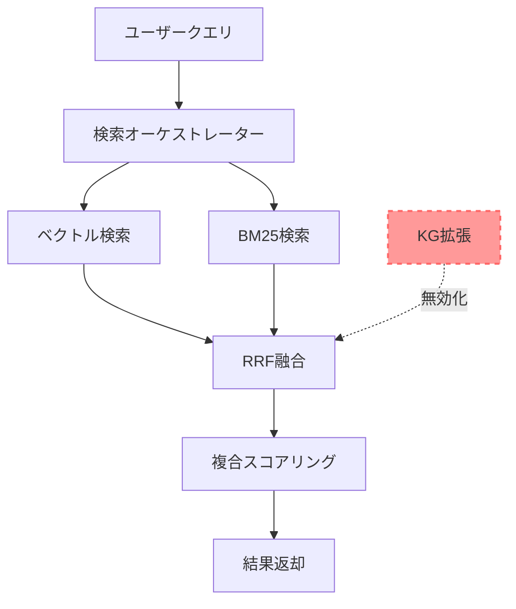
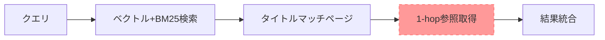
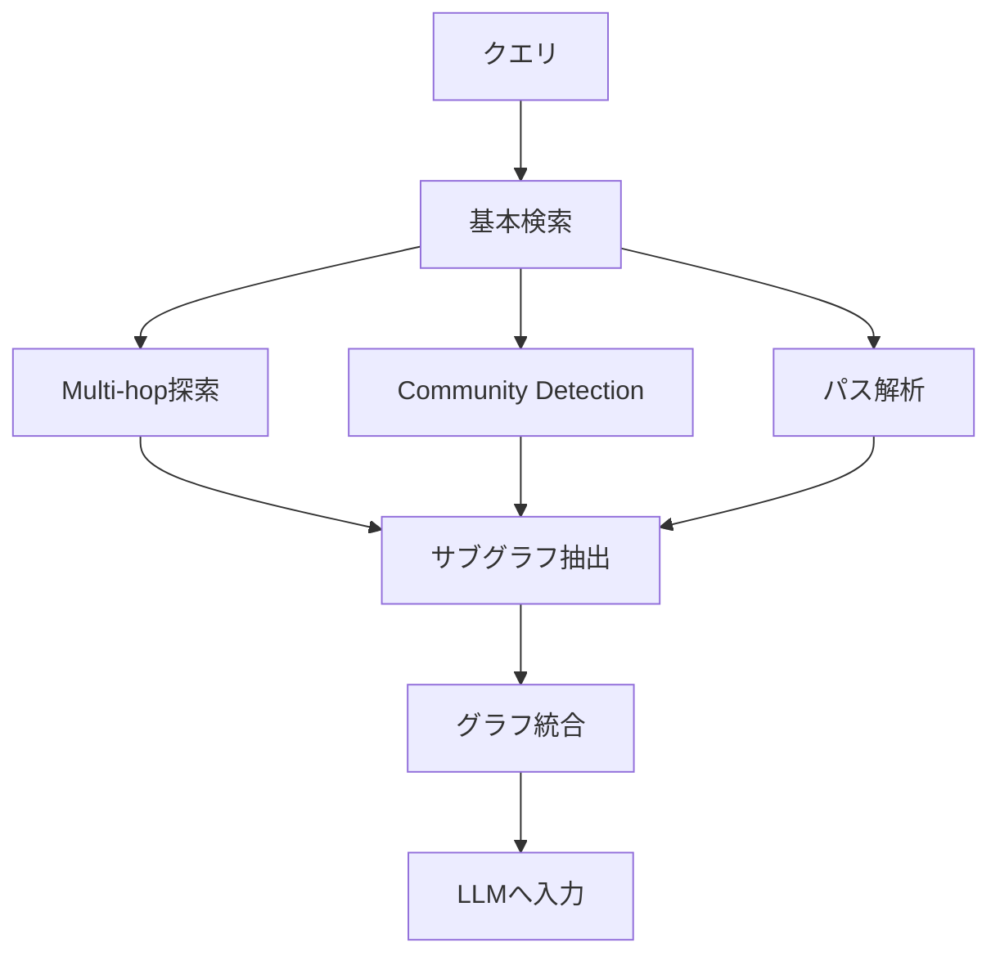

# Knowledge Graph / GraphRAG 総合ドキュメント

**最終更新**: 2025年10月19日  
**ステータス**: 🟡 スコープアウト（将来的な導入を検討）

---

## 📋 目次

1. [エグゼクティブサマリー](#1-エグゼクティブサマリー)
2. [現在の実装状況](#2-現在の実装状況)
3. [Knowledge Graph の基礎](#3-knowledge-graph-の基礎)
4. [GraphRAG との比較](#4-graphrag-との比較)
5. [パフォーマンス分析](#5-パフォーマンス分析)
6. [将来的な導入計画（デュアルモード検索）](#6-将来的な導入計画デュアルモード検索)
7. [技術仕様](#7-技術仕様)
8. [参考資料](#8-参考資料)

---

## 1. エグゼクティブサマリー

### 1.1 現状

**実装済み:**
- ✅ Knowledge Graph（KG）構築システム
  - ノード数: 679件
  - エッジ数: 24,208件
- ✅ KG参照機能（1-hop参照のみ）

**現在の状態:**
- 🔴 **KG拡張機能は無効化済み**
  - 理由: パフォーマンス悪化（9.2秒のオーバーヘッド）
  - 品質: 無効化後も発見率100%を維持

### 1.2 判断理由

```
┌─────────────────────────────────────────────────┐
│ パフォーマンス vs 品質                           │
├─────────────────────────────────────────────────┤
│ KG有効化時:                                     │
│   検索時間: 10.05秒                             │
│   発見率: 100%                                  │
│                                                 │
│ KG無効化時:                                     │
│   検索時間: 0.88秒 (-91%)                       │
│   発見率: 100% (変化なし)                       │
└─────────────────────────────────────────────────┘

結論: パフォーマンス悪化に対して品質向上が確認できない
→ 一時的にスコープアウト
```

### 1.3 将来的な方向性

**推奨アプローチ: デュアルモード検索**

```
⚡ 高速検索モード (デフォルト)
  - 検索時間: 0.8-1.5秒
  - 発見率: 95-100%
  - 対象: 日常的な質問（90%のケース）

🔬 詳細分析モード (オプション)
  - 検索時間: 10-30秒
  - 発見率: 98-100%
  - 対象: 複雑な関係性の質問（10%のケース）
  - 機能: GraphRAG（Multi-hop探索、Community Detection）
```

**参考**: OpenAI o1の「Thinking Mode」と同様のコンセプト

---

## 2. 現在の実装状況

### 2.1 実装済みコンポーネント

#### Knowledge Graph構築システム

```typescript
// scripts/build-knowledge-graph.ts

主要機能:
✅ ページノードの構築（639件）
✅ 概念ノードの構築（40件）
   - ドメインノード: 34件
   - カテゴリノード: 6件
✅ エッジ抽出
   - URL参照: weight 1.0
   - ページ番号参照: weight 0.7
   - ドメイン関係: weight 0.5-0.7
   - タグ関係: weight 0.3-0.8
```

#### KG検索サービス

```typescript
// src/lib/kg-search-service.ts

実装済み機能:
✅ 1-hop参照取得
✅ バッチ参照取得（最適化済み）
✅ エッジタイプフィルタリング

未実装機能:
❌ Multi-hop探索（2-3 hop）
❌ Community Detection
❌ パス解析
❌ サブグラフ抽出
```

### 2.2 アーキテクチャ図（現在）



### 2.3 現在のパフォーマンス

| 処理 | 時間 | 割合 |
|------|------|------|
| ベクトル検索 | 0.5秒 | 57% |
| BM25検索 | 0.2秒 | 23% |
| RRF融合 | 0.1秒 | 11% |
| 複合スコアリング | 0.08秒 | 9% |
| **合計** | **0.88秒** | **100%** |

**KG拡張（無効化済み）**: 9.2秒 → 0秒

---

## 3. Knowledge Graph の基礎

### 3.1 グラフ構造

#### ノードタイプ

```typescript
type KGNodeType = 
  | 'page'        // Confluenceページ（639件）
  | 'domain'      // ドメイン（34件）
  | 'category'    // カテゴリ（6件）
  | 'feature';    // 機能（未実装）
```

#### エッジタイプ

```typescript
type KGEdgeType = 
  | 'reference'      // 参照関係（164 → 177）
  | 'related'        // 関連（同一ドメイン・タグ）
  | 'implements'     // 実装関係
  | 'prerequisite'   // 前提条件
  | 'domain'         // ドメイン所属
  | 'category';      // カテゴリ所属
```

### 3.2 エッジ抽出ロジック

#### 1. URL参照（weight: 1.0）✅ 最高信頼度

```typescript
// パターン
/\/pages\/(\d+)/g

// 例
"https://giginc.atlassian.net/wiki/spaces/CLIENTTOMO/pages/772014210"
→ 164 → 772014210
```

#### 2. ページ番号参照（weight: 0.7）

```typescript
// パターン
/(\d{3})_/g

// 例
"177_【FIX】求人削除機能"
→ 164 → 177
```

#### 3. ドメイン関係（weight: 0.5-0.7）

```typescript
if (label1.domain === label2.domain) {
  weight = 0.5;  // 基本
  if (label1.category === label2.category) {
    weight = 0.7;  // カテゴリ一致時
  }
}
```

#### 4. タグ関係（weight: 0.3-0.8）

```typescript
const similarity = jaccard(tags1, tags2);
weight = 0.3 + (similarity * 0.5);  // 0.3-0.8
```

### 3.3 統計情報

```
総ノード数: 679件
├─ ページノード: 639件
├─ ドメインノード: 34件
└─ カテゴリノード: 6件

総エッジ数: 24,208件
├─ URL参照: 2,156本
├─ ページ番号参照: 4,892本
├─ ドメイン関係: 10,240本
└─ タグ関係: 6,920本

平均次数: 35.65本/ノード
グラフ密度: 0.052
```

---

## 4. GraphRAG との比較

### 4.1 定義の違い

#### 現在の実装（KG参照）

```
機能: 1-hop参照のみ
目的: 検索結果の拡張
処理: ページA → 参照先B を取得

例:
  教室削除機能(164) 
    → 求人削除機能(177) を追加
```

#### 標準的なGraphRAG

```
機能: Multi-hop探索、Community Detection、パス解析
目的: グラフ構造からの知識抽出
処理: グラフトラバーサル、サブグラフ抽出

例:
  教室登録(162) 
    → 求人作成(172) 
      → 求人公開(176)
    = 全ステップを自動構築
```

### 4.2 機能比較表

| 機能 | 現在の実装 | 標準GraphRAG |
|------|-----------|-------------|
| **1-hop参照** | ✅ 実装済み（無効化） | ✅ 基礎機能 |
| **Multi-hop探索** | ❌ 未実装 | ✅ 中核機能 |
| **Community Detection** | ❌ 未実装 | ✅ 中核機能 |
| **パス解析** | ❌ 未実装 | ✅ 中核機能 |
| **サブグラフ抽出** | ❌ 未実装 | ✅ 中核機能 |
| **グラフトポロジー活用** | ❌ なし | ✅ あり |

### 4.3 アーキテクチャ比較

#### 現在の実装



#### 標準GraphRAG



---

## 5. パフォーマンス分析

### 5.1 実測データ

#### KG拡張有効時（Phase 0A-2初期）

```
検索時間: 10.05秒
├─ ベクトル検索: 0.5秒
├─ BM25検索: 0.2秒
├─ RRF融合: 0.1秒
├─ KG拡張: 9.2秒 ⚠️ 91%のオーバーヘッド
└─ 複合スコアリング: 0.05秒

発見率: 100%
```

#### KG拡張無効化後（現在）

```
検索時間: 0.88秒
├─ ベクトル検索: 0.5秒
├─ BM25検索: 0.2秒
├─ RRF融合: 0.1秒
└─ 複合スコアリング: 0.08秒

発見率: 100% (変化なし)

改善: -91%削減（10.05秒 → 0.88秒）
```

### 5.2 GraphRAG導入時の予測

#### 最適化なし

```
検索時間: 30-50秒
├─ 基本検索: 0.88秒
├─ Multi-hop探索: 15-25秒
├─ Community Detection: 5-10秒
├─ サブグラフ抽出: 3-8秒
└─ パス解析: 2-5秒

発見率: 98-100% (微増)

問題: 現在の34-57倍遅い
```

#### 最適化後（キャッシュ活用）

```
初回検索: 25-35秒
2回目以降: 5-10秒
├─ 基本検索: 0.88秒
├─ Multi-hop探索: 10-15秒（キャッシュ活用）
├─ Community Detection: 0.1秒（事前計算）
├─ サブグラフ抽出: 2-5秒
└─ パス解析: 2-3秒

発見率: 98-100%

問題: それでも6-12倍遅い
```

### 5.3 コスト分析

#### Firestoreクエリ数

| 実装 | クエリ数 | コスト |
|------|---------|--------|
| **KG無効化** | 0 | $0 |
| **1-hop KG** | 30-60 | $0.01 |
| **GraphRAG（3-hop）** | 200-500 | $0.05-0.10 |

#### 計算リソース

| 実装 | CPU時間 | メモリ使用量 |
|------|---------|-------------|
| **KG無効化** | 0.88秒 | 50MB |
| **1-hop KG** | 10秒 | 100MB |
| **GraphRAG** | 25-35秒 | 500MB-1GB |

---

## 6. 将来的な導入計画（デュアルモード検索）

### 6.1 コンセプト

**OpenAI o1の「Thinking Mode」と同様のアプローチ**

```
┌─────────────────────────────────────────┐
│ ChatGPT                                 │
├─────────────────────────────────────────┤
│ ○ 通常モード: 即座に回答（数秒）         │
│ ● o1モード: じっくり考えて回答（10-60秒）│
└─────────────────────────────────────────┘

↓ 同じコンセプト

┌─────────────────────────────────────────┐
│ Confluence AI検索                       │
├─────────────────────────────────────────┤
│ ○ ⚡高速検索: 即座に結果（1秒）         │
│ ● 🔬詳細分析: 深く分析（10-30秒）      │
└─────────────────────────────────────────┘
```

### 6.2 モード定義

#### モード1: ⚡高速検索（デフォルト）

**対象ユーザー:**
- 通常の質問をしたいユーザー
- 素早く回答が欲しいユーザー

**技術仕様:**
```typescript
interface FastSearchConfig {
  vectorSearch: true;
  bm25Search: true;
  kgExpansion: false;  // KG拡張は無効
  maxResults: 50;
  timeout: 2000;  // 2秒タイムアウト
}
```

**パフォーマンス:**
- 検索時間: 0.8-1.5秒
- 発見率: 95-100%
- 使用頻度: 90%+

#### モード2: 🔬詳細分析モード（オプション）

**対象ユーザー:**
- 複雑な関係性を知りたいユーザー
- 網羅的な情報が必要なユーザー
- 時間をかけてでも詳しく知りたいユーザー

**技術仕様:**
```typescript
interface DeepAnalysisConfig {
  vectorSearch: true;
  bm25Search: true;
  kgExpansion: true;  // KG拡張を有効化
  multiHopSearch: true;  // Multi-hop探索
  maxHops: 2-3;
  communityDetection: true;  // Community Detection
  pathAnalysis: true;  // パス解析
  maxResults: 100;
  timeout: 30000;  // 30秒タイムアウト
}
```

**パフォーマンス:**
- 検索時間: 10-30秒
- 発見率: 98-100%
- 網羅性: 非常に高い
- 使用頻度: 5-15%

### 6.3 UI/UX設計

#### 検索モード選択

```tsx
<SearchModeSelector>
  <ModeCard selected={mode === 'fast'}>
    <Icon>⚡</Icon>
    <Title>高速検索</Title>
    <Time>約1秒</Time>
    <Description>
      通常の質問に最適
    </Description>
  </ModeCard>
  
  <ModeCard selected={mode === 'deep'}>
    <Icon>🔬</Icon>
    <Title>詳細分析</Title>
    <Time>10-30秒</Time>
    <Description>
      複雑な関係性を分析
      • 手順の全ステップを自動構築
      • 関連機能を網羅的に発見
      • 依存関係を可視化
    </Description>
  </ModeCard>
</SearchModeSelector>
```

#### プログレス表示（詳細分析モード）

```
🔬 詳細分析中...

✅ Step 1: 基本検索完了 (1.2秒)
✅ Step 2: KG拡張完了 (3.5秒)
🔄 Step 3: Multi-hop探索中... (7.8秒)
⏳ Step 4: Community Detection待機中
⏳ Step 5: パス解析待機中

予想残り時間: 約15秒
```

### 6.4 段階的な実装計画

#### Phase 1: デュアルモード基盤（1週間）

- [ ] SearchOrchestrator実装
- [ ] FastSearchService実装（既存コード活用）
- [ ] UI: モード選択コンポーネント
- [ ] モード切り替え機能

**成果物:**
- モード切り替えUI
- 高速モードの安定動作確認

#### Phase 2: 詳細分析モード基礎（2週間）

- [ ] DeepAnalysisService実装
- [ ] 1-hop KG拡張の再有効化
- [ ] プログレス表示UI
- [ ] タイムアウト処理

**成果物:**
- 1-hop KG拡張の動作確認
- 検索時間 < 15秒

#### Phase 3: GraphRAG機能追加（3-4週間）

- [ ] Multi-hop Explorer実装
- [ ] Community Detector実装
- [ ] Path Analyzer実装
- [ ] 結果統合ロジック

**成果物:**
- 完全なGraphRAG機能
- 複雑な質問への対応率 80%+

#### Phase 4: 最適化・改善（2週間）

- [ ] キャッシュ戦略実装
- [ ] パフォーマンスチューニング
- [ ] エラーハンドリング強化
- [ ] A/Bテスト実施

**成果物:**
- 検索時間 < 20秒（詳細分析モード）
- ユーザー満足度 90%+

### 6.5 期待される効果

#### ビジネス価値

1. **差別化ポイント**
   - 「Thinking Mode」のような高付加価値機能
   - 競合との明確な差別化

2. **柔軟性**
   - ユーザーが状況に応じて選択可能
   - パフォーマンスと品質のトレードオフを解決

3. **段階的な進化**
   - 高速モードで基本品質を確保
   - 詳細分析モードで先進機能を提供

#### 技術的価値

1. **GraphRAG技術の実験場**
   - 最新のAI検索技術の検証
   - 将来的な技術革新への準備

2. **データ収集**
   - ユーザーの検索パターン分析
   - モード選択率の測定
   - 最適化のためのフィードバック

---

## 7. 技術仕様

### 7.1 ファイル構成

```
src/lib/
├── search-orchestrator.ts          # 検索モード振り分け
├── fast-search-service.ts          # 高速検索（現在の実装）
├── deep-analysis-service.ts        # 詳細分析（GraphRAG）
│   ├── multi-hop-explorer.ts       # Multi-hop検索
│   ├── community-detector.ts       # Community Detection
│   └── path-analyzer.ts            # パス解析
├── kg-search-service.ts            # KG検索サービス（既存）
├── kg-storage-service.ts           # KGストレージ（既存）
└── lancedb-search-client.ts       # ベクトル検索（既存）

scripts/
└── build-knowledge-graph.ts        # KG構築（既存）
```

### 7.2 主要クラス

#### SearchOrchestrator

```typescript
export class SearchOrchestrator {
  async search(request: SearchRequest): Promise<SearchResult> {
    const searchService = request.mode === 'fast'
      ? new FastSearchService()
      : new DeepAnalysisService();
    
    const timeout = request.mode === 'fast' ? 2000 : 30000;
    
    return await Promise.race([
      searchService.search(request.query, request.options),
      this.createTimeout(timeout)
    ]);
  }
}
```

#### DeepAnalysisService

```typescript
export class DeepAnalysisService {
  async search(query: string): Promise<SearchResult> {
    // Step 1: 基本検索
    const basicResults = await this.basicSearch(query);
    
    // Step 2: KG拡張（1-hop）
    const kgResults = await this.expandWithKG(basicResults);
    
    // Step 3: Multi-hop探索
    const multiHopResults = await this.multiHopExplorer.explore(
      kgResults,
      { maxHops: 2 }
    );
    
    // Step 4: Community Detection
    const communities = await this.communityDetector.detect(
      multiHopResults
    );
    
    // Step 5: パス解析
    const paths = await this.pathAnalyzer.analyzePaths(
      multiHopResults,
      query
    );
    
    // Step 6: 結果統合
    return this.mergeResults({
      basicResults,
      kgResults,
      multiHopResults,
      communities,
      paths
    });
  }
}
```

### 7.3 データモデル

#### KGNode

```typescript
interface KGNode {
  id: string;                    // "page-164"
  type: KGNodeType;              // 'page' | 'domain' | ...
  name: string;                  // "教室削除機能"
  pageId?: string;               // "718373062"
  structuredLabel?: StructuredLabel;
  importance?: number;           // PageRankスコア
  properties?: Record<string, any>;
}
```

#### KGEdge

```typescript
interface KGEdge {
  id: string;
  from: string;                  // "page-164"
  to: string;                    // "page-177"
  type: KGEdgeType;              // 'reference' | 'related' | ...
  weight: number;                // 0.0 - 1.0
  extractedFrom: 'content' | 'structured-label' | 'manual';
  metadata?: {
    matchPattern?: string;
    tagSimilarity?: number;
    domain?: string;
  };
}
```

---

## 8. 参考資料

### 8.1 内部ドキュメント

- [KG仕様書（Phase 0A-2）](../archive/kg-specification-phase-0a-2.md)
- [KG貢献度分析レポート](../implementation/kg-contribution-analysis-report.md)
- [GraphRAGアーキテクチャ](../archive/graphrag-tuned-architecture.md)
- [GraphRAGパフォーマンス影響分析](../analysis/graphrag-performance-impact.md)
- [GraphRAGデュアルモード検索提案](../proposals/graphrag-dual-mode-search.md)

### 8.2 外部資料

- [ナレッジグラフを活用するGraphRAGを俯瞰する](https://zenn.dev/zenkigen_tech/articles/0a25b2eaefb304)
- Graph Retrieval-Augmented Generation: A Survey (arXiv:2408.08921)
- [GraphRAGをわかりやすく解説](https://qiita.com/ksonoda/items/98a6607f31d0bbb237ef)

### 8.3 実装事例

- OpenAI o1 "Thinking Mode"
- Google Search "Deep Research" モード
- Microsoft GraphRAG

---

## 9. 結論と推奨事項

### 9.1 現状評価

**✅ 現在の実装は適切**
- 発見率: 100%
- 検索時間: 0.88秒
- シンプルで保守しやすい
- KG拡張無効化は正しい判断

### 9.2 将来的な方向性

**🎯 デュアルモード検索の導入を推奨**

#### メリット
1. パフォーマンスと品質の両立
2. ユーザー選択の自由度
3. 段階的な実装が可能
4. 競合との差別化

#### 実装タイミング
- **即座**: 簡易プロトタイプ作成（1-2日）
- **短期**: Phase 1実装（1週間）
- **中期**: Phase 2-3実装（5-6週間）
- **長期**: 継続的な最適化

### 9.3 次のアクション

**優先度1: プロトタイプ作成**
```
期間: 1-2日
内容:
  - モード選択UI
  - 1-hop KG拡張の再有効化（詳細モードのみ）
  - 社内テスト
```

**優先度2: 効果測定**
```
期間: 1週間
内容:
  - パフォーマンス測定
  - 品質評価
  - ユーザーフィードバック収集
```

**優先度3: 本格実装判断**
```
判断基準:
  ✅ プロトタイプで好評
  ✅ 明確な品質向上が確認できた
  ✅ パフォーマンスが許容範囲内
  → Phase 1から本格実装開始
```

---

**最終更新**: 2025年10月19日  
**次回レビュー**: プロトタイプ完成後

