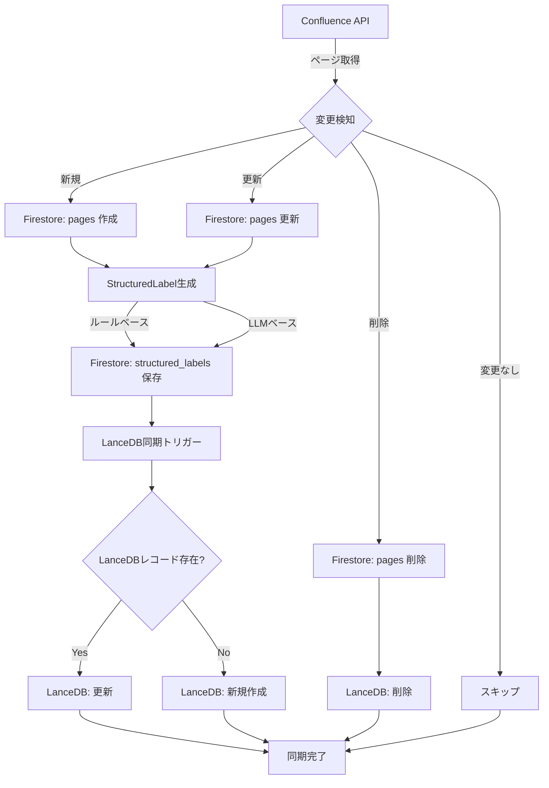

# LanceDB-Firestore 統合設計書

**バージョン**: 1.0  
**作成日**: 2025年10月15日  
**Phase**: Phase 0A-2  
**ステータス**: 設計

---

## 📋 目次

1. [概要](#概要)
2. [現状分析](#現状分析)
3. [統合アーキテクチャ](#統合アーキテクチャ)
4. [データスキーマ](#データスキーマ)
5. [同期戦略](#同期戦略)
6. [ワークフロー](#ワークフロー)
7. [実装計画](#実装計画)
8. [エラーハンドリング](#エラーハンドリング)
9. [パフォーマンス最適化](#パフォーマンス最適化)

---

## 概要

### 目的

LanceDBとFirestoreの両方で管理されているラベル情報を統合し、以下を実現する：

1. **単一の真実のソース**: Firestoreを`StructuredLabel`のマスターデータとして管理
2. **高速検索**: LanceDBに`StructuredLabel`を埋め込み、ベクトル検索と組み合わせる
3. **自動同期**: Confluence → Firestore → LanceDBの一貫性を保つ
4. **更新対応**: 既存ページの更新時に自動的にラベルを再生成・同期

### 設計原則

- **信頼できる単一のソース (SSOT)**: Firestoreをマスターデータとする
- **最終的整合性**: 同期処理は非同期・バッチで実行
- **冪等性**: 同じ処理を複数回実行しても結果が同じ
- **段階的移行**: 既存システムへの影響を最小化

---

## 現状分析

### 現在の状態

| データストア | ラベル形式 | 件数 | 用途 |
|------------|----------|------|------|
| **LanceDB** | `labels: string[]` | 1,316レコード | ベクトル検索・BM25検索 |
| **Firestore** | `structuredLabel: StructuredLabel` | 639ドキュメント | 構造化ラベル管理 |

### 問題点

1. **データの不整合**: LanceDBとFirestoreでラベル情報が分断
2. **未生成ラベル**: 約50%のページで`StructuredLabel`が未生成
3. **検索の非効率**: LanceDBの`labels: string[]`では高度なフィルタリングが困難
4. **同期機構の欠如**: 更新時の自動同期フローが未実装

---

## 統合アーキテクチャ

### システム構成図

```
┌─────────────────────────────────────────────────────────────┐
│                      Confluence API                          │
│                   (ソースデータ)                              │
└──────────────────────┬──────────────────────────────────────┘
                       │
                       ▼
┌─────────────────────────────────────────────────────────────┐
│              Confluence同期スクリプト                         │
│   (scripts/sync-confluence-to-firestore.ts)                  │
└──────────────────────┬──────────────────────────────────────┘
                       │
       ┌───────────────┼───────────────┐
       ▼               ▼               ▼
   ページ取得      ラベル生成      メタデータ抽出
       │               │               │
       └───────────────┴───────────────┘
                       │
                       ▼
┌─────────────────────────────────────────────────────────────┐
│                    Firestore                                 │
│                 (マスターデータ)                              │
│                                                              │
│  collections/                                                │
│  ├── pages/                                                  │
│  │   └── {pageId}/                                          │
│  │       ├── title: string                                  │
│  │       ├── content: string                                │
│  │       ├── labels: string[]         (旧形式・互換性用)    │
│  │       ├── lastUpdated: timestamp                         │
│  │       └── ...                                            │
│  │                                                           │
│  └── structured_labels/                                      │
│      └── {pageId}/                                          │
│          ├── pageId: string                                 │
│          ├── structuredLabel: StructuredLabel               │
│          ├── generatedAt: timestamp                         │
│          ├── generatedBy: 'rule-based' | 'llm-based'        │
│          └── version: number                                │
└──────────────────────┬──────────────────────────────────────┘
                       │
                       ▼
┌─────────────────────────────────────────────────────────────┐
│           LanceDB同期スクリプト                               │
│   (scripts/sync-firestore-to-lancedb.ts)                     │
└──────────────────────┬──────────────────────────────────────┘
                       │
                       ▼
┌─────────────────────────────────────────────────────────────┐
│                    LanceDB                                   │
│                 (検索エンジン)                                │
│                                                              │
│  table: confluence                                           │
│  ├── id: string                                             │
│  ├── vector: float32[768]                                   │
│  ├── pageId: int64                                          │
│  ├── title: string                                          │
│  ├── content: string                                        │
│  ├── labels: string[]              (旧形式・互換性用)       │
│  ├── structuredLabel: {            (新規追加)               │
│  │     category: string                                     │
│  │     domain: string                                       │
│  │     feature: string                                      │
│  │     priority: string                                     │
│  │     status: string                                       │
│  │     version?: string                                     │
│  │     tags?: string[]                                      │
│  │     confidence?: float32                                 │
│  │     content_length?: int32                               │
│  │     is_valid?: boolean                                   │
│  │   }                                                       │
│  ├── url: string                                            │
│  ├── lastUpdated: string                                    │
│  └── ...                                                    │
└─────────────────────────────────────────────────────────────┘
```

### データフロー

```
【新規ページ追加】
Confluence → 同期スクリプト → Firestore (pages + structured_labels) → LanceDB

【既存ページ更新】
Confluence → 同期スクリプト → Firestore (更新) → LanceDB (差分更新)

【ラベル再生成】
LLM → Firestore (structured_labels更新) → LanceDB (差分更新)

【検索クエリ】
ユーザー → LanceDB (ベクトル検索 + StructuredLabelフィルタ) → 結果
```

---

## データスキーマ

### Firestore スキーマ

#### Collection: `pages`

```typescript
interface PageDocument {
  pageId: string;                    // Confluenceページ ID
  title: string;                     // ページタイトル
  content: string;                   // ページ内容（プレーンテキスト）
  spaceKey: string;                  // スペースキー
  url: string;                       // ページURL
  labels: string[];                  // 旧形式ラベル（互換性用）
  lastUpdated: Timestamp;            // 最終更新日時
  lastSyncedAt: Timestamp;           // 最終同期日時
  version: number;                   // Confluenceバージョン番号
}
```

#### Collection: `structured_labels`

```typescript
interface StructuredLabelDocument {
  pageId: string;                    // Confluenceページ ID
  structuredLabel: StructuredLabel;  // 構造化ラベル
  generatedAt: Timestamp;            // 生成日時
  generatedBy: 'rule-based' | 'llm-based';  // 生成方法
  confidence: number;                // 信頼度 (0.0 - 1.0)
  version: number;                   // ラベルスキーマバージョン
  lastUpdatedAt: Timestamp;          // 最終更新日時
}

interface StructuredLabel {
  category: DocumentCategory;        // spec, data, template, workflow, meeting, manual, other
  domain: SystemDomain;              // 会員管理, 求人管理, 教室管理, など
  feature: string;                   // 具体的な機能名
  priority: Priority;                // critical, high, medium, low, unknown
  status: DocumentStatus;            // draft, review, approved, deprecated, unknown
  version?: string;                  // バージョン番号（例: "168", "515"）
  tags?: string[];                   // 追加の分類キーワード
  confidence?: number;               // 自動ラベル付けの信頼度
  content_length?: number;           // コンテンツ長
  is_valid?: boolean;                // 有効ページフラグ
}
```

### LanceDB スキーマ（拡張版）

```typescript
export const ExtendedLanceDBSchema = {
  // 既存フィールド
  id: 'string',
  vector: {
    type: 'fixed_size_list',
    listSize: 768,
    field: { type: 'float32' }
  },
  space_key: 'string',
  title: 'string',
  content: 'string',
  pageId: 'int64',
  chunkIndex: 'int32',
  url: 'string',
  lastUpdated: 'string',
  isChunked: 'boolean',
  
  // 互換性用（既存システムとの互換性を保つ）
  labels: {
    type: 'list',
    field: { type: 'utf8' }
  },
  
  // 新規追加: StructuredLabel（フラット化）
  structured_category: 'string',      // StructuredLabel.category
  structured_domain: 'string',        // StructuredLabel.domain
  structured_feature: 'string',       // StructuredLabel.feature
  structured_priority: 'string',      // StructuredLabel.priority
  structured_status: 'string',        // StructuredLabel.status
  structured_version: 'string',       // StructuredLabel.version (nullable)
  structured_tags: {                  // StructuredLabel.tags
    type: 'list',
    field: { type: 'utf8' }
  },
  structured_confidence: 'float32',   // StructuredLabel.confidence
  structured_content_length: 'int32', // StructuredLabel.content_length
  structured_is_valid: 'boolean',     // StructuredLabel.is_valid
};
```

**注**: LanceDBは複雑なネストされたオブジェクトをサポートしていないため、`StructuredLabel`をフラット化して保存します。

---

## 同期戦略

### 同期の種類

#### 1. **フル同期** (Full Sync)

- **実行タイミング**: 初回セットアップ、月次メンテナンス
- **対象**: 全ページ
- **処理**: Confluence → Firestore → LanceDB の全データを再構築

#### 2. **差分同期** (Incremental Sync)

- **実行タイミング**: 毎日、毎週（Firebase Scheduler）
- **対象**: 最終同期以降に更新されたページのみ
- **処理**: 変更検知 → Firestore更新 → LanceDB差分更新

#### 3. **リアルタイム同期** (Real-time Sync)

- **実行タイミング**: ページ更新イベント（将来の拡張）
- **対象**: 特定のページ
- **処理**: Webhook → Firestore更新 → LanceDB更新

### 同期フロー



### 同期ステート管理

#### Collection: `sync_state`

```typescript
interface SyncStateDocument {
  id: 'confluence_sync';
  lastFullSyncAt: Timestamp;         // 最終フル同期日時
  lastIncrementalSyncAt: Timestamp;  // 最終差分同期日時
  totalPages: number;                // 総ページ数
  syncedPages: number;               // 同期済みページ数
  failedPages: string[];             // 失敗したページID
  status: 'idle' | 'syncing' | 'error';
  errorMessage?: string;
}
```

---

## ワークフロー

### 1. 新規ページ追加

```typescript
// Step 1: Confluenceからページ取得
const newPage = await fetchPageFromConfluence(pageId);

// Step 2: Firestoreに保存
await savePageToFirestore({
  pageId: newPage.id,
  title: newPage.title,
  content: stripHtml(newPage.body.storage.value),
  spaceKey: newPage.space.key,
  url: buildPageUrl(newPage),
  labels: extractLabels(newPage),
  lastUpdated: Timestamp.fromDate(new Date(newPage.version.when)),
  lastSyncedAt: Timestamp.now(),
  version: newPage.version.number
});

// Step 3: StructuredLabel生成
const structuredLabel = await generateStructuredLabel(newPage);

// Step 4: Firestoreに保存
await saveStructuredLabel(pageId, structuredLabel);

// Step 5: LanceDBに同期
await syncPageToLanceDB(pageId);
```

### 2. 既存ページ更新

```typescript
// Step 1: 変更検知
const lastSyncedVersion = await getLastSyncedVersion(pageId);
const currentVersion = await getCurrentVersion(pageId);

if (currentVersion > lastSyncedVersion) {
  // Step 2: Firestore更新
  await updatePageInFirestore(pageId, updatedData);
  
  // Step 3: StructuredLabel再生成（必要に応じて）
  if (shouldRegenerateLabel(updatedData)) {
    const newLabel = await generateStructuredLabel(updatedData);
    await saveStructuredLabel(pageId, newLabel);
  }
  
  // Step 4: LanceDB差分更新
  await updatePageInLanceDB(pageId);
}
```

### 3. ページ削除

```typescript
// Step 1: Firestoreから削除
await deletePageFromFirestore(pageId);
await deleteStructuredLabel(pageId);

// Step 2: LanceDBから削除
await deletePageFromLanceDB(pageId);
```

### 4. バッチ同期（定期実行）

```typescript
async function incrementalSync() {
  // Step 1: 最終同期日時を取得
  const syncState = await getSyncState();
  const lastSyncAt = syncState.lastIncrementalSyncAt;
  
  // Step 2: 最終同期以降の変更ページを取得
  const updatedPages = await getUpdatedPagesSince(lastSyncAt);
  
  console.log(`Found ${updatedPages.length} updated pages`);
  
  // Step 3: バッチ処理（50件ずつ）
  const batchSize = 50;
  for (let i = 0; i < updatedPages.length; i += batchSize) {
    const batch = updatedPages.slice(i, i + batchSize);
    
    await Promise.all(batch.map(async (page) => {
      try {
        // Firestore更新
        await updatePageInFirestore(page.id, page);
        
        // StructuredLabel更新
        const label = await generateStructuredLabel(page);
        await saveStructuredLabel(page.id, label);
        
        // LanceDB更新
        await updatePageInLanceDB(page.id);
        
      } catch (error) {
        console.error(`Failed to sync page ${page.id}:`, error);
        await recordFailedPage(page.id, error);
      }
    }));
  }
  
  // Step 4: 同期ステート更新
  await updateSyncState({
    lastIncrementalSyncAt: Timestamp.now(),
    syncedPages: syncState.syncedPages + updatedPages.length
  });
}
```

---

## 実装計画

### Phase 1: スキーマ拡張（1-2日）

- [ ] LanceDBスキーマ定義（`StructuredLabel`フラット化）
- [ ] マイグレーションスクリプト作成
- [ ] テーブル再構築（既存データ保持）

### Phase 2: 同期スクリプト実装（3-5日）

- [ ] `sync-firestore-to-lancedb.ts` 実装
  - [ ] Firestoreからの読み込み
  - [ ] LanceDBへの書き込み
  - [ ] 差分検知ロジック
  - [ ] バッチ処理

- [ ] `sync-confluence-to-firestore.ts` 更新
  - [ ] StructuredLabel生成を統合
  - [ ] 変更検知ロジック強化

### Phase 3: ラベル生成（2-3日）

- [ ] 未生成ページ（約50%）のラベル生成
- [ ] 信頼度の低いラベル（<80%）の再生成
- [ ] バッチ処理で段階的に実行

### Phase 4: 検索システム更新（2-3日）

- [ ] `lancedb-search-client.ts` 更新
  - [ ] StructuredLabelフィルタリング
  - [ ] StructuredLabelスコアリング
- [ ] フロントエンド更新（フィルタUI）

### Phase 5: 定期同期設定（1日）

- [ ] Firebase Scheduler設定
- [ ] エラー通知（Google Chat）
- [ ] モニタリングダッシュボード

### Phase 6: テスト・検証（2-3日）

- [ ] 統合テスト
- [ ] パフォーマンステスト
- [ ] データ整合性検証

**総所要時間**: 11-17日

---

## エラーハンドリング

### エラーカテゴリ

#### 1. **同期エラー**

```typescript
class SyncError extends Error {
  constructor(
    public pageId: string,
    public source: 'confluence' | 'firestore' | 'lancedb',
    public operation: 'create' | 'update' | 'delete',
    message: string
  ) {
    super(message);
  }
}
```

#### 2. **ラベル生成エラー**

```typescript
class LabelGenerationError extends Error {
  constructor(
    public pageId: string,
    public method: 'rule-based' | 'llm-based',
    message: string
  ) {
    super(message);
  }
}
```

### エラー処理フロー

```typescript
async function syncWithErrorHandling(pageId: string) {
  const maxRetries = 3;
  let attempt = 0;
  
  while (attempt < maxRetries) {
    try {
      await syncPage(pageId);
      return; // 成功
      
    } catch (error) {
      attempt++;
      
      if (error instanceof SyncError) {
        // 同期エラー: リトライ
        console.error(`Sync error (attempt ${attempt}/${maxRetries}):`, error);
        await sleep(1000 * attempt); // 指数バックオフ
        
      } else if (error instanceof LabelGenerationError) {
        // ラベル生成エラー: フォールバックロジック
        console.error('Label generation failed, using fallback:', error);
        await saveFallbackLabel(pageId);
        return;
        
      } else {
        // 予期しないエラー: 記録して次へ
        console.error('Unexpected error:', error);
        await recordFailedPage(pageId, error);
        return;
      }
    }
  }
  
  // 最大リトライ回数到達
  await recordFailedPage(pageId, new Error('Max retries exceeded'));
}
```

### 失敗ページの管理

```typescript
// Firestore: failed_syncs コレクション
interface FailedSyncDocument {
  pageId: string;
  error: string;
  errorStack: string;
  failedAt: Timestamp;
  retryCount: number;
  lastRetryAt?: Timestamp;
  resolved: boolean;
}

// リトライ処理
async function retryFailedSyncs() {
  const failedSyncs = await getFailedSyncs({ resolved: false });
  
  for (const sync of failedSyncs) {
    try {
      await syncPage(sync.pageId);
      await markSyncResolved(sync.pageId);
    } catch (error) {
      await incrementRetryCount(sync.pageId);
    }
  }
}
```

---

## パフォーマンス最適化

### 1. バッチ処理

```typescript
const BATCH_SIZE = 50; // 一度に処理するページ数

async function batchSync(pageIds: string[]) {
  for (let i = 0; i < pageIds.length; i += BATCH_SIZE) {
    const batch = pageIds.slice(i, i + BATCH_SIZE);
    
    // 並列処理
    await Promise.all(batch.map(syncPage));
    
    // レート制限対策（休憩）
    if (i + BATCH_SIZE < pageIds.length) {
      await sleep(1000);
    }
  }
}
```

### 2. キャッシング

```typescript
// Firestoreからの読み込みキャッシュ
const labelCache = new Map<string, StructuredLabel>();

async function getStructuredLabelCached(pageId: string): Promise<StructuredLabel | null> {
  if (labelCache.has(pageId)) {
    return labelCache.get(pageId)!;
  }
  
  const label = await getStructuredLabel(pageId);
  if (label) {
    labelCache.set(pageId, label);
  }
  
  return label;
}

// キャッシュクリア（定期的）
setInterval(() => {
  labelCache.clear();
}, 1000 * 60 * 60); // 1時間ごと
```

### 3. インデックス最適化

```firestore
// Firestore インデックス
Collection: structured_labels
- pageId (ASC)
- generatedAt (DESC)
- structuredLabel.category (ASC)
- structuredLabel.domain (ASC)
- structuredLabel.status (ASC)
```

### 4. LanceDB クエリ最適化

```typescript
// 効率的なフィルタリング（LanceDB側で実行）
const results = await table
  .search(queryVector)
  .where("structured_category = 'spec' AND structured_status = 'approved'")
  .limit(20)
  .toArray();

// 非効率なフィルタリング（避ける）
const allResults = await table.search(queryVector).limit(1000).toArray();
const filtered = allResults.filter(r => 
  r.structured_category === 'spec' && r.structured_status === 'approved'
);
```

---

## モニタリング・ログ

### 同期ログ

```typescript
interface SyncLog {
  timestamp: Timestamp;
  operation: 'full_sync' | 'incremental_sync';
  pagesProcessed: number;
  pagesSucceeded: number;
  pagesFailed: number;
  duration: number; // ミリ秒
  errorRate: number; // 0.0 - 1.0
}

// ログ保存
await saveSyncLog({
  timestamp: Timestamp.now(),
  operation: 'incremental_sync',
  pagesProcessed: 100,
  pagesSucceeded: 98,
  pagesFailed: 2,
  duration: 45000,
  errorRate: 0.02
});
```

### Google Chat 通知

```typescript
// エラー率が閾値を超えた場合に通知
if (errorRate > 0.1) { // 10%以上
  await sendGoogleChatNotification({
    title: '⚠️ 同期エラー率が高い',
    message: `エラー率: ${(errorRate * 100).toFixed(1)}%\n失敗ページ数: ${pagesFailed}`,
    severity: 'warning'
  });
}
```

---

## セキュリティ・権限

### Firestore Security Rules

```javascript
rules_version = '2';
service cloud.firestore {
  match /databases/{database}/documents {
    
    // structured_labels: 管理者のみ書き込み可能
    match /structured_labels/{pageId} {
      allow read: if request.auth != null;
      allow write: if request.auth.token.admin == true;
    }
    
    // sync_state: 管理者のみアクセス可能
    match /sync_state/{id} {
      allow read, write: if request.auth.token.admin == true;
    }
  }
}
```

---

## 付録

### A. 必要な環境変数

```bash
# Confluence
CONFLUENCE_BASE_URL=https://your-domain.atlassian.net
CONFLUENCE_USER_EMAIL=your-email@example.com
CONFLUENCE_API_TOKEN=your-confluence-api-token
CONFLUENCE_SPACE_KEY=YOUR_SPACE

# Google AI
GEMINI_API_KEY=your-gemini-api-key

# Firebase
GOOGLE_APPLICATION_CREDENTIALS=./keys/firebase-adminsdk-key.json
```

### B. スクリプト一覧

| スクリプト | 用途 | 実行頻度 |
|-----------|------|---------|
| `sync-confluence-to-firestore.ts` | Confluence → Firestore 同期 | 毎日 |
| `sync-firestore-to-lancedb.ts` | Firestore → LanceDB 同期 | 毎日 |
| `generate-missing-labels.ts` | 未生成ラベルの生成 | 手動 |
| `retry-failed-syncs.ts` | 失敗した同期の再試行 | 毎週 |
| `verify-sync-integrity.ts` | データ整合性検証 | 毎週 |

### C. 参考資料

- [LanceDB公式ドキュメント](https://lancedb.com/docs/)
- [Firestore公式ドキュメント](https://firebase.google.com/docs/firestore)
- [StructuredLabel設計書](./structured-label-design.md)
- [LanceDBデータ構造仕様書](../implementation/lancedb-data-structure-specification.md)

---

## 更新履歴

| 日付 | バージョン | 変更内容 |
|------|----------|---------|
| 2025-10-15 | 1.0 | 初版作成 |


