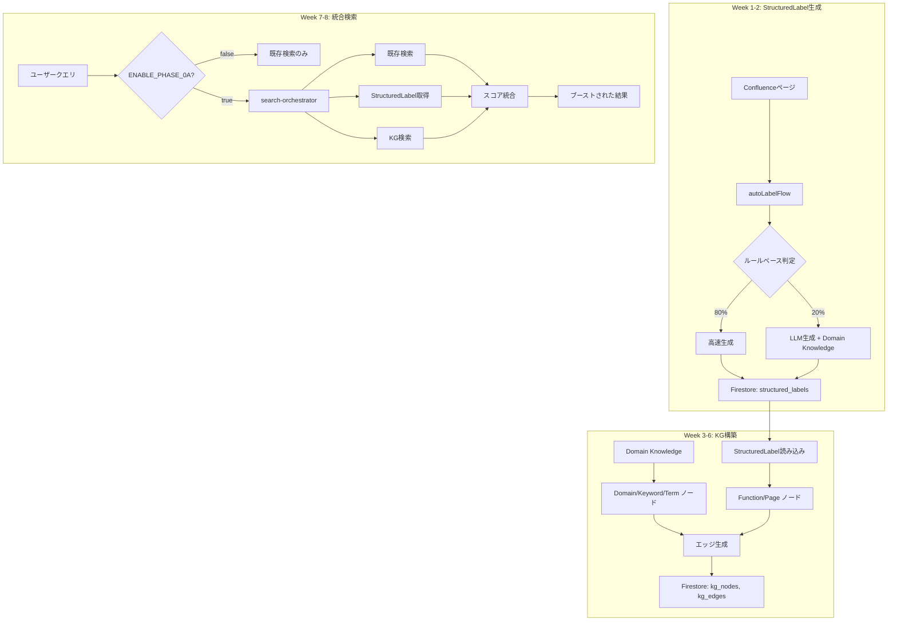

# Phase 0A: 最小リスク実装計画書

**バージョン**: 2.0（最小リスク版）  
**作成日**: 2025年10月14日  
**ステータス**: 確定  
**原則**: **既存システムに一切影響を与えない**

---

## 📋 基本方針

### ✅ 遵守する原則

1. **既存システムは一切変更しない**
   - LanceDBスキーマ変更なし
   - 検索ロジック変更なし
   - UI変更なし

2. **独立バッチ処理として実装**
   - 既存の同期処理とは完全に分離
   - 独立したスクリプトとして実行

3. **段階的なテスト・検証**
   - 10ページ → 100ページ → 全ページ
   - 各段階で品質検証

4. **環境変数で制御**
   - デフォルトOFF（既存動作）
   - オプトイン方式（新機能）

---

## 🏗️ アーキテクチャ設計

### システム構成（並行運用）

```
┌─────────────────────────────────────────────────┐
│ 既存システム（一切変更なし）                      │
├─────────────────────────────────────────────────┤
│ • LanceDB: confluence テーブル                   │
│ • Firestore: users/{uid}/pages/                 │
│ • 検索: lancedb-search-client.ts                │
│ • ラベル: labels (string[])                     │
│ • 同期: batch-sync-confluence.ts                │
└─────────────────────────────────────────────────┘

┌─────────────────────────────────────────────────┐
│ 新規システム（独立稼働）                         │
├─────────────────────────────────────────────────┤
│ • Firestore: structured_labels/{pageId}         │
│ • Firestore: knowledge_graph/nodes, edges       │
│ • 検索: structured-label-boost.ts（オプション）  │
│ • ラベル: StructuredLabel                        │
│ • 生成: generate-structured-labels.ts（独立）    │
└─────────────────────────────────────────────────┘

                    ↓ Phase 0A-3で統合

┌─────────────────────────────────────────────────┐
│ 統合検索（オプショナル機能）                      │
├─────────────────────────────────────────────────┤
│ • search-orchestrator.ts                        │
│ • 既存検索 + StructuredLabel + KG               │
│ • 環境変数 ENABLE_PHASE_0A=true で有効化        │
└─────────────────────────────────────────────────┘
```

---

## 📊 Phase 0A-1: StructuredLabel（2週間）

### Week 1: 基盤構築

#### **1.1 Domain Knowledge読み込みサービス**

```typescript
// src/lib/domain-knowledge-loader.ts（新規）

import * as fs from 'fs';
import * as path from 'path';

interface DomainKnowledge {
  domainNames: string[];
  systemFields: string[];
  systemTerms: string[];
}

let cachedDomainKnowledge: DomainKnowledge | null = null;

export async function loadDomainKnowledge(): Promise<DomainKnowledge> {
  if (cachedDomainKnowledge) {
    return cachedDomainKnowledge;
  }
  
  const filePath = path.join(
    process.cwd(),
    'data/domain-knowledge-v2/final-domain-knowledge-v2.json'
  );
  
  const data = JSON.parse(fs.readFileSync(filePath, 'utf-8'));
  
  cachedDomainKnowledge = {
    domainNames: data.domainNames || [],
    systemFields: data.systemFields || [],
    systemTerms: data.systemTerms || []
  };
  
  return cachedDomainKnowledge;
}
```

**影響**: なし（新規ファイル）

---

#### **1.2 自動ラベル付けFlow**

```typescript
// src/ai/flows/auto-label-flow.ts（新規）

import { ai } from '../genkit';
import { z } from 'zod';
import { loadDomainKnowledge } from '@/lib/domain-knowledge-loader';
import { StructuredLabelHelper } from '@/types/structured-label';

// スキーマ定義
const InputSchema = z.object({
  title: z.string(),
  content: z.string(),
  labels: z.array(z.string()),
});

const OutputSchema = z.object({
  category: z.enum(['spec', 'data', 'template', 'workflow', 'meeting', 'manual', 'other']),
  domain: z.string(),
  feature: z.string(),
  priority: z.enum(['critical', 'high', 'medium', 'low', 'unknown']),
  status: z.enum(['draft', 'review', 'approved', 'deprecated', 'unknown']),
  version: z.string().optional(),
  tags: z.array(z.string()).optional(),
  confidence: z.number().optional(),
});

// ★Genkit Flowとして定義
export const autoLabelFlow = ai.defineFlow(
  {
    name: 'autoLabelFlow',
    inputSchema: InputSchema,
    outputSchema: OutputSchema,
  },
  async (input) => {
    // Step 1: ルールベースで高速判定（80%のケース）
    const ruleBasedLabel = tryRuleBasedLabeling(input);
    if (ruleBasedLabel && ruleBasedLabel.confidence > 0.8) {
      console.log(`✅ ルールベースでラベル生成: ${input.title}`);
      return ruleBasedLabel;
    }
    
    // Step 2: Domain Knowledgeを活用したLLMラベル付け（20%のケース）
    console.log(`🤖 LLMでラベル生成: ${input.title}`);
    const domainKnowledge = await loadDomainKnowledge();
    
    // ドメイン候補を抽出
    const domainCandidates = domainKnowledge.domainNames
      .filter(domain => 
        input.title.includes(domain) || 
        input.content.substring(0, 500).includes(domain)
      )
      .slice(0, 5);
    
    // プロンプト生成
    const prompt = buildPrompt(input, domainCandidates, domainKnowledge.domainNames.slice(0, 30));
    
    // Gemini実行
    const { text } = await ai.generate({
      model: 'googleai/gemini-1.5-flash',
      prompt,
      config: {
        temperature: 0.1,
        maxOutputTokens: 500,
      },
    });
    
    const result = JSON.parse(text);
    result.confidence = 0.7;  // LLMベースの信頼度
    
    return result;
  }
);

// ルールベースラベル付け（高速・高精度）
function tryRuleBasedLabeling(input: any): any | null {
  const status = StructuredLabelHelper.extractStatusFromTitle(input.title);
  const version = StructuredLabelHelper.extractVersionFromTitle(input.title);
  const category = StructuredLabelHelper.inferCategoryFromLabels(input.labels);
  const domain = StructuredLabelHelper.inferDomainFromContent(input.title, input.content);
  
  // ルールで全フィールドを決定できた場合
  if (status !== 'unknown' && category !== 'other' && domain !== 'その他') {
    return {
      category,
      domain,
      feature: StructuredLabelHelper.cleanTitle(input.title),
      status,
      version,
      priority: StructuredLabelHelper.inferPriority(category, status),
      tags: extractTagsFromContent(input.content),
      confidence: 0.9  // ルールベースの信頼度
    };
  }
  
  return null;
}

// プロンプト生成
function buildPrompt(input: any, domainCandidates: string[], allDomains: string[]): string {
  return `
以下のConfluenceページを分析し、StructuredLabelを生成してJSON形式で出力してください。

【ページ情報】
タイトル: ${input.title}
内容: ${input.content.substring(0, 800)}...
既存ラベル: ${input.labels.join(', ')}

【参考: このページに関連するドメイン候補】
${domainCandidates.join(', ') || 'なし'}

【参考: ドメイン一覧（上位30件）】
${allDomains.join(', ')}

【出力形式】
\`\`\`json
{
  "category": "spec|data|template|workflow|meeting|other",
  "domain": "上記のドメイン一覧から選択（できるだけ既存のものを使用）",
  "feature": "クリーンな機能名（バージョン番号やステータスマーカーを除く）",
  "priority": "high|medium|low",
  "status": "draft|review|approved|deprecated|unknown",
  "version": "タイトルから抽出（例: 168_【FIX】... → \"168\"）",
  "tags": ["関連キーワード"],
  "confidence": 0.7
}
\`\`\`

【判定基準】
- category: タイトルに「機能」含む→spec, 「帳票」含む→data, 「メール」含む→template
- status: 【FIX】→approved, 【作成中】→draft, 【レビュー中】→review
- priority: category=spec & status=approved → high

JSON形式のみ出力してください。説明文は不要です。
`;
}
```

**影響**: なし（新規ファイル、独立したFlow）

---

#### **1.3 Firestore保存サービス**

```typescript
// src/lib/structured-label-service.ts（新規）

import { getFirestore, doc, setDoc, getDoc, collection, getDocs } from 'firebase/firestore';
import { app } from './firebase';
import type { StructuredLabel } from '@/types/structured-label';

const db = getFirestore(app);

/**
 * StructuredLabelを保存（新規コレクション）
 */
export async function saveStructuredLabel(
  pageId: string,
  label: StructuredLabel
): Promise<void> {
  await setDoc(
    doc(db, 'structured_labels', pageId),
    {
      ...label,
      generatedAt: new Date(),
      pageId
    }
  );
}

/**
 * StructuredLabelを取得
 */
export async function getStructuredLabel(
  pageId: string
): Promise<StructuredLabel | null> {
  const docSnap = await getDoc(doc(db, 'structured_labels', pageId));
  
  if (!docSnap.exists()) {
    return null;
  }
  
  return docSnap.data() as StructuredLabel;
}

/**
 * 複数ページのStructuredLabelを一括取得
 */
export async function getStructuredLabels(
  pageIds: string[]
): Promise<Map<string, StructuredLabel>> {
  const labels = new Map<string, StructuredLabel>();
  
  // 並列取得で高速化
  await Promise.all(
    pageIds.map(async (pageId) => {
      const label = await getStructuredLabel(pageId);
      if (label) {
        labels.set(pageId, label);
      }
    })
  );
  
  return labels;
}
```

**影響**: なし（新規ファイル、新規Firestoreコレクション）

---

#### **1.4 ラベル生成スクリプト**

```typescript
// scripts/generate-structured-labels.ts（新規・独立実行）

import { autoLabelFlow } from '../src/ai/flows/auto-label-flow';
import { saveStructuredLabel } from '../src/lib/structured-label-service';
import { optimizedLanceDBClient } from '../src/lib/optimized-lancedb-client';

async function generateLabels() {
  console.log('🏷️ StructuredLabel生成開始\n');
  
  // コマンドライン引数でページ数を制御
  const limit = parseInt(process.argv[2] || '10');
  console.log(`📊 生成対象: ${limit}ページ\n`);
  
  // LanceDBから既存ページを取得
  const connection = await optimizedLanceDBClient.getConnection();
  const arrow = await connection.table.query().limit(limit).toArrow();
  
  const pages: any[] = [];
  for (let i = 0; i < arrow.numRows; i++) {
    const row: any = {};
    for (let j = 0; j < arrow.schema.fields.length; j++) {
      const field = arrow.schema.fields[j];
      const column = arrow.getChildAt(j);
      row[field.name] = column?.get(i);
    }
    pages.push(row);
  }
  
  console.log(`✅ ${pages.length}ページ取得完了\n`);
  
  // 各ページのラベル生成
  let successCount = 0;
  let failCount = 0;
  
  for (let i = 0; i < pages.length; i++) {
    const page = pages[i];
    
    try {
      console.log(`[${i + 1}/${pages.length}] ${page.title}...`);
      
      // ★autoLabelFlow実行（Genkit Flow）
      const structuredLabel = await autoLabelFlow({
        title: page.title || '',
        content: page.content?.substring(0, 2000) || '',
        labels: Array.isArray(page.labels) ? page.labels : []
      });
      
      // Firestoreに保存（新規コレクション）
      await saveStructuredLabel(String(page.pageId || page.id), structuredLabel);
      
      console.log(`  ✅ ${structuredLabel.domain} > ${structuredLabel.feature} (${structuredLabel.confidence})`);
      successCount++;
      
    } catch (error: any) {
      console.error(`  ❌ エラー: ${error.message}`);
      failCount++;
    }
  }
  
  console.log(`\n${'='.repeat(60)}`);
  console.log('📊 生成結果');
  console.log('='.repeat(60));
  console.log(`成功: ${successCount}件`);
  console.log(`失敗: ${failCount}件`);
  console.log(`成功率: ${(successCount / pages.length * 100).toFixed(1)}%`);
}

generateLabels().catch(console.error);
```

**使用方法:**
```bash
# 10ページでテスト
npx tsx scripts/generate-structured-labels.ts 10

# 100ページに拡大
npx tsx scripts/generate-structured-labels.ts 100

# 全ページ
npx tsx scripts/generate-structured-labels.ts 10000
```

**影響**: なし（独立実行、既存システムに触れない）

---

### Week 2: 検証・統合準備

#### **1.5 品質検証スクリプト**

```typescript
// scripts/verify-label-quality.ts（新規）

import { getStructuredLabels } from '../src/lib/structured-label-service';

async function verifyQuality() {
  // 生成されたラベルの品質をチェック
  // - ドメイン名の一貫性
  // - 信頼度の分布
  // - カテゴリの妥当性
}
```

**影響**: なし（新規ファイル）

---

## 🕸️ Phase 0A-2: Knowledge Graph（4週間）

### Week 3-4: KG基盤構築

#### **2.1 KGスキーマ定義**

```typescript
// src/types/knowledge-graph.ts（新規）

export type NodeType = 
  | 'Domain'       // ドメイン（例: 教室管理）← Domain Knowledgeから
  | 'Function'     // 機能（例: 教室コピー機能）← StructuredLabelから
  | 'Page'         // Confluenceページ
  | 'Keyword'      // キーワード（例: コピー）← Domain Knowledgeから
  | 'SystemField'  // システム項目（例: 教室ID）← Domain Knowledgeから
  | 'SystemTerm';  // システム用語（例: ログイン）← Domain Knowledgeから

export interface KgNode {
  id: string;
  type: NodeType;
  name: string;
  properties?: Record<string, any>;
}

export interface KgEdge {
  source: string;
  target: string;
  type: 'DESCRIBES' | 'BELONGS_TO' | 'RELATES_TO' | 'TAGGED_WITH';
}
```

**影響**: なし（型定義のみ）

---

#### **2.2 KG構築スクリプト**

```typescript
// scripts/build-knowledge-graph.ts（新規・独立実行）

import { loadDomainKnowledge } from '../src/lib/domain-knowledge-loader';
import { getStructuredLabels } from '../src/lib/structured-label-service';
import { saveKnowledgeGraph } from '../src/lib/knowledge-graph-service';

async function buildKG() {
  console.log('🕸️ Knowledge Graph構築開始\n');
  
  const nodes: KgNode[] = [];
  const edges: KgEdge[] = [];
  
  // Step 1: Domain Knowledgeからノード生成
  const domainKnowledge = await loadDomainKnowledge();
  
  for (const domainName of domainKnowledge.domainNames) {
    nodes.push({
      id: `domain-${domainName}`,
      type: 'Domain',
      name: domainName,
      properties: {}
    });
  }
  
  // Step 2: StructuredLabelからノード・エッジ生成
  const labels = await getAllStructuredLabels();
  
  for (const [pageId, label] of labels) {
    // Functionノード
    const functionId = `function-${label.feature}`;
    if (!nodes.find(n => n.id === functionId)) {
      nodes.push({
        id: functionId,
        type: 'Function',
        name: label.feature,
        properties: {
          priority: label.priority,
          status: label.status
        }
      });
    }
    
    // Pageノード
    nodes.push({
      id: `page-${pageId}`,
      type: 'Page',
      name: label.feature,
      properties: { pageId }
    });
    
    // エッジ: Page -> Function
    edges.push({
      source: `page-${pageId}`,
      target: functionId,
      type: 'DESCRIBES'
    });
    
    // エッジ: Function -> Domain
    edges.push({
      source: functionId,
      target: `domain-${label.domain}`,
      type: 'BELONGS_TO'
    });
    
    // エッジ: Function -> Keyword（tags）
    if (label.tags) {
      for (const tag of label.tags) {
        const keywordId = `keyword-${tag}`;
        if (!nodes.find(n => n.id === keywordId)) {
          nodes.push({
            id: keywordId,
            type: 'Keyword',
            name: tag,
            properties: {}
          });
        }
        
        edges.push({
          source: functionId,
          target: keywordId,
          type: 'TAGGED_WITH'
        });
      }
    }
  }
  
  // Step 3: Firestoreに保存（新規コレクション）
  await saveKnowledgeGraph(nodes, edges);
  
  console.log(`✅ KG構築完了: ${nodes.length}ノード, ${edges.length}エッジ`);
}
```

**使用方法:**
```bash
# 独立実行
npx tsx scripts/build-knowledge-graph.ts
```

**影響**: なし（独立実行、新規Firestoreコレクション）

---

#### **2.3 KG保存サービス**

```typescript
// src/lib/knowledge-graph-service.ts（新規）

import { getFirestore, doc, setDoc, collection, getDocs } from 'firebase/firestore';
import { app } from './firebase';
import type { KgNode, KgEdge } from '@/types/knowledge-graph';

const db = getFirestore(app);

export async function saveKnowledgeGraph(
  nodes: KgNode[],
  edges: KgEdge[]
): Promise<void> {
  // Firestore: knowledge_graph/nodes, edges コレクション（新規）
  
  // ノード保存
  for (const node of nodes) {
    await setDoc(doc(db, 'knowledge_graph_nodes', node.id), node);
  }
  
  // エッジ保存
  for (let i = 0; i < edges.length; i++) {
    await setDoc(doc(db, 'knowledge_graph_edges', `edge-${i}`), edges[i]);
  }
}
```

**影響**: なし（新規ファイル、新規コレクション）

---

## 🔗 Phase 0A-3: 統合検索（1.5週間）

### Week 7-8: オプショナル統合

#### **3.1 検索オーケストレーター**

```typescript
// src/lib/search-orchestrator.ts（新規）

import { searchLanceDB } from './lancedb-search-client';
import { getStructuredLabels } from './structured-label-service';
import { queryKnowledgeGraph } from './knowledge-graph-search';

export async function orchestrateSearch(
  query: string,
  options: SearchOptions
): Promise<SearchResult[]> {
  // Step 1: 既存の検索（変更なし）
  const baseResults = await searchLanceDB({
    query,
    topK: options.topK,
    // ... 既存パラメータ
  });
  
  // ★環境変数チェック
  if (process.env.ENABLE_PHASE_0A !== 'true') {
    return baseResults;  // 既存動作のまま
  }
  
  // Step 2: StructuredLabelでブースト
  const labels = await getStructuredLabels(
    baseResults.map(r => String(r.pageId))
  );
  
  // Step 3: Knowledge Graphで関連ページを発見
  const kgResults = await queryKnowledgeGraph(query);
  
  // Step 4: スコア統合
  const boostedResults = baseResults.map(result => {
    const label = labels.get(String(result.pageId));
    const kgScore = calculateKGScore(result, kgResults);
    const labelScore = label ? calculateLabelScore(query, label) : 0;
    
    return {
      ...result,
      _labelScore: labelScore,
      _kgScore: kgScore,
      _finalScore: result.score + (labelScore * 0.2) + (kgScore * 0.3)
    };
  });
  
  // スコア順に並び替え
  return boostedResults.sort((a, b) => b._finalScore - a._finalScore);
}
```

**影響**: なし（新規ファイル、環境変数で制御）

---

#### **3.2 検索API更新（オプショナル）**

```typescript
// src/app/api/streaming-process/route.ts

import { orchestrateSearch } from '@/lib/search-orchestrator';

// ★既存の検索呼び出しを条件分岐
const searchResults = process.env.ENABLE_PHASE_0A === 'true'
  ? await orchestrateSearch(question, { labelFilters })  // 新機能
  : await retrieveRelevantDocs({ question, labelFilters });  // 既存（変更なし）
```

**影響**: 最小限（環境変数OFF時は既存動作と完全に同じ）

---

## 📊 統合計画の全体像

### タイムライン

```
Week 1-2: Phase 0A-1
├─ StructuredLabel基盤構築
├─ 独立バッチで10→100ページ生成
└─ 品質検証

Week 3-6: Phase 0A-2
├─ Knowledge Graph構築
├─ Domain Knowledge統合
└─ Firestore: kg_nodes, kg_edges保存

Week 7-8: Phase 0A-3
├─ search-orchestrator.ts実装
├─ 環境変数 ENABLE_PHASE_0A=true でテスト
└─ A/Bテストで効果検証

Week 9-10: Phase 0B（Genkit本格移行）
├─ 既存機能をGenkitでラップ
└─ トレース機能活用
```

---

## 🎯 ラベルとKGの統合フロー



---

## 📈 期待される効果（段階的）

| Phase | 完了時点 | 効果 |
|-------|---------|------|
| **0A-1完了** | Week 2 | ラベル生成のみ（検索には未統合） |
| **0A-2完了** | Week 6 | KG構築完了（検索には未統合） |
| **0A-3完了** | Week 8 | 統合検索（環境変数でON/OFF） |
| | | **検索精度 +15-20%** |
| | | **「教室コピー機能」問題の解決** |

---

## 🛡️ リスク管理

### リスクマトリクス

| リスク | 発生確率 | 影響度 | 対策 |
|--------|---------|--------|------|
| **既存機能への影響** | ❌ なし | - | 独立実装で完全分離 |
| **LLM生成精度** | 🟡 中 | 中 | ルールベース優先（80%）+ 段階的検証 |
| **パフォーマンス** | 🟢 低 | 低 | バッチ処理で非同期実行 |
| **データ移行失敗** | 🟢 低 | 低 | 段階的移行（10→100→全件） |

---

## ✅ まとめ

### **最小リスクアプローチの3原則**

1. ✅ **既存システムに一切触れない**
   - 新規ファイルのみ作成
   - 新規Firestoreコレクションのみ使用

2. ✅ **独立バッチ処理**
   - 既存の同期処理とは完全分離
   - 手動実行で制御

3. ✅ **環境変数で制御**
   - デフォルトOFF（既存動作）
   - Phase 0A完了後にON（新機能）

### **Genkitの使用範囲**

- **Phase 0A**: autoLabelFlowのみ（限定的）
- **Phase 0B**: 全面的なラップ（2ヶ月後）

---

## 🚀 次のアクション

この最小リスク実装計画で進めてよろしいですか？

実装する最初のファイル:
1. `src/lib/domain-knowledge-loader.ts`
2. `src/ai/flows/auto-label-flow.ts`
3. `src/lib/structured-label-service.ts`
4. `scripts/generate-structured-labels.ts`

すべて新規ファイルで、既存システムへの影響はゼロです。🛡️✨

