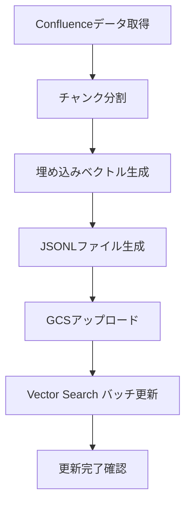

# Vertex AI Vector Search バッチ更新設計書

## 1. 概要

このドキュメントでは、Confluence データを Vertex AI Vector Search にバッチ更新するためのプロセスと実装について説明します。

## 2. バッチ更新プロセスの流れ



## 3. 実装詳細

### 3.1 データ準備

#### 3.1.1 Confluenceデータ取得

```typescript
async function fetchConfluencePages() {
  const confluenceClient = new ConfluenceClient({
    baseUrl: process.env.CONFLUENCE_BASE_URL,
    auth: {
      email: process.env.CONFLUENCE_USER_EMAIL,
      apiToken: process.env.CONFLUENCE_API_TOKEN
    }
  });

  const pages = await confluenceClient.getAllPages({
    spaceKey: process.env.CONFLUENCE_SPACE_KEY,
    expand: 'body.storage,version,space,metadata.labels'
  });

  return pages;
}
```

#### 3.1.2 チャンク分割

```typescript
function splitIntoChunks(page) {
  const htmlContent = page.body.storage.value;
  const plainText = htmlToText(htmlContent);
  
  const chunks = [];
  let currentChunk = '';
  const paragraphs = plainText.split('\n\n');
  
  for (const paragraph of paragraphs) {
    if ((currentChunk + paragraph).length <= MAX_CHUNK_SIZE) {
      currentChunk += paragraph + '\n\n';
    } else {
      chunks.push(currentChunk);
      currentChunk = paragraph + '\n\n';
    }
  }
  
  if (currentChunk) {
    chunks.push(currentChunk);
  }
  
  return chunks.map((content, index) => ({
    pageId: page.id,
    chunkIndex: index,
    content: content.trim(),
    metadata: {
      title: page.title,
      spaceKey: page.space.key,
      url: `${process.env.CONFLUENCE_BASE_URL}/wiki/spaces/${page.space.key}/pages/${page.id}`,
      lastUpdated: page.version.when
    }
  }));
}
```

#### 3.1.3 埋め込みベクトル生成

```typescript
async function generateEmbeddings(chunks) {
  const textEmbeddingService = new TextEmbeddingService();
  
  const results = [];
  for (const chunk of chunks) {
    const embedding = await textEmbeddingService.embed(chunk.content);
    results.push({
      ...chunk,
      embedding: embedding
    });
  }
  
  return results;
}
```

### 3.2 バッチファイル生成とアップロード

#### 3.2.1 JSONLファイル生成

```typescript
function createBatchFile(chunks) {
  const records = chunks.map(chunk => ({
    id: `${chunk.pageId}-${chunk.chunkIndex}`,
    embedding: chunk.embedding,
    restricts: [
      {
        namespace: 'title',
        allow_list: [chunk.metadata.title]
      },
      {
        namespace: 'space_key',
        allow_list: [chunk.metadata.spaceKey]
      },
      {
        namespace: 'content_type',
        allow_list: ['confluence_page']
      }
    ],
    crowding_tag: chunk.pageId
  }));
  
  return records.map(record => JSON.stringify(record)).join('\n');
}
```

#### 3.2.2 GCSアップロード

```typescript
async function uploadToGCS(content, filename) {
  const storage = new Storage();
  const bucketName = process.env.GCS_BUCKET_NAME;
  const file = storage.bucket(bucketName).file(filename);
  
  await file.save(content, {
    contentType: 'application/json',
    metadata: {
      cacheControl: 'no-cache'
    }
  });
  
  return `gs://${bucketName}/${filename}`;
}
```

### 3.3 Vector Search バッチ更新

#### 3.3.1 バッチ更新リクエスト

```typescript
async function updateVectorSearchIndex(gcsUri) {
  const aiplatform = require('@google-cloud/aiplatform');
  const {IndexServiceClient} = aiplatform.v1;
  
  const client = new IndexServiceClient({
    apiEndpoint: `${process.env.VERTEX_AI_LOCATION}-aiplatform.googleapis.com`
  });
  
  const indexName = client.indexPath(
    process.env.VERTEX_AI_PROJECT_ID,
    process.env.VERTEX_AI_LOCATION,
    process.env.VERTEX_AI_INDEX_ID
  );
  
  const updateRequest = {
    index: indexName,
    contentsDeltaUri: gcsUri
  };
  
  const [operation] = await client.updateIndex(updateRequest);
  return operation;
}
```

#### 3.3.2 更新完了確認

```typescript
async function waitForUpdateCompletion(operation) {
  const [response] = await operation.promise();
  console.log(`インデックス更新が完了しました: ${response.name}`);
  return response;
}
```

## 4. バッチ更新の最適化

### 4.1 差分更新

前回の同期以降に更新されたページのみを処理することで、処理時間とコストを削減します。

```typescript
async function fetchUpdatedPages(lastSyncTime) {
  // Confluenceから更新日時でフィルタリングしてページを取得
  const pages = await confluenceClient.getPages({
    spaceKey: process.env.CONFLUENCE_SPACE_KEY,
    expand: 'body.storage,version,space,metadata.labels',
    lastModified: lastSyncTime
  });
  
  return pages;
}
```

### 4.2 削除処理

削除されたページを検出し、Vector Searchからも削除します。

```typescript
async function handleDeletedPages(currentPageIds, previousPageIds) {
  const deletedPageIds = previousPageIds.filter(id => !currentPageIds.includes(id));
  
  if (deletedPageIds.length === 0) {
    return;
  }
  
  // 削除対象のIDを含むJSONLファイルを生成
  const deleteRecords = deletedPageIds.map(pageId => ({
    id: pageId,
    deleteDatapoint: true
  }));
  
  const content = deleteRecords.map(record => JSON.stringify(record)).join('\n');
  const gcsUri = await uploadToGCS(content, `delete/deleted-${Date.now()}.json`);
  
  // Vector Searchインデックス更新
  const operation = await updateVectorSearchIndex(gcsUri);
  await waitForUpdateCompletion(operation);
}
```

### 4.3 バッチサイズの最適化

大量のデータを処理する場合、適切なバッチサイズに分割して処理します。

```typescript
async function processPagesInBatches(pages, batchSize = 100) {
  const batches = [];
  for (let i = 0; i < pages.length; i += batchSize) {
    batches.push(pages.slice(i, i + batchSize));
  }
  
  for (let i = 0; i < batches.length; i++) {
    console.log(`バッチ ${i+1}/${batches.length} を処理中...`);
    await processPageBatch(batches[i]);
  }
}
```

## 5. エラーハンドリングと再試行

### 5.1 Confluence API エラー処理

```typescript
async function fetchWithRetry(fn, maxRetries = 3) {
  let retries = 0;
  
  while (true) {
    try {
      return await fn();
    } catch (error) {
      if (error.response?.status === 429) {
        // レート制限 - 指数バックオフで待機
        const waitTime = Math.pow(2, retries) * 1000;
        console.log(`レート制限により待機中... ${waitTime}ms`);
        await new Promise(resolve => setTimeout(resolve, waitTime));
        retries++;
      } else if (retries < maxRetries) {
        console.error(`エラーが発生しました。再試行中... (${retries+1}/${maxRetries})`, error);
        retries++;
      } else {
        throw error;
      }
    }
  }
}
```

### 5.2 Vector Search 更新エラー処理

```typescript
async function updateIndexWithErrorHandling(gcsUri) {
  try {
    const operation = await updateVectorSearchIndex(gcsUri);
    return await waitForUpdateCompletion(operation);
  } catch (error) {
    if (error.message.includes('INVALID_ARGUMENT')) {
      console.error('無効なデータ形式:', error.message);
      // データ形式のエラーログを詳細に記録
      await logDataFormatError(gcsUri, error);
      throw new Error(`データ形式が無効です: ${error.message}`);
    } else if (error.message.includes('RESOURCE_EXHAUSTED')) {
      console.warn('リソース制限に達しました。バッチサイズを縮小して再試行します。');
      // バッチを分割して再試行
      return await retryWithSmallerBatch(gcsUri);
    } else {
      throw error;
    }
  }
}
```

## 6. 監視とロギング

### 6.1 進捗ロギング

```typescript
function logProgress(current, total, operation) {
  const percentage = Math.round((current / total) * 100);
  console.log(`[${operation}] 進捗: ${current}/${total} (${percentage}%)`);
}
```

### 6.2 同期ステータスの保存

```typescript
async function saveSyncStatus(status) {
  const admin = require('firebase-admin');
  if (!admin.apps.length) {
    admin.initializeApp();
  }
  
  await admin.firestore().collection('syncLogs').add({
    timestamp: admin.firestore.FieldValue.serverTimestamp(),
    status: status.status,
    pagesProcessed: status.pagesProcessed,
    chunksProcessed: status.chunksProcessed,
    errors: status.errors,
    completedAt: status.completedAt
  });
  
  if (status.status === 'completed') {
    await admin.firestore().collection('syncConfig').doc('lastSync').set({
      lastSyncTime: admin.firestore.FieldValue.serverTimestamp()
    });
  }
}
```

## 7. メインプロセス

```typescript
async function main() {
  try {
    console.log('Confluence同期プロセスを開始します...');
    await saveSyncStatus({ status: 'started' });
    
    // 前回の同期時刻を取得
    const lastSyncTime = await getLastSyncTime();
    
    // 更新されたページを取得
    const pages = await fetchWithRetry(() => 
      lastSyncTime ? fetchUpdatedPages(lastSyncTime) : fetchConfluencePages()
    );
    
    console.log(`処理対象: ${pages.length}ページ`);
    
    // 現在のページIDと前回のページIDを比較して削除を処理
    const currentPageIds = pages.map(page => page.id);
    const previousPageIds = await getPreviousPageIds();
    await handleDeletedPages(currentPageIds, previousPageIds);
    
    // バッチ処理
    let totalChunks = 0;
    let errors = [];
    
    await processPagesInBatches(pages, 100, async (batch) => {
      try {
        // チャンク分割
        const allChunks = [];
        for (const page of batch) {
          const chunks = splitIntoChunks(page);
          allChunks.push(...chunks);
        }
        
        // 埋め込み生成
        const chunksWithEmbeddings = await generateEmbeddings(allChunks);
        
        // JSONLファイル生成
        const content = createBatchFile(chunksWithEmbeddings);
        
        // GCSアップロード
        const filename = `batch-${Date.now()}.json`;
        const gcsUri = await uploadToGCS(content, filename);
        
        // Vector Search更新
        await updateIndexWithErrorHandling(gcsUri);
        
        totalChunks += allChunks.length;
      } catch (error) {
        console.error('バッチ処理中にエラーが発生しました:', error);
        errors.push({
          message: error.message,
          stack: error.stack,
          timestamp: new Date().toISOString()
        });
      }
    });
    
    // 最終ステータス保存
    await saveSyncStatus({
      status: errors.length > 0 ? 'completed_with_errors' : 'completed',
      pagesProcessed: pages.length,
      chunksProcessed: totalChunks,
      errors: errors,
      completedAt: new Date().toISOString()
    });
    
    console.log('同期プロセスが完了しました。');
  } catch (error) {
    console.error('同期プロセス全体でエラーが発生しました:', error);
    await saveSyncStatus({
      status: 'failed',
      error: {
        message: error.message,
        stack: error.stack
      },
      completedAt: new Date().toISOString()
    });
  }
}
```

## 8. スケジューリング

Cloud Scheduler を使用して、定期的にバッチ更新プロセスを実行します。

```yaml
# cloud-scheduler.yaml
name: confluence-sync-job
schedule: "0 2 * * *"  # 毎日午前2時に実行
timeZone: "Asia/Tokyo"
httpTarget:
  uri: "https://asia-northeast1-{PROJECT_ID}.cloudfunctions.net/syncConfluenceData"
  httpMethod: POST
  headers:
    Content-Type: application/json
  body: eyJtb2RlIjoiZnVsbCJ9  # {"mode":"full"} をBase64エンコード
```
