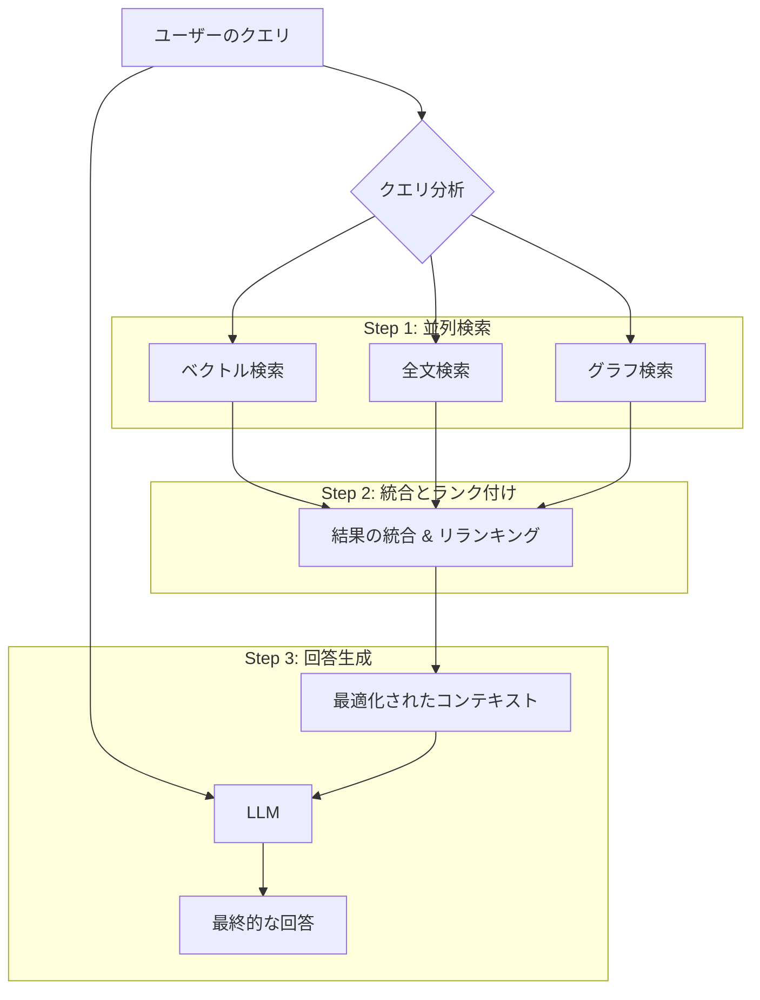

# GraphRAG-Tuned Architecture: 次世代検索システム設計書

## 更新履歴
- **2025年1月**: 現在の実装状況との関係を明確化
  - 現在のハイブリッド検索システムとの比較
  - 将来の拡張計画として位置づけ

## 1. 概要

本ドキュメントは、現在の検索システムが抱える「ベクトル検索の不確実性」という課題を解決し、検索品質を飛躍的に向上させるための次世代アーキテクチャ「GraphRAG-Tuned Architecture」について詳述する。

### 現在の実装状況（2025年1月）
- **ハイブリッド検索**: ベクトル検索 + BM25検索 + キーワード検索 + 動的関連性スコアリング
- **ドメイン知識**: 8,122個のキーワードを管理する知識ベース
- **ストリーミング**: リアルタイム回答生成とプログレス表示
- **認証**: Firebase Authentication + @tomonokai-corp.com ドメイン制限

### 将来の拡張計画
この設計は、現在のハイブリッド検索システムに、新たに**構造化データ（ナレッジグラフ）**の層を導入する。これら4つの要素を連携させることで、より正確で文脈を理解した検索結果の生成を目指すものである。このアプローチは、[GraphRAGをわかりやすく解説](https://qiita.com/ksonoda/items/98a6607f31d0bbb237ef) [1] で紹介されている最先端の概念に基づいている。

## 2. アーキテクチャ設計の3つの柱

本アーキテクチャは、以下の3つの主要な要素で構成される。

1.  **ナレッジグラフ (Knowledge Graph) の構築**: ドメイン知識をエンティティと関係性のグラフとして表現する。
2.  **多層的検索 (Multi-layered Search) プロセス**: 複数の検索手法を並列実行し、結果を統合して最適なコンテキストを生成する。
3.  **進化したラベルシステム (Evolved Labeling)**: ラベルを単なるフィルタから、ナレッジグラフを構成する属性情報へと進化させる。

---

## 3. ナレッジグラフの構築

既存の「ドメイン知識抽出システム」を拡張し、システムの知識を構造化されたナレッジグラフとして構築する。

### グラフの構成要素

-   **ノード (Entities):**
    -   `機能 (Function)`: 例：「教室新規登録機能」
    -   `システム項目 (System Item)`: 例：「CSVアップロードボタン」
    -   `関連キーワード (Keyword)`: 例：「一括登録」「管理者」
    -   `Confluenceページ (Page)`: ドキュメント本体
    -   `ラベル (Label)`: 例：「機能要件」「高優先度」

-   **エッジ (Relationships):**
    -   `DESCRIBES` (説明する): `Page` -> `Function`
    -   `CONTAINS` (含む): `Function` -> `System Item`
    -   `RELATES_TO` (関連する): `Function` -> `Function`
    -   `ASSOCIATED_WITH` (関連付けられる): `Function` -> `Keyword`
    -   `TAGGED_WITH` (タグ付けされる): `Page` or `Function` -> `Label`

### 実装方法

`domain-knowledge-extraction`スクリプトを拡張し、JSON出力に加えて、グラフデータベース（例: Neo4j）にインポート可能な形式（ノードリストとエッジリストのCSVファイル）を出力する。

---

## 4. 多層的検索プロセス

ユーザーのクエリから回答を生成するまでのプロセスを以下のように再設計する。

-   **クエリ分析:** クエリから主要なエンティティ（例：「教室管理」「一括登録」）を特定する。
-   **並列検索:**
    -   **ベクトル検索 (既存):** 意味的に類似したテキストチャンクを取得。
    -   **全文検索 (新規):** キーワードに完全に一致するチャンクを取得。
    -   **グラフ検索 (最重要):** クエリ内のエンティティを起点にナレッジグラフを探索し、関連する機能、項目、ページを正確に特定する。
-   **統合 & リランキング:** 3つの検索結果をReciprocal Rank Fusion (RRF) 等のアルゴリズムで統合し、最も関連性の高い情報を上位に並べ替える。
-   **回答生成:** 最適化されたコンテキストに基づき、LLMが正確で網羅的な回答を生成する。

---

## 5. 進化したラベルシステム

提案済みの「機能ごとラベル設計」をさらに発展させ、ナレッジグラフの属性として活用する。

-   **動的フィルタリング:** グラフ検索時にラベルを条件に加えることで、「`高優先度`で`未完了`の`教室管理`に関連する機能」といった複雑な検索が可能になる。
-   **コンテキストの強化:** 検索結果にラベル情報（例：この機能は「レビュー中」です）を含めることで、LLMがより状況に応じた回答を生成できるようになる。

---

## 6. 具体的な検索例

**クエリ:** 「教室管理で生徒を一括登録する機能について教えて」

#### Before (現在のRAG)
- ベクトル検索が「教室管理」「一括登録」に関連するチャンクを複数見つけるが、無関係な「教室情報編集」などの情報が混じる可能性がある。
- 結果として、少しぼやけた、あるいは不正確な回答が生成されるリスクがある。

#### After (GraphRAG-Tuned Architecture)
1.  **グラフ検索**が `教室管理` ドメインに属し、`一括登録` というキーワードを持つ `教室一括登録機能` ノードを直接特定する。
2.  グラフを辿り、この機能が `生徒データインポート機能` に関連し、`CSVアップロードボタン` を含み、`page-164` で説明されているといった構造化された関係性をすべて取得する。
3.  これらの正確な情報をベクトル検索・全文検索の結果と統合し、完璧なコンテキストをLLMに提供する。
4.  結果として、「教室管理の一括登録機能は完了済みの高優先度機能で、CSVアップロードボタンを通じて生徒データをインポートします...」といった、極めて正確で詳細な回答が生成される。

---

## 7. 実装計画

| フェーズ | 内容 | 期間（目安） |
| :--- | :--- | :--- |
| **Phase 1** | **ナレッジグラフ構築** | 3-5日 |
| | `domain-knowledge-extraction`スクリプトを改修し、グラフデータを出力。 | |
| **Phase 2** | **グラフ検索APIの実装** | 2-3日 |
| | クエリに応じてグラフを探索し、関連エンティティを返すAPIを実装。 | |
| **Phase 3** | **検索パイプラインの統合** | 3-4日 |
| | 既存の検索ロジックに全文検索とグラフ検索を組み込み、結果を統合。 | |
| **Phase 4** | **テストと品質評価** | 2-3日 |
| | 新旧アーキテクチャの性能を比較評価。 | |

## 8. 期待される効果

-   **検索精度の飛躍的向上**: 複雑な質問に対しても、より正確で網羅的な回答が可能になる。
-   **回答の信頼性向上**: ハルシネーションを大幅に抑制し、根拠に基づいた回答を生成する。
-   **システムの拡張性**: 新しい知識や関係性をグラフに追加するだけで、容易にシステムを拡張できる。

---
[1] ksonoda. (2024). *GraphRAGをわかりやすく解説*. Qiita. Retrieved from https://qiita.com/ksonoda/items/98a6607f31d0bbb237ef
