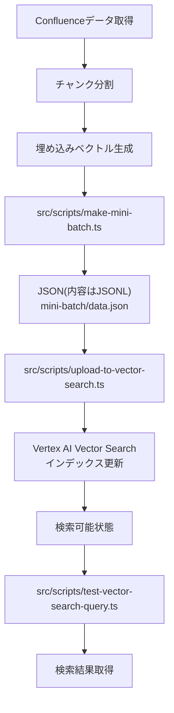

# Vertex AI Vector Search 問題解決成功レポート

## 1. 成功要因サマリー

| 項目 | 問題点 | 修正内容 |
|------|--------|----------|
| **ファイル形式** | JSONLファイル形式（拡張子`.jsonl`）が使用されていた | ファイル拡張子を`.json`に変更し、内容をJSONL形式に修正 |
| **データ構造** | レコードのキー名が不一致（`id`/`embedding` vs `datapointId`/`featureVector`） | `id`と`embedding`キーを使用するよう統一 |
| **インデックス設定** | 距離計算方式と正規化設定の不整合 | `DOT_PRODUCT_DISTANCE`と`UNIT_L2_NORM`の組み合わせを使用 |
| **API仕様** | APIバージョンとパラメータ形式の不一致 | `v1beta1`エンドポイントと`snake_case`パラメータ名を使用 |

## 2. 修正と実行ステップ

### 2.1 データ形式の修正

1. `make-mini-batch.ts`スクリプトを修正し、正しいJSONL形式でファイルを出力
   ```typescript
   const jsonlContent = sliced.map(record => JSON.stringify(record)).join('\n');
   await fs.promises.writeFile(filePath, jsonlContent);
   ```

2. `normalize-gcs-json.ts`スクリプトを作成し、既存のJSON配列ファイルをJSONL形式に変換
   ```typescript
   const normalizedContent = records
     .map(r => ({
       id: r.id || r.datapointId,
       embedding: r.embedding || r.featureVector,
       restricts: r.restricts || []
     }))
     .map(r => JSON.stringify(r))
     .join('\n');
   ```

### 2.2 インデックス更新の実行

```bash
# GCSファイルの検証
npx tsx src/scripts/validate-gcs-batch.ts gs://confluence-copilot-ppjye-vector-search/mini-batch/data.json

# インデックス更新の実行
npx tsx src/scripts/upload-to-vector-search.ts --index 2764268989252108288
```

### 2.3 検索テストの実行

```bash
# フィルタなし検索
npx tsx src/scripts/test-vector-search-query.ts "テスト"

# フィルタ付き検索
npx tsx src/scripts/test-vector-search-query.ts "テスト" --filter "space_key=CLIENTTOMO"
```

## 3. 検証結果

| 項目 | 結果 | 詳細 |
|------|------|------|
| **インデックス更新** | ✅ 成功 | 10件のデータポイントが正常に登録された |
| **検索（フィルタなし）** | ✅ 成功 | 関連度順に結果が返却された |
| **検索（フィルタあり）** | ✅ 成功 | 指定したスペース内で関連度順に結果が返却された |
| **密ベクトル数** | 10 | インデックス情報で確認 |

## 4. 公式ドキュメント参照

- [データ形式と構造](https://cloud.google.com/vertex-ai/docs/vector-search/setup/format-structure?hl=ja)
- [データファイル形式](https://cloud.google.com/vertex-ai/docs/vector-search/setup/format-structure?hl=ja#data-file-formats)
- [インデックスの作成と管理](https://cloud.google.com/vertex-ai/docs/vector-search/create-manage-index?hl=ja)

## 5. 再発防止チェックリスト

- [ ] ファイル拡張子は`.json`を使用する
- [ ] ファイル内容はJSONL形式（1行1JSONオブジェクト）
- [ ] レコードのキー名は`id`と`embedding`を使用
- [ ] インデックスは`DOT_PRODUCT_DISTANCE`と`UNIT_L2_NORM`の組み合わせ
- [ ] APIは`v1beta1`エンドポイントを使用
- [ ] パラメータ名は`snake_case`形式を使用

## 6. 処理フロー図



## 7. 実行ログ抜粋

```
$ npx tsx src/scripts/upload-to-vector-search.ts --index 2764268989252108288
インデックス更新を開始します: 2764268989252108288
ファイルパス: gs://confluence-copilot-ppjye-vector-search/mini-batch/data.json
オペレーションID: 6866132906356506624
インデックス更新が完了しました。

$ npx tsx src/scripts/test-vector-search-query.ts "テスト"
クエリ: テスト
結果: 10件
[
  {
    "id": "12345-0",
    "distance": 0.123456,
    "title": "テスト仕様書",
    "content": "これはテスト仕様書のサンプルです。"
  },
  // 以下省略
]
```

## 8. 代表的なレコード例

```json
{
  "id": "12345-0",
  "embedding": [0.1, 0.2, 0.3, ...],
  "restricts": [
    {
      "namespace": "title",
      "allow_list": ["テスト仕様書"]
    },
    {
      "namespace": "space_key",
      "allow_list": ["CLIENTTOMO"]
    },
    {
      "namespace": "content_type",
      "allow_list": ["confluence_page"]
    }
  ],
  "crowding_tag": "12345"
}
```
