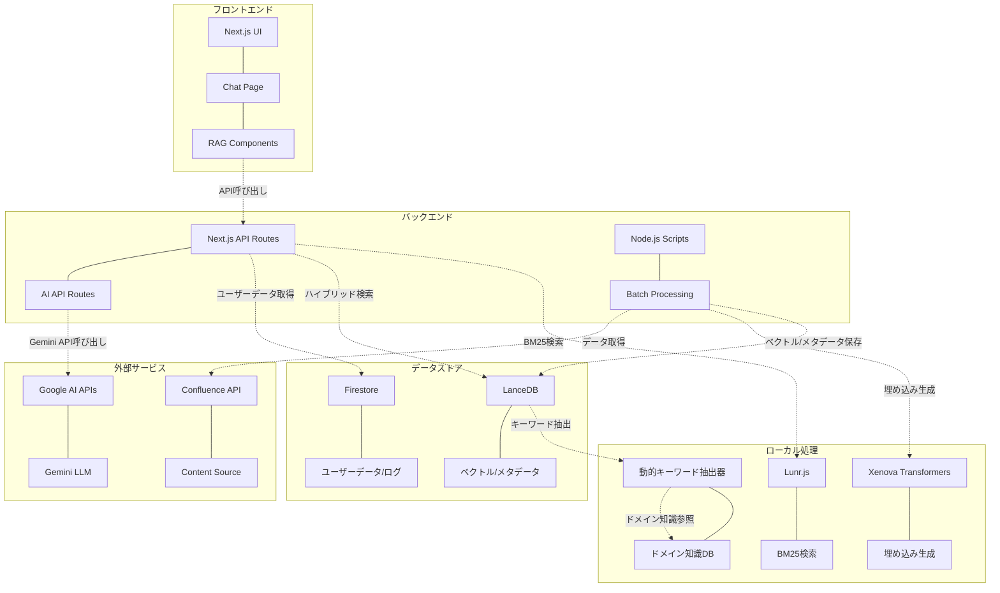
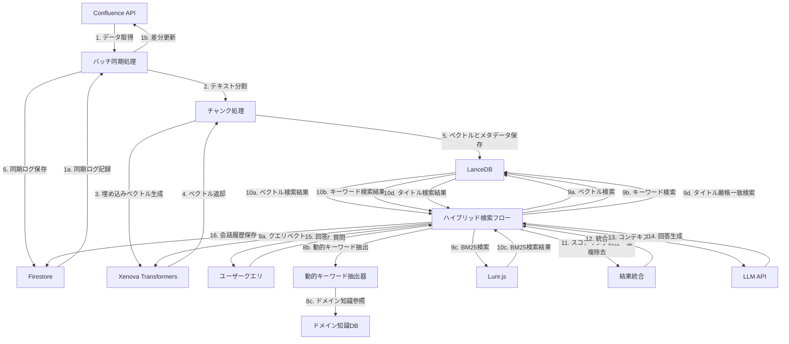
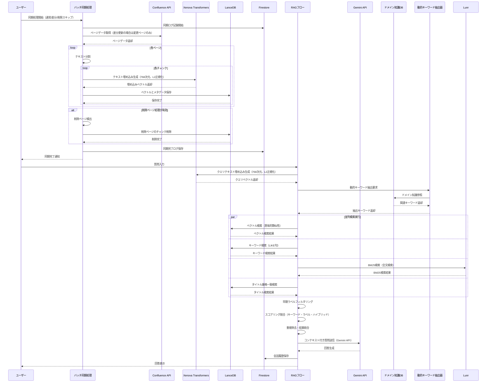

# Confluence Vector Search システム設計図 (LanceDB版)

このドキュメントでは、LanceDBを使用したConfluence Vector Search システムのコンポーネント図、データフロー図、シーケンス図を示します。

## 更新履歴
- **2024年12月**: 現在の実装に合わせて最新化
  - 埋め込みモデル: paraphrase-multilingual-mpnet-base-v2（768次元）
  - LLM: Gemini API (gemini-2.5-flash)
  - ハイブリッド検索: ベクトル検索 + BM25検索 + キーワード検索
  - 日本語対応: Kuromojiトークナイザー使用
  - ドメイン知識抽出システム: 8,122個のキーワードを管理する知識ベース
  - 動的キーワード抽出器: クエリに応じた動的な検索精度向上

## コンポーネント図

## データフロー図

## シーケンス図

## 実装フローの詳細

### 1. データ取得と処理
- Confluenceから全ページデータを取得（約1000ページ）
  - 差分更新モード（`--differential`）では前回の同期以降に更新されたページのみを取得
- テキストをチャンクに分割（合計約2500チャンク）
- 各チャンクの埋め込みベクトルを生成（Xenova Transformersライブラリ使用、768次元、L2正規化）
- 生成したベクトルとメタデータをLanceDBに直接保存

### 2. データ保存
- LanceDBにベクトルとメタデータを保存（`.lancedb/`ディレクトリ）
  - メタデータには、タイトル、スペースキー、ラベル、コンテンツなどを含む
  - 検索時に必要なすべての情報をLanceDBに保存
- Firestoreには同期ログとユーザーデータのみ保存
  - 同期の開始・完了・エラー情報
  - ユーザーアカウント情報と会話履歴

### 3. ハイブリッド検索と回答生成
- ユーザーの質問をベクトル化（Xenova Transformersライブラリ使用、768次元、L2正規化）
- 動的キーワード抽出（ドメイン知識データベースから関連キーワードを抽出・分類）
- 並列実行による複数検索ソースの組み合わせ：
  - **ベクトル検索**: LanceDBで類似ベクトル検索（意味的類似性）
  - **キーワード検索**: LanceDBのLIKE句によるタイトル・コンテンツ検索
  - **BM25検索**: Lunr.jsによる全文検索（BM25アルゴリズム）
  - **タイトル厳格一致検索**: タイトルがクエリに完全一致する検索
- 早期ラベルフィルタリング（議事録、アーカイブ等の除外）
- スコアリング統合（キーワードスコア、ラベルスコア、ハイブリッドスコア）
- 重複除去と結果統合
- LanceDBから直接メタデータを取得（Firestoreアクセス不要）
- 取得したコンテキストと質問をGemini APIに送信
- 生成された回答をユーザーに表示
- 会話履歴をFirestoreに保存

## 技術スタック

- **フロントエンド**: Next.js
- **バックエンド**: Next.js API Routes + Node.js Scripts
- **データベース**: 
  - Firestore（ユーザーデータ、会話履歴、ログ）
  - LanceDB（ベクトルデータ、検索メタデータ）
- **検索エンジン**: ハイブリッド検索システム
  - ベクトル検索: LanceDBによる意味的類似性検索
  - キーワード検索: LanceDBのLIKE句による部分一致検索
  - BM25検索: Lunr.jsによる全文検索
  - タイトル厳格一致検索: 完全一致による高精度検索
- **ベクトル生成**: Xenova Transformersライブラリ（paraphrase-multilingual-mpnet-base-v2、768次元）
- **LLM**: Google AI Gemini API (gemini-2.5-flash)
- **AI Framework**: 現在は直接API呼び出し（Genkit統合予定）

## コンポーネントの詳細説明

### フロントエンド
- **Next.js UI**: Reactベースのフロントエンドフレームワーク
- **Chat Page**: ユーザーとのチャットインターフェース
- **RAG Components**: 検索結果表示や回答生成のUIコンポーネント

### バックエンド
- **Next.js API Routes**: フロントエンドからのAPIリクエストを処理
- **AI API Routes**: Gemini APIとの直接連携（Genkit統合予定）
- **Node.js Scripts**: バッチ処理やスケジュールされたタスクを実行
- **Batch Processing**: Confluenceデータの定期同期処理

### データストア
- **Firestore**: ユーザーデータ、会話履歴、同期ログを保存
- **LanceDB**: ローカルベクトルデータベース（埋め込みベクトルとメタデータを保存）
  - ベクトル検索と検索結果表示に必要なすべてのデータを一元管理

### 外部サービス
- **Confluence API**: ドキュメントのソースデータを提供
- **Content Source**: ページ、スペース、ラベルなどの構造化コンテンツ
- **Google AI APIs**: AIモデルへのアクセスを提供
- **Gemini LLM**: 質問応答と要約生成のための大規模言語モデル（gemini-2.5-flash）

### ローカル処理
- **Xenova Transformers**: ローカルでの埋め込みベクトル生成
  - paraphrase-multilingual-mpnet-base-v2モデル使用（768次元）
  - 外部APIに依存せず、コスト削減とプライバシー保護を実現
- **Lunr.js**: ローカルでのBM25全文検索
  - 軽量なJavaScript検索ライブラリ
  - インデックス構築とBM25アルゴリズムによる関連性スコアリング
  - 日本語テキスト対応（Kuromojiトークナイザー使用）

- **ドメイン知識データベース**: システム仕様書から抽出された構造化知識
  - 8,122個のキーワードを管理（1,067ページから抽出）
  - 6つのカテゴリ: ドメイン名、機能名、操作名、システム項目、システム用語、関連キーワード
  - 重複削除機能による高品質な知識ベース

- **動的キーワード抽出器**: クエリに応じた動的なキーワード抽出
  - ドメイン知識データベースから関連キーワードを抽出
  - 動的優先度管理による検索精度向上
  - クエリの意図に応じた適切なキーワード分類