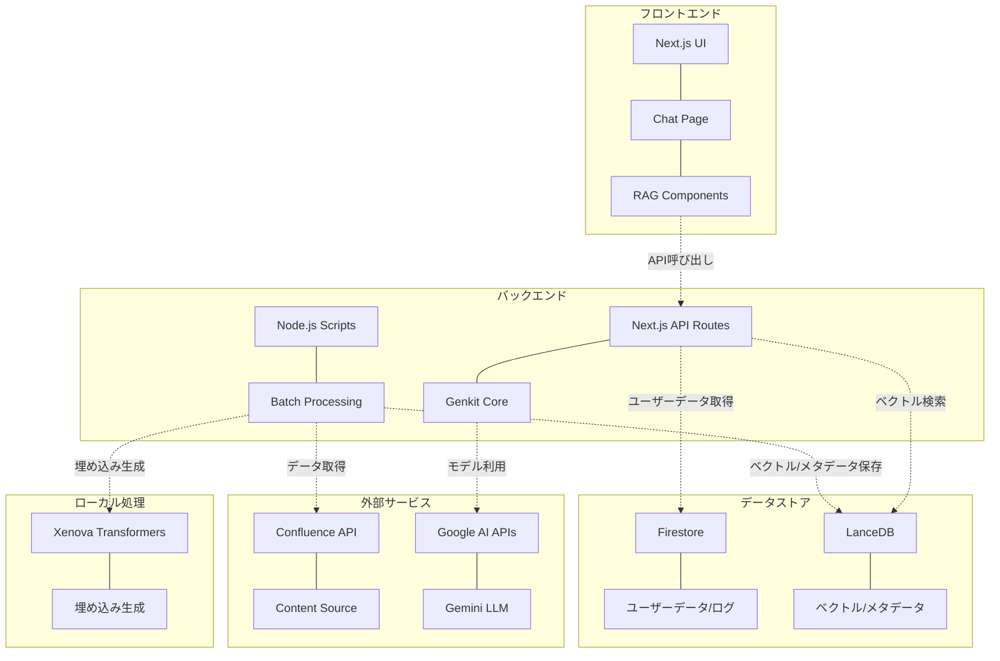
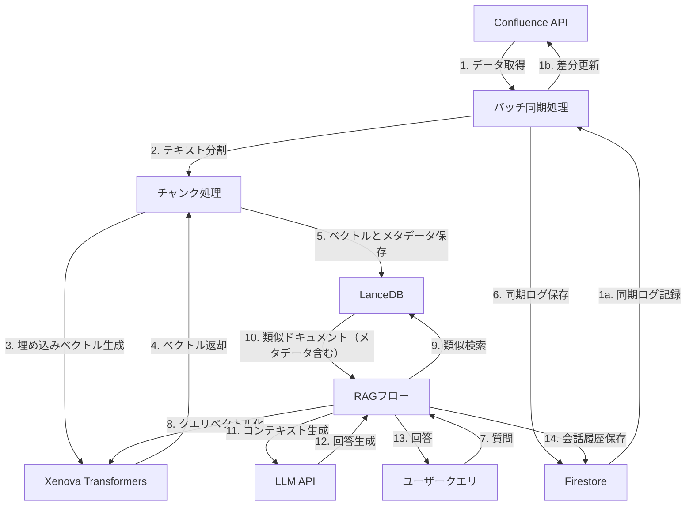
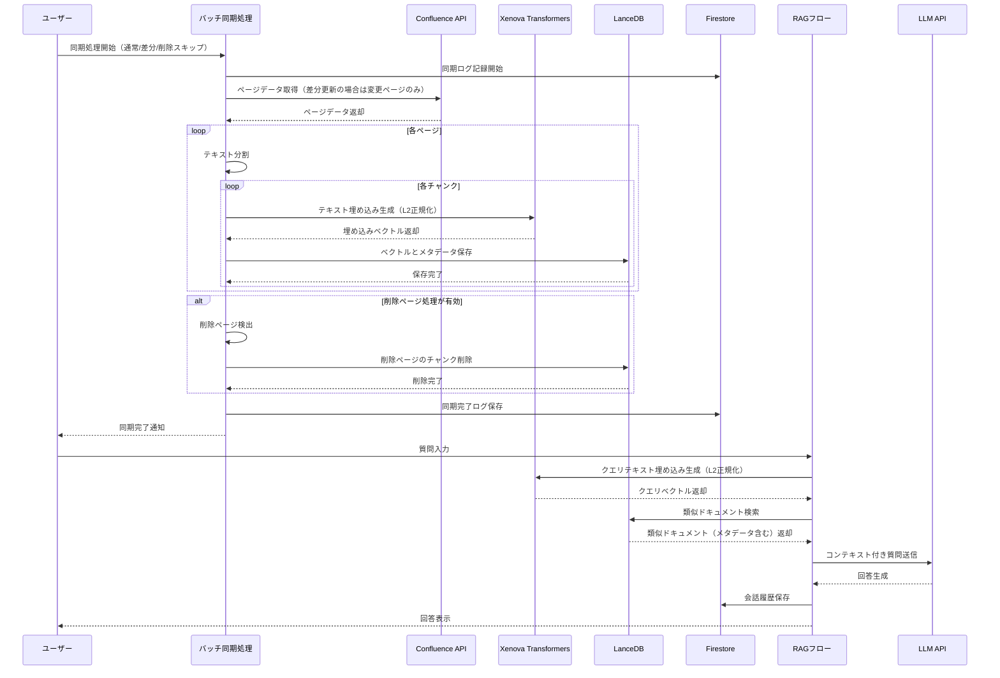

# Confluence Vector Search システム設計図 (LanceDB版)

このドキュメントでは、LanceDBを使用したConfluence Vector Search システムのコンポーネント図、データフロー図、シーケンス図を示します。

## コンポーネント図

## データフロー図

## シーケンス図

## 実装フローの詳細

### 1. データ取得と処理
- Confluenceから全ページデータを取得（約1000ページ）
  - 差分更新モード（`--differential`）では前回の同期以降に更新されたページのみを取得
- テキストをチャンクに分割（合計約2500チャンク）
- 各チャンクの埋め込みベクトルを生成（Xenova Transformersライブラリ使用、768次元、L2正規化）
- 生成したベクトルとメタデータをLanceDBに直接保存

### 2. データ保存
- LanceDBにベクトルとメタデータを保存（`.lancedb/`ディレクトリ）
  - メタデータには、タイトル、スペースキー、ラベル、コンテンツなどを含む
  - 検索時に必要なすべての情報をLanceDBに保存
- Firestoreには同期ログとユーザーデータのみ保存
  - 同期の開始・完了・エラー情報
  - ユーザーアカウント情報と会話履歴

### 3. 検索と回答生成
- ユーザーの質問をベクトル化（Xenova Transformersライブラリ使用、768次元、L2正規化）
- LanceDBで類似ドキュメントを検索
- LanceDBから直接メタデータを取得（Firestoreアクセス不要）
- 取得したコンテキストと質問をLLMに送信
- 生成された回答をユーザーに表示
- 会話履歴をFirestoreに保存

## 技術スタック

- **フロントエンド**: Next.js
- **バックエンド**: Next.js API Routes + Node.js Scripts
- **データベース**: 
  - Firestore（ユーザーデータ、会話履歴、ログ）
  - LanceDB（ベクトルデータ、検索メタデータ）
- **ベクトル生成**: Xenova Transformersライブラリ（ローカル埋め込み生成）
- **LLM**: Google AI Gemini Pro (gemini-2.0-flash)
- **AI Framework**: Genkit (core)

## コンポーネントの詳細説明

### フロントエンド
- **Next.js UI**: Reactベースのフロントエンドフレームワーク
- **Chat Page**: ユーザーとのチャットインターフェース
- **RAG Components**: 検索結果表示や回答生成のUIコンポーネント

### バックエンド
- **Next.js API Routes**: フロントエンドからのAPIリクエストを処理
- **Genkit Core**: AIモデルとの連携を担当するフレームワーク
- **Node.js Scripts**: バッチ処理やスケジュールされたタスクを実行
- **Batch Processing**: Confluenceデータの定期同期処理

### データストア
- **Firestore**: ユーザーデータ、会話履歴、同期ログを保存
- **LanceDB**: ローカルベクトルデータベース（埋め込みベクトルとメタデータを保存）
  - ベクトル検索と検索結果表示に必要なすべてのデータを一元管理

### 外部サービス
- **Confluence API**: ドキュメントのソースデータを提供
- **Content Source**: ページ、スペース、ラベルなどの構造化コンテンツ
- **Google AI APIs**: AIモデルへのアクセスを提供
- **Gemini LLM**: 質問応答と要約生成のための大規模言語モデル

### ローカル処理
- **Xenova Transformers**: ローカルでの埋め込みベクトル生成
  - 外部APIに依存せず、コスト削減とプライバシー保護を実現