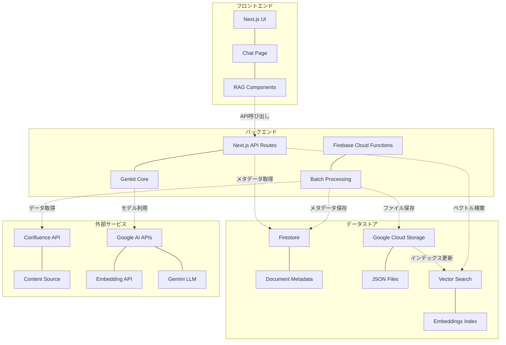
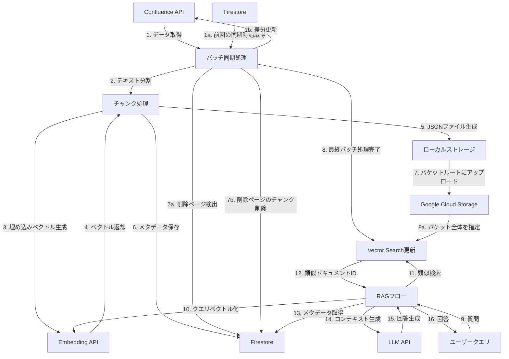
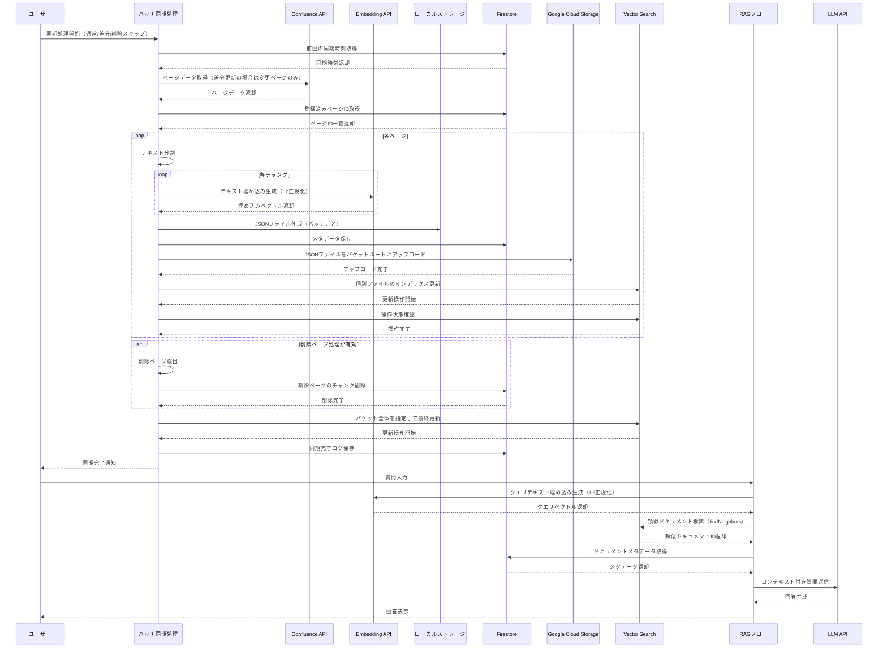

# Confluence Vector Search システム設計図

このドキュメントでは、Confluence Vector Search システムのコンポーネント図、データフロー図、シーケンス図を示します。

## コンポーネント図

## データフロー図

## シーケンス図

## 実装フローの詳細

### 1. データ取得と処理
- Confluenceから全ページデータを取得（約1000ページ）
  - 差分更新モード（`--differential`）では前回の同期以降に更新されたページのみを取得
- テキストをチャンクに分割（合計約2500チャンク）
- 各チャンクの埋め込みベクトルを生成（768次元、L2正規化）
- バッチ単位（100ページごと）でJSONファイルを生成
  - Vector Search仕様に準拠した形式（`id`、`embedding`、`restricts`、`crowding_tag`）
- Firestoreにメタデータを保存

### 2. データ保存と転送
- 生成されたJSONファイルをローカルの`temp`ディレクトリに保存
- JSONファイルをGoogle Cloud Storage（GCS）のバケットルートに直接アップロード
  - Vector Search仕様に準拠（サブディレクトリ不可）
- 各バッチごとにVector Searchインデックスに個別ファイルをインポート
- 削除ページ処理（`--skip-deleted`オプションで無効化可能）
  - Confluenceから削除されたページのチャンクをFirestoreから削除
- 全バッチ処理完了後、バケット全体を指定して最終更新を実行

### 3. 検索と回答生成
- ユーザーの質問をベクトル化（768次元、L2正規化）
- Vector Searchで類似ドキュメントを検索（`findNeighbors` API）
- 検索結果IDを使ってFirestoreからメタデータを取得
- 取得したコンテキストと質問をLLMに送信
- 生成された回答をユーザーに表示

## 技術スタック

- **フロントエンド**: Next.js
- **バックエンド**: Next.js API Routes + Firebase Cloud Functions
- **データベース**: Firestore
- **ストレージ**: Google Cloud Storage
- **ベクトル検索**: Vertex AI Vector Search
- **埋め込み生成**: Google AI Text Embedding API (text-embedding-004)
- **LLM**: Google AI Gemini Pro (gemini-2.0-flash)
- **AI Framework**: Genkit (core)

## コンポーネントの詳細説明

### フロントエンド
- **Next.js UI**: Reactベースのフロントエンドフレームワーク
- **Chat Page**: ユーザーとのチャットインターフェース
- **RAG Components**: 検索結果表示や回答生成のUIコンポーネント

### バックエンド
- **Next.js API Routes**: フロントエンドからのAPIリクエストを処理
- **Genkit Core**: AIモデルとの連携を担当するフレームワーク
- **Firebase Cloud Functions**: バッチ処理やスケジュールされたタスクを実行
- **Batch Processing**: Confluenceデータの定期同期処理

### データストア
- **Firestore**: ドキュメントのメタデータと検索結果表示用データを保存
- **Document Metadata**: チャンクのタイトル、URL、ラベルなどの情報
- **Google Cloud Storage**: 大容量のJSONファイルを保存
- **JSON Files**: ベクトルデータとメタデータを含む構造化ファイル
- **Vector Search**: 高速なベクトル類似度検索を提供（DOT_PRODUCT_DISTANCE + UNIT_L2_NORM）
- **Embeddings Index**: 埋め込みベクトルのインデックス

### 外部サービス
- **Confluence API**: ドキュメントのソースデータを提供
- **Content Source**: ページ、スペース、ラベルなどの構造化コンテンツ
- **Google AI APIs**: AIモデルへのアクセスを提供
- **Embedding API**: テキストの埋め込みベクトル生成
- **Gemini LLM**: 質問応答と要約生成のための大規模言語モデル
