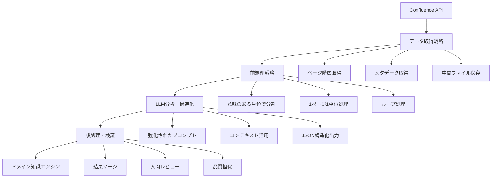

# ドメイン知識抽出・構造化ツール構築戦略

## 概要

このツールは、単なるスクリプトではなく、「Confluence上の仕様書を知識源とする、継続的に更新可能なドメイン知識エンジン」として位置づけます。

## 全体アーキテクチャ



## Step 1: データ取得戦略 (Confluence API)

### 1.1 取得対象データ

- **ページ階層**: 親子関係、機能の全体像、依存関係
- **ページメタデータ**: タイトル、ラベル、URL、作成日時
- **ページコンテンツ**: 本文テキスト、構造化データ

### 1.2 取得スクリプト仕様

```typescript
interface ConfluencePage {
  id: string;
  title: string;
  content: string;
  parentId?: string;
  parentTitle?: string;
  labels: string[];
  url: string;
  spaceKey: string;
  lastModified: string;
  author: string;
}

interface ConfluenceSpace {
  key: string;
  name: string;
  pages: ConfluencePage[];
  hierarchy: PageHierarchy;
}
```

### 1.3 実装方針

- TypeScriptでConfluence APIクライアントを構築
- 特定のスペースを起点に全ページを再帰的に取得
- 中間ファイル（JSON）として保存
- エラーハンドリングとリトライ機能を実装

## Step 2: 前処理戦略 (1000ページの効率的処理)

### 2.1 分割戦略

- **最適な分割単位**: 1ページ = 1チャンク
- **理由**: 1ページは特定の機能・仕様について完結している
- **処理方式**: ページ単位でのループ処理

### 2.2 処理フロー

```typescript
interface ProcessingPipeline {
  input: ConfluencePage[];
  chunkSize: 1; // 1ページ単位
  batchSize: 10; // バッチ処理サイズ
  output: ProcessedPage[];
}
```

### 2.3 メタデータ活用

- ページタイトルから機能名を推定
- ラベルからカテゴリを分類
- 階層情報から依存関係を把握

## Step 3: LLM分析・構造化戦略

### 3.1 強化されたプロンプト設計

```typescript
interface AnalysisPrompt {
  role: "ドメイン知識抽出専門家";
  context: {
    pageTitle: string;
    parentPage?: string;
    url: string;
    labels: string[];
    hierarchy: string[];
  };
  task: "機能とキーワードの抽出";
  rules: {
    outputFormat: "JSON";
    structure: "機能名: キーワード配列";
  };
  input: string; // ページ本文
}
```

### 3.2 プロンプトテンプレート

```markdown
# Role
あなたは仕様書を分析し、機能とそれに紐づくキーワードを抽出する専門家です。

# Context
これから渡すテキストは、大規模なシステム仕様書の一部です。
- ページタイトル: "{pageTitle}"
- 親ページ: "{parentTitle}"
- ラベル: "{labels}"
- 階層: "{hierarchy}"
- URL: "{url}"

# Task
上記コンテキストを考慮して、このページで説明されている主要機能と、関連する操作キーワードを抽出してください。

# Rules
- 出力は必ずJSON形式にしてください
- フォーマット: { "機能名": ["キーワード1", "キーワード2", ...] }
- 機能名は具体的で分かりやすいものにしてください
- キーワードは検索に有効なものを抽出してください

# Input
---
{pageContent}
---
```

### 3.3 出力構造

```typescript
interface ExtractedKnowledge {
  pageId: string;
  pageTitle: string;
  extractedAt: string;
  functions: {
    [functionName: string]: string[];
  };
  confidence: number; // 0-1
  metadata: {
    processingTime: number;
    tokenCount: number;
  };
}
```

## Step 4: 後処理・検証戦略

### 4.1 結果マージ

```typescript
interface MergedKnowledge {
  functions: {
    [functionName: string]: {
      keywords: string[];
      sources: string[]; // ページIDの配列
      confidence: number;
      lastUpdated: string;
    };
  };
  statistics: {
    totalFunctions: number;
    totalKeywords: number;
    totalPages: number;
    averageConfidence: number;
  };
}
```

### 4.2 品質担保プロセス

1. **自動検証**: 重複キーワードの統合、信頼度の計算
2. **人間レビュー**: 抽出結果の妥当性確認
3. **継続的改善**: フィードバックに基づくプロンプト調整

### 4.3 検証ルール

- 機能名の一意性確認
- キーワードの重複除去
- 信頼度スコアの計算
- 異常値の検出と報告

## 実装計画

### Phase 1: 基盤構築
- [ ] Confluence APIクライアントの実装
- [ ] データ取得スクリプトの作成
- [ ] 基本データ構造の定義

### Phase 2: 前処理パイプライン
- [ ] ページ分割ロジックの実装
- [ ] メタデータ抽出機能の実装
- [ ] バッチ処理システムの構築

### Phase 3: LLM分析システム
- [ ] プロンプトテンプレートの実装
- [ ] LLM API連携の実装
- [ ] 結果構造化ロジックの実装

### Phase 4: 後処理・検証
- [ ] 結果マージシステムの実装
- [ ] 品質担保プロセスの実装
- [ ] 人間レビューインターフェースの構築

### Phase 5: 継続的改善
- [ ] フィードバック収集システム
- [ ] プロンプト最適化機能
- [ ] 品質メトリクス監視

## 期待される成果

### 短期的成果
- 1000ページの仕様書から構造化された知識の抽出
- 検索精度の大幅向上
- 開発効率の向上

### 長期的成果
- 継続的に更新可能なドメイン知識エンジン
- 新機能開発時の知識活用
- チーム全体の知識共有促進

## 技術スタック

- **言語**: TypeScript
- **LLM**: Gemini 2.5 Flash
- **データベース**: LanceDB (既存)
- **API**: Confluence REST API
- **ストレージ**: JSON files, Firestore
- **監視**: カスタムメトリクス

## リスク管理

### 技術的リスク
- LLM APIの制限・コスト
- 大量データ処理のパフォーマンス
- データ品質のばらつき

### 対策
- バッチ処理とレート制限の実装
- 段階的な実装とテスト
- 品質チェックポイントの設置

## 成功指標

- **抽出精度**: 95%以上の機能名抽出精度
- **処理速度**: 1000ページを24時間以内に処理
- **検索改善**: 検索精度80%以上、再現率70%以上
- **運用効率**: 月次更新の自動化
