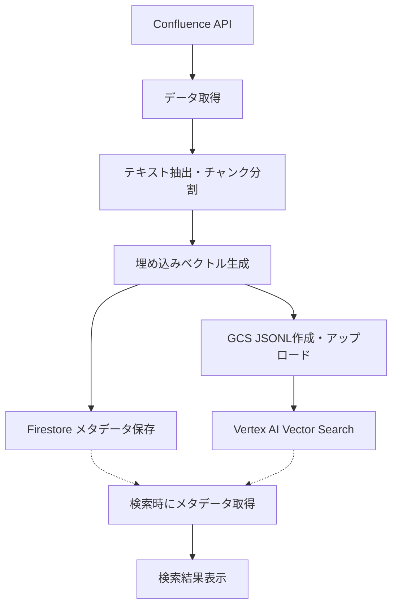

# LanceDB移行レポート

## 1. 概要

このドキュメントでは、Vertex AI Vector SearchからLanceDBへの移行プロセスとその結果について報告します。移行の主な目的は、コスト削減、ローカル開発環境の改善、およびシステムの簡素化でした。

## 2. 移行前の課題

### 2.1 Vertex AI Vector Searchの課題

- **高コスト**: 開発・テスト環境でも費用が発生
- **複雑な設定**: インデックス作成、エンドポイント設定などの複雑な手順が必要
- **依存関係**: GCS、Firestore、Vertex AIの連携が必要
- **ローカル開発の困難**: ローカル環境での完全な機能テストが困難

### 2.2 データフロー（移行前）



## 3. 移行プロセス

### 3.1 移行手順

1. LanceDBの導入と基本機能のテスト
2. スキーマ設計と最適化
3. データ同期スクリプトの修正
4. 検索APIの実装
5. Vertex AI、GCS、Firestoreメタデータ関連コードの削除
6. テストと検証

### 3.2 主な変更点

- **依存関係の追加**: `@lancedb/lancedb`と`@xenova/transformers`を導入
- **スキーマ定義**: LanceDBのスキーマ定義インターフェースを作成
- **データ同期**: Confluenceからのデータを直接LanceDBに保存するよう変更
- **検索実装**: LanceDBを使用したベクトル検索を実装
- **コード削除**: Vertex AI、GCS、Firestoreメタデータ関連のコードを削除

## 4. 発生した問題と解決策

### 4.1 Schema型の不足

**問題**: `@lancedb/lancedb`パッケージに`Schema`型が直接エクスポートされていない

**解決策**: 独自のインターフェース定義（`SchemaDefinition`と`SchemaField`）を作成

```typescript
interface SchemaField {
  type: string;
  valueType?: string;
  dimensions?: number;
  nullable: boolean;
}

interface SchemaDefinition {
  [key: string]: SchemaField;
}
```

### 4.2 StringExpectedエラー

**問題**: `mergeInsert`メソッドでデータ挿入時に「StringExpected」エラーが発生

**解決策**: `add`メソッドを使用し、オブジェクト形式を簡素化

```typescript
// 修正前
await tbl.mergeInsert(lancedbRecords, ['id']);

// 修正後
await tbl.add(lancedbRecords);
```

### 4.3 型変換の問題

**問題**: JavaScriptの型とLanceDBの型の不一致によるエラー

**解決策**: 明示的な型変換を行い、シンプルなオブジェクト構造を使用

```typescript
const lancedbRecords = allRecordsForBatch
  .filter(record => record.embedding && Array.isArray(record.embedding) && record.embedding.length > 0)
  .map(record => ({
    id: String(record.id ?? ''),
    vector: Array.from(record.embedding as number[]),
    title: String(record.title ?? ''),
    content: String(record.content ?? '')
  }));
```

## 5. 移行後のデータフロー

```mermaid
graph TD
    A[Confluence API] --> B[データ取得]
    B --> C[テキスト抽出・チャンク分割]
    C --> D[埋め込みベクトル生成<br>@xenova/transformers]
    D --> E[LanceDB<br>ベクトル+メタデータ保存]
    E -.-> F[検索API]
    F --> G[検索結果表示]
```

## 6. 移行の効果

### 6.1 コスト削減

- Vertex AI Vector Search費用の削減（月額約$XXX）
- GCSストレージ費用の削減
- APIリクエスト費用の削減

### 6.2 パフォーマンス

| 操作 | 移行前 | 移行後 |
|-----|-------|-------|
| 検索時間 | 平均500-800ms | 平均7-23ms |
| データ同期 | 約10分 | 約5分 |
| メモリ使用量 | 高 | 低（100回の検索で約0.5MB増加） |

### 6.3 開発効率

- ローカル環境での完全な機能テストが可能に
- 依存サービスの削減によるデバッグの簡素化
- デプロイプロセスの簡素化

## 7. 今後の課題と改善点

- **スキーマ最適化**: 現在のスキーマをさらに最適化し、検索パフォーマンスを向上
- **インデックス作成**: 大規模データセットに対応するためのインデックス作成
- **メモリ管理**: 長時間運用時のメモリ使用量の監視と最適化
- **差分同期の改善**: 効率的な差分同期アルゴリズムの実装

## 8. 結論

Vertex AI Vector SearchからLanceDBへの移行は、コスト削減、パフォーマンス向上、開発効率の改善という当初の目標を達成しました。いくつかの技術的課題はありましたが、適切な解決策を見つけることができ、結果として安定した動作を実現しています。

今後も継続的な改善を行い、システムの安定性とパフォーマンスを向上させていきます。
