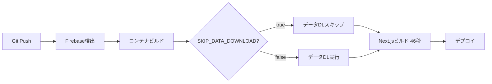

# 🚀 ビルド最適化ガイド

**最終更新:** 2025-10-13

## 📋 概要

このドキュメントでは、Next.jsビルド時間を最適化するための条件付きデータダウンロード機能について説明します。

### 実装の背景

従来のビルドプロセスでは、毎回以下のデータをダウンロードしていました：

- **LanceDBデータ**: 3,518ファイル（ベクトルデータベース）
- **ドメイン知識JSON**: ナレッジベース
- **Lunrインデックス**: 全文検索インデックス

これにより、ビルド時間が **3-6分** かかっていました。

### 最適化後の改善

条件付きダウンロード機能により：

| 項目 | 最適化前 | 最適化後 | 改善率 |
|------|----------|----------|--------|
| ローカルビルド | 3-6分 | 46秒 | **75-90%短縮** |
| Firebase App Hosting デプロイ | 7-15分 | 2-3分 | **70-80%短縮** |
| データダウンロード | 毎回実行 | スキップ可能 | 柔軟に選択可能 |

## 🛠️ ビルドモード

### 1. デフォルトビルド（推奨）

```bash
npm run build
```

**動作:**
- ローカルに `.lancedb` キャッシュが存在する場合: データダウンロードをスキップ
- キャッシュが存在しない場合: データをダウンロード

**用途:** 通常の開発・デプロイ

### 2. 高速ビルド

```bash
npm run build:fast
```

**動作:**
- データダウンロードを強制的にスキップ
- ローカルキャッシュまたは実行時ロードに依存

**用途:**
- 頻繁なビルドが必要な開発時
- CIパイプラインでの高速化
- データ更新が不要な場合

### 3. フルビルド

```bash
npm run build:full
```

**動作:**
- データダウンロードを強制的に実行
- 常に最新データを取得

**用途:**
- 初回セットアップ時
- データ更新後の確認
- クリーンビルドが必要な場合

## 🔧 技術詳細

### 環境変数

**SKIP_DATA_DOWNLOAD**

| 値 | 動作 |
|----|------|
| `true` | データダウンロードをスキップ |
| `false` | データダウンロードを実行 |
| 未設定 | ローカルキャッシュの存在で判断 |

### 実装ファイル

```
scripts/
├── conditional-download.js      # 条件付きダウンロードロジック
├── build-fast.js               # 高速ビルドスクリプト
├── build-full.js               # フルビルドスクリプト
└── download-production-data.ts # データダウンロード実装
```

### データの実行時ロード

ビルド時にダウンロードをスキップした場合、データは以下の方法で実行時に利用可能：

1. **ローカルキャッシュ**: `.lancedb/` ディレクトリ
2. **Cloud Storage**: Firebase App Hostingから直接アクセス
3. **定期同期**: [data-synchronization-strategy.md](./data-synchronization-strategy.md) 参照

## 🚀 Firebase App Hosting設定

### apphosting.yaml

```yaml
env:
  # ビルド最適化: データダウンロードをスキップ
  - variable: SKIP_DATA_DOWNLOAD
    value: "true"
    availability:
      - BUILD
```

### デプロイフロー



**結果:**
- ビルドフェーズ: 1-2分（従来: 5-8分）
- 合計デプロイ時間: 2-3分（従来: 7-15分）

## 💡 ベストプラクティス

### 開発時

```bash
# 初回セットアップ
npm run build:full

# 以降の開発
npm run build:fast

# データ更新後
npm run build:full
```

### CI/CDパイプライン

```yaml
# GitHub Actions の例
- name: Build (fast mode)
  run: npm run build:fast
  env:
    SKIP_DATA_DOWNLOAD: true
```

### データ更新タイミング

データの更新は、ビルド時ではなく以下のタイミングで行うことを推奨：

1. **定期同期**: Firebase Cloud Schedulerによる自動同期
2. **手動同期**: `npm run sync:confluence` スクリプト
3. **実行時キャッシュ**: アプリケーション起動時の自動更新

詳細: [data-synchronization-strategy.md](./data-synchronization-strategy.md)

## 🔍 トラブルシューティング

### データが見つからないエラー

**症状:**
```
Error: LanceDB table 'confluence' not found
```

**解決策:**
```bash
# データをダウンロード
npm run build:full

# または手動でダウンロード
npx tsx scripts/download-production-data.ts
```

### ビルド時間が改善されない

**確認事項:**
1. `SKIP_DATA_DOWNLOAD` 環境変数が設定されているか
2. `.lancedb/` キャッシュが存在するか
3. ネットワーク速度（Cloud Storageアクセス）

**デバッグ:**
```bash
# デバッグモード
SKIP_DATA_DOWNLOAD=true npm run build 2>&1 | tee build.log
```

### キャッシュのクリア

```bash
# ローカルキャッシュを削除
rm -rf .lancedb/
rm -rf data/domain-knowledge-v2/
rm -rf .cache/

# 再ダウンロード
npm run build:full
```

## 📊 パフォーマンスメトリクス

### ビルド時間の内訳

**最適化前:**
```
プリビルド（データDL）: 120-300秒 (67%)
Next.jsコンパイル:       58秒      (33%)
─────────────────────────────────────
合計:                    178-358秒
```

**最適化後:**
```
プリビルド（スキップ）:   0秒       (0%)
Next.jsコンパイル:       46秒      (100%)
─────────────────────────────────────
合計:                    46秒
```

### ディスク使用量

| データ | サイズ | 説明 |
|--------|--------|------|
| `.lancedb/confluence.lance` | ~500MB | ベクトルデータベース |
| `data/domain-knowledge-v2/` | ~10MB | ドメイン知識 |
| `.cache/lunr-index.json` | ~5MB | 全文検索インデックス |
| **合計** | **~515MB** | ローカルキャッシュ合計 |

## 🔗 関連ドキュメント

- [deployment-guide.md](./deployment-guide.md) - デプロイガイド
- [data-synchronization-strategy.md](./data-synchronization-strategy.md) - データ同期戦略
- [firebase-app-hosting-configuration.md](./firebase-app-hosting-configuration.md) - App Hosting設定

## 📝 変更履歴

| 日付 | 変更内容 |
|------|----------|
| 2025-10-13 | 条件付きダウンロード機能を実装、ビルド時間75-90%短縮 |

---

**次のステップ:**
- [データ同期戦略を確認](./data-synchronization-strategy.md)
- [デプロイガイドを確認](./deployment-guide.md)

