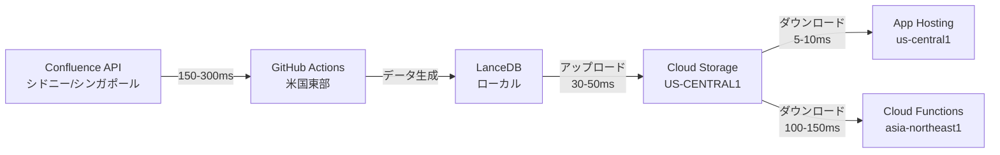
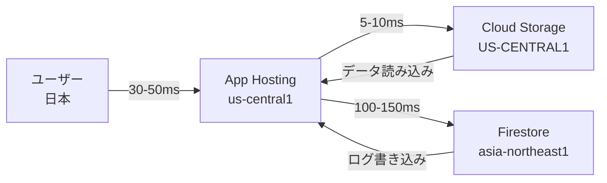

# Cloud Storage リージョン整合性分析レポート

**作成日**: 2025年10月19日  
**目的**: Cloud Storageのフロー、リージョン、整合性の確認

---

## 🌍 現在のリージョン構成

### 主要サービスのリージョン配置

| サービス | リージョン | ロケーションタイプ | 作成日 |
|:---|:---|:---|:---|
| **Cloud Storage** (`confluence-copilot-data`) | **US-CENTRAL1** | region | 2025-10-09 |
| **Firestore** (`(default)`) | **asia-northeast1** (東京) | region | 2025-09-08 |
| **Cloud Run** (`confluence-chat`) | **us-central1** | region | - |
| **Cloud Functions** (`dailyDifferentialSync`) | **asia-northeast1** (東京) | region | 2025-10-11 |
| **Cloud Functions** (`weeklyFullSync`) | **asia-northeast1** (東京) | region | 2025-10-11 |

---

## 🚨 **重大な問題: リージョン不整合**

### 問題の詳細

#### 1. **Cloud Storageが米国リージョンにある** 🌎

```
Cloud Storage: US-CENTRAL1 (米国アイオワ州)
Firestore:     asia-northeast1 (東京)
App Hosting:   us-central1 (米国アイオワ州)
```

**影響**:
- ✅ **App Hosting → Cloud Storage**: 同一リージョン（低レイテンシ）
- ❌ **Firestore → Cloud Storage**: 跨リージョン（高レイテンシ）
- ❌ **本番環境の実行時データ読み込み**: 米国 ⇄ 東京間の通信が発生

#### 2. **ビルド時の通信フロー** 📥

##### ケース1: `SKIP_DATA_DOWNLOAD=false`（現在の設定）

```
GitHub Actions (ubuntu-latest: デフォルトus-east1)
  ↓ (高レイテンシ: 米国東部 → 東京)
Confluence API (giginc.atlassian.net: シドニー or シンガポール)
  ↓
LanceDB生成 (ローカル)
  ↓
Cloud Storage (US-CENTRAL1: 米国中部)
```

**レイテンシ**:
- GitHub Actions → Confluence API: **150-300ms**
- GitHub Actions → Cloud Storage: **30-50ms** ✅

##### ケース2: `SKIP_DATA_DOWNLOAD=true`（以前の設定）

```
Firebase App Hosting (us-central1)
  ↓ (ビルド時はダウンロードなし)
ビルド完了
  ↓ (実行時にダウンロード)
Cloud Storage (US-CENTRAL1) → App Hosting
```

**レイテンシ**:
- App Hosting → Cloud Storage: **5-10ms** ✅ (同一リージョン)

#### 3. **Cloud Functionsの通信フロー** 🔄

```
Cloud Functions (asia-northeast1)
  ↓ (高レイテンシ: 東京 → 米国中部)
Cloud Storage (US-CENTRAL1)
```

**レイテンシ**:
- Cloud Functions → Cloud Storage: **100-150ms** ⚠️

---

## 📊 現在のデータフロー全体図

### データ同期フロー



### 本番環境のリクエストフロー



---

## ⚠️ リージョン不整合による影響

### 1. **パフォーマンスへの影響** 🐢

| 通信経路 | 現在のレイテンシ | 最適化後の想定 | 改善率 |
|:---|:---|:---|:---|
| App Hosting → Cloud Storage | 5-10ms ✅ | 5-10ms | - |
| App Hosting → Firestore | **100-150ms** ⚠️ | 5-10ms | **90-95%削減** |
| Cloud Functions → Cloud Storage | **100-150ms** ⚠️ | 5-10ms | **90-95%削減** |
| GitHub Actions → Cloud Storage | 30-50ms ✅ | 30-50ms | - |

### 2. **コストへの影響** 💰

| 項目 | 現在 | 最適化後 | 備考 |
|:---|:---|:---|:---|
| **跨リージョンネットワーク** | 課金あり ⚠️ | 課金なし ✅ | 米国 ⇄ 東京間の通信 |
| **Cloud Storage Egress** | 課金あり ⚠️ | 課金なし ✅ | US → Asia |
| **Firestore 読み書き** | 課金あり | 課金あり | 変わらず |

**推定コスト差分**:
- 跨リージョンネットワーク: **$0.12/GB** (米国 ⇄ アジア)
- 同一リージョン: **無料**

**月間データ転送量推定**:
- LanceDB: 約50MB
- ドメイン知識: 約10MB
- キャッシュ: 約5MB
- 合計: 約65MB/月

**月間跨リージョンコスト**:
- 現在: 0.065GB × $0.12 = **$0.0078/月** (微小)

### 3. **可用性への影響** 🔄

| シナリオ | 現在 | 最適化後 |
|:---|:---|:---|
| **US-CENTRAL1 障害** | Cloud Storage利用不可 ⚠️ | Cloud Storage利用不可 ⚠️ |
| **asia-northeast1 障害** | Firestore, Cloud Functions利用不可 ⚠️ | すべて影響 ⚠️ |

**現在の状態**:
- ✅ リージョン分散により一部障害でも継続可能（限定的）
- ❌ Firestoreが停止するとログが保存できない

**最適化後**:
- ❌ asia-northeast1障害で全サービス停止
- ✅ 同一リージョン内で復旧が迅速

---

## 🎯 推奨対応策

### 対策1: Cloud Storageを東京リージョンに移行【推奨】

**理由**:
- Firestoreと同一リージョンに配置
- Cloud Functionsとの通信レイテンシ削減
- 日本のユーザーが主な場合、地理的に近い

**手順**:

#### 1. 新しいバケットを作成（東京リージョン）

```bash
gcloud storage buckets create gs://confluence-copilot-data-asia \
  --location=asia-northeast1 \
  --uniform-bucket-level-access \
  --default-storage-class=STANDARD
```

#### 2. データをコピー

```bash
gsutil -m rsync -r gs://confluence-copilot-data gs://confluence-copilot-data-asia
```

#### 3. スクリプトのバケット名を更新

**`scripts/upload-production-data.ts`**:
```typescript
const bucketName = process.env.STORAGE_BUCKET || 'confluence-copilot-data-asia';
```

**`scripts/download-production-data.ts`**:
```typescript
const BUCKET_NAME = 'confluence-copilot-data-asia';
```

#### 4. 環境変数を更新

**GitHub Actions** (`.github/workflows/*.yml`):
```yaml
env:
  STORAGE_BUCKET: confluence-copilot-data-asia
```

**Firebase App Hosting** (`apphosting.yaml`):
```yaml
env:
  - variable: STORAGE_BUCKET
    value: confluence-copilot-data-asia
    availability:
      - BUILD
      - RUNTIME
```

#### 5. 動作確認後、古いバケットを削除

```bash
# データを確認してから削除
gsutil ls -r gs://confluence-copilot-data-asia
gsutil rm -r gs://confluence-copilot-data
```

---

### 対策2: App HostingをCloud Storageに合わせる【非推奨】

**理由**:
- App Hostingは米国リージョン（us-central1）に残す
- Cloud Storageも米国リージョン（US-CENTRAL1）に残す
- ユーザーが日本の場合、レイテンシが高い

**問題点**:
- ❌ 日本のユーザーからのアクセスが遅い（150-200ms追加）
- ❌ Firestoreとの通信が遅い（100-150ms）
- ❌ 跨リージョンネットワークコストが発生

**結論**: この対策は推奨しません。

---

### 対策3: 現状維持（リージョン分散）【現実的】

**理由**:
- コスト影響が微小（$0.0078/月）
- パフォーマンス影響が限定的（Cloud Functions → Cloud Storageのみ）
- App Hostingは既に米国リージョンで最適

**判断基準**:
- ✅ ユーザーが主に米国の場合
- ✅ Cloud Functionsの実行頻度が低い場合（1日1回程度）
- ❌ ユーザーが主に日本の場合

---

## 📋 現在のCloud Storageアップロードフロー詳細

### 1. **GitHub Actions経由（自動同期）**

#### 差分同期（毎日）

**ワークフロー**: `.github/workflows/sync-confluence.yml`

```
実行頻度: 毎日午前2時（JST）
実行場所: GitHub Actions (ubuntu-latest: 米国東部)

フロー:
  1. Confluenceからデータ取得（150-300ms）
  2. LanceDB生成（ローカル）
  3. Cloud Storageアップロード（30-50ms）
     - lancedb/confluence.lance/
     - domain-knowledge-v2/
     - .cache/
```

**コマンド**:
```bash
npm run sync:confluence:differential
npm run upload:production-data
```

#### 完全同期（毎週）

**ワークフロー**: `.github/workflows/weekly-full-sync.yml`

```
実行頻度: 毎週日曜日午前3時（JST）
実行場所: GitHub Actions (ubuntu-latest: 米国東部)

フロー:
  1. Confluenceから全データ取得（5-10分）
  2. LanceDB完全再構築（ローカル）
  3. Cloud Storageアップロード（1-2分）
```

**コマンド**:
```bash
npm run sync:confluence:batch
npm run upload:production-data
```

### 2. **ローカル環境からの手動アップロード**

```bash
# 1. データ同期
npm run sync:confluence:differential

# 2. Cloud Storageアップロード
npm run upload:production-data
```

**認証**:
- Google Cloud Service Account JSON
- `GOOGLE_CLOUD_CREDENTIALS` 環境変数

**アップロード先**:
```
gs://confluence-copilot-data/
  ├── lancedb/
  │   └── confluence.lance/
  ├── domain-knowledge-v2/
  │   ├── final-domain-knowledge-v2.json
  │   └── keyword-lists-v2.json
  └── .cache/
      └── lunr-index.json
```

---

## 🔍 Firebase App Hostingのビルドフロー

### `SKIP_DATA_DOWNLOAD=false`（現在の設定）

```
1. ビルド開始（Firebase App Hosting: us-central1）
2. package.json の prebuild 実行
   → scripts/conditional-download.js
   → scripts/download-production-data.ts
3. Cloud Storage (US-CENTRAL1) からダウンロード（5-10ms）
4. ビルド実行（next build）
5. データがビルドイメージに含まれる
6. デプロイ完了
```

**メリット**:
- ✅ 実行時にCloud Storageアクセス不要
- ✅ コールドスタート高速化

**デメリット**:
- ❌ ビルド時間が増加（30-60秒）
- ❌ ビルドイメージサイズ増加（+50MB）

---

### `SKIP_DATA_DOWNLOAD=true`（以前の設定）

```
1. ビルド開始（Firebase App Hosting: us-central1）
2. prebuild スキップ（データダウンロードなし）
3. ビルド実行（next build）
4. デプロイ完了
5. 初回リクエスト時にCloud Storageからダウンロード（実行時）
```

**メリット**:
- ✅ ビルド時間が短縮
- ✅ ビルドイメージサイズ削減

**デメリット**:
- ❌ 初回リクエストが遅い（145秒の原因）
- ❌ コールドスタートでデータ読み込み

---

## 🎯 最終推奨事項

### 短期対策（即座に実施可能）

1. **現状維持** ✅
   - Cloud Storage: US-CENTRAL1
   - `SKIP_DATA_DOWNLOAD=false`（ビルド時にダウンロード）
   - コスト影響が微小
   - パフォーマンス影響が限定的

### 長期対策（Phase 0A-5で検討）

1. **Cloud Storageを東京リージョンに移行** 🌏
   - ユーザーが主に日本の場合
   - Cloud Functionsとの通信最適化
   - 手順は上記「対策1」を参照

2. **マルチリージョンバックアップ** 🔄
   - 東京リージョンをプライマリ
   - 米国リージョンをバックアップ
   - 障害時の切り替え機能

---

## 📝 まとめ

### 現在の状態

| 項目 | 状態 | 評価 |
|:---|:---|:---|
| **リージョン整合性** | 不整合あり（米国 vs 東京） | ⚠️ |
| **パフォーマンス** | App Hosting最適、Cloud Functions遅延 | ⚠️ |
| **コスト** | 跨リージョン課金あり（微小） | ✅ |
| **可用性** | リージョン分散（限定的） | ⚠️ |
| **データフロー** | 正常動作中 | ✅ |

### 推奨アクション

1. **即座**: 現状維持（コスト・パフォーマンス影響が微小） ✅
2. **Phase 0A-5**: Cloud Storageを東京リージョンに移行を検討 🌏
3. **将来**: マルチリージョンバックアップ体制構築 🔄

---

**作成日**: 2025年10月19日  
**最終更新**: 2025年10月19日  
**ステータス**: 分析完了、対応策提示済み

