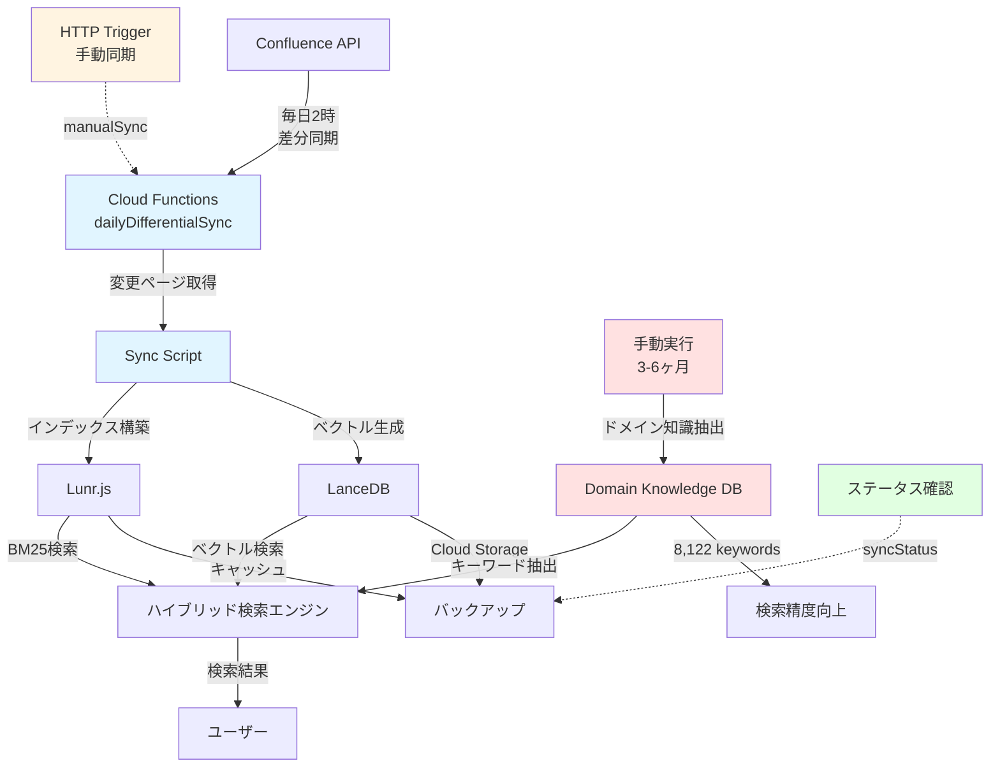
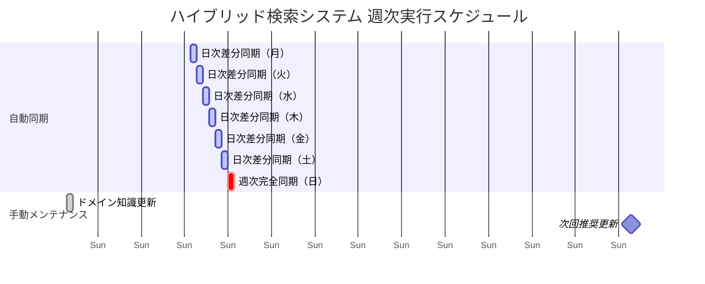
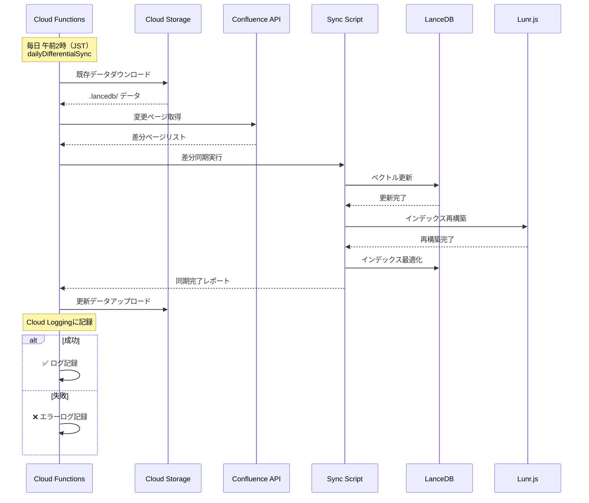

# データ同期戦略と定期実行スケジュール

**最終更新日**: 2025年10月11日  
**バージョン**: 1.1 (Firebase Functions対応)  
**対象システム**: Confluence Vector Search（ハイブリッド検索）

## 概要

このドキュメントでは、ハイブリッド検索システムにおける各データソースの更新戦略、定期実行スケジュール、および運用手順を定義します。

### システム全体のデータフロー



---

## 📊 データソース一覧と更新頻度

### 自動更新されるデータソース

| データソース | 更新頻度 | 自動/手動 | 保存場所 | 備考 |
|-------------|---------|----------|---------|------|
| **Confluenceページデータ** | 毎日 午前2時（JST） | 自動 | `.lancedb/`, Cloud Storage | GitHub Actions自動実行 |
| **LanceDBベクトルDB** | Confluence同期後 | 自動 | `.lancedb/confluence.lance/` | 約2,500チャンク、768次元 |
| **Lunr.js BM25インデックス** | LanceDB更新後 | 自動 | メモリ + ディスクキャッシュ | 日本語トークン化済み |

### 手動更新が必要なデータソース

| データソース | 推奨更新頻度 | 自動/手動 | 保存場所 | 最終更新日 |
|-------------|------------|----------|---------|-----------|
| **ドメイン知識DB** | 3〜6ヶ月に1回 | 手動 | `data/domain-knowledge-v2/` | 2025年9月23日 |
| **LLM抽出知識** | 必要に応じて | 手動 | `data/llm-extraction-v2/` | - |

---

## 🔄 定期実行スケジュール

### 週次スケジュール概要



### Firebase Functions自動同期

#### 日次差分同期
```yaml
関数名: dailyDifferentialSync
スケジュール: 毎日 午前2時（JST）
実行内容: 差分同期（変更されたページのみ）
タイムアウト: 60分（1時間）
メモリ: 2GiB
リージョン: asia-northeast1
実装: functions/src/scheduled-sync.ts
```

**処理フロー**:
1. Cloud Storageから既存データをダウンロード
2. Confluence APIから変更ページを取得
3. 差分同期実行（`npm run sync:confluence:differential`）
4. Lunr.jsインデックス再構築
5. LanceDBベクトルインデックス最適化
6. Cloud Storageへアップロード
7. 同期レポート生成



#### 週次完全同期
```yaml
関数名: weeklyFullSync
スケジュール: 毎週日曜日 午前3時（JST）
実行内容: 完全同期（全ページ再取得）
タイムアウト: 60分（1時間）
メモリ: 4GiB
リージョン: asia-northeast1
実装: functions/src/scheduled-sync.ts
```

**処理フロー**:
1. Confluence APIから全ページを取得
2. 完全同期実行（`npm run sync:confluence:batch`）
3. Lunr.jsインデックス完全再構築
4. LanceDBベクトルインデックス最適化
5. Cloud Storageへアップロード
6. Cloud Loggingに結果を記録

---

## 🛠️ 同期スクリプト詳細

### 1. Confluence同期スクリプト

#### 差分同期（推奨・日常利用）
```bash
npm run sync:confluence:differential
```
- **説明**: 前回同期以降に更新されたページのみを同期
- **実行時間**: 約5〜15分
- **APIコール数**: 最小限
- **使用シーン**: 日次自動同期、開発中の定期更新

#### 完全同期
```bash
npm run sync:confluence:batch
```
- **説明**: 全ページを再取得して完全に再構築
- **実行時間**: 約30〜60分
- **APIコール数**: 大量（約1,000ページ + メタデータ取得）
- **使用シーン**: 週次同期、大規模変更後、データ不整合時

#### 削除スキップ同期
```bash
npm run sync:confluence:no-delete
```
- **説明**: 削除されたページの処理をスキップ
- **使用シーン**: アーカイブページを保持したい場合

#### 差分+削除スキップ
```bash
npm run sync:confluence:diff-no-delete
```
- **説明**: 差分同期 + 削除ページの処理をスキップ
- **使用シーン**: 安全な日次同期

### 2. インデックス再構築スクリプト

同期スクリプト実行後、以下が自動的に実行されます：

```bash
# Lunr.jsインデックス再構築（標準版）
lunrInitializer.initializeAsync()

# Lunr.jsインデックス再構築（最適化版）
optimizedLunrInitializer.initializeOnce()

# LanceDBベクトルインデックス最適化
lancedbClient.getTable() # 自動最適化トリガー
```

### 3. ドメイン知識抽出スクリプト

#### ドメイン知識抽出（v2）
```bash
npm run domain-knowledge-extraction-v2
```
- **説明**: Confluenceページから構造化知識を抽出
- **実行時間**: 約20〜40分（LLM API使用）
- **出力**:
  - `final-domain-knowledge-v2.json`: 8,122個のキーワード
  - `keyword-lists-v2.json`: カテゴリ別キーワードリスト
- **使用シーン**: 
  - 初回セットアップ
  - Confluenceの内容が大幅に変更された場合
  - 3〜6ヶ月ごとの定期更新

#### 完全パイプライン実行
```bash
npm run complete-pipeline
```
- **説明**: Confluence抽出 + LLM知識抽出 + ドメイン知識抽出の完全パイプライン
- **実行時間**: 約60〜90分
- **使用シーン**: システム全体の再構築

### 4. Cloud Storage連携スクリプト

#### データアップロード
```bash
npm run upload:production-data
```
- **説明**: ローカルの`.lancedb/`をCloud Storageにアップロード
- **アップロード先**: `gs://confluence-copilot-data/`

#### データダウンロード
```bash
npm run download:production-data
```
- **説明**: Cloud Storageからローカルにダウンロード
- **使用シーン**: 新環境のセットアップ、ビルド前の事前準備

---

## 📋 推奨される運用戦略

### 日常運用（自動）

```
毎日 午前2時（JST）
├─ Cloud Functions自動トリガー (dailyDifferentialSync)
├─ 差分同期実行
├─ Lunr.jsインデックス再構築
├─ LanceDBインデックス最適化
└─ Cloud Storageへバックアップ
```

**メリット**:
- API使用量が最小限
- 実行時間が短い（5〜15分）
- 自動化されているため運用負荷ゼロ

### 週次メンテナンス（自動）

```
毎週日曜日 午前3時（JST）
├─ Cloud Functions自動トリガー (weeklyFullSync)
├─ 完全同期実行
├─ 全インデックス完全再構築
├─ データ整合性チェック
└─ Cloud Storageへバックアップ
```

**メリット**:
- データの不整合を週次で解消
- 削除ページの適切な処理
- インデックスの完全最適化

### 月次・四半期メンテナンス（手動）

#### ドメイン知識更新（3〜6ヶ月）

```bash
# ステップ1: 最新Confluenceデータで完全同期
npm run sync:confluence:batch

# ステップ2: ドメイン知識を再抽出
npm run domain-knowledge-extraction-v2

# ステップ3: Cloud Storageへアップロード
npm run upload:production-data
```

**実行タイミング**:
- 大規模なConfluence更新後
- 新しいドメイン用語が大量に追加された場合
- 検索精度が低下したと感じた場合
- 前回更新から3〜6ヶ月経過

---

## 🚨 トラブルシューティング

### 同期失敗時の対応

#### Cloud Functionsで同期失敗

1. **ログ確認**: Cloud Loggingでエラーを確認
   ```bash
   # リアルタイムログ確認
   firebase functions:log --only dailyDifferentialSync
   
   # Cloud Consoleでログ確認
   # https://console.cloud.google.com/logs
   ```

2. **確認事項**:
   - Confluence API トークンの有効期限
   - API レート制限（約1,000リクエスト/時間）
   - ネットワーク接続状態
   - Google Cloud Storage の認証情報
   - Firebase Functionsのシークレット設定

3. **リカバリー手順**:
   ```bash
   # オプション1: HTTP手動トリガーで再実行
   curl -X POST \
     -H "Authorization: Bearer YOUR_SYNC_SECRET" \
     -H "Content-Type: application/json" \
     -d '{"syncType": "differential"}' \
     https://asia-northeast1-confluence-copilot-ppjye.cloudfunctions.net/manualSync
   
   # オプション2: ローカルで手動実行
   npm run sync:confluence:differential
   npm run upload:production-data
   ```

4. **ステータス確認**:
   ```bash
   # 同期ステータスをHTTPで確認
   curl https://asia-northeast1-confluence-copilot-ppjye.cloudfunctions.net/syncStatus
   ```

#### Lunr.jsインデックス初期化失敗

**症状**: BM25検索が機能しない、検索結果が不完全

**対応**:
```bash
# キャッシュをクリアして再初期化
rm -rf .cache/lunr-*
npm run sync:confluence:differential
```

#### LanceDBデータ破損

**症状**: ベクトル検索がエラーを返す、データ不整合

**対応**:
```bash
# Cloud Storageから最新データをダウンロード
npm run download:production-data

# または完全再構築
npm run sync:confluence:batch
npm run upload:production-data
```

### 検索精度低下時の対応

#### 症状別診断

| 症状 | 考えられる原因 | 対応 |
|-----|-------------|------|
| 最新ページが検索されない | 同期漏れ | 差分同期実行 |
| 古い情報が表示される | キャッシュ問題 | 完全同期実行 |
| 用語認識が不正確 | ドメイン知識が古い | ドメイン知識再抽出 |
| 検索結果が少ない | インデックス不整合 | Lunr.js再構築 |

#### 段階的リカバリー手順

```bash
# レベル1: 差分同期（5〜15分）
npm run sync:confluence:differential

# レベル2: 完全同期（30〜60分）
npm run sync:confluence:batch

# レベル3: ドメイン知識再抽出（20〜40分）
npm run domain-knowledge-extraction-v2

# レベル4: 完全パイプライン再実行（60〜90分）
npm run complete-pipeline
```

---

## 📈 モニタリングと評価指標

### 同期成功の確認項目

#### Cloud Functions実行後
1. **Cloud Loggingで確認**:
   ```bash
   # 最新のログを確認
   firebase functions:log --only dailyDifferentialSync --limit 10
   ```

2. **HTTP ステータス確認**:
   ```bash
   # 同期ステータスAPI
   curl https://asia-northeast1-confluence-copilot-ppjye.cloudfunctions.net/syncStatus
   
   # レスポンス例:
   # {"status":"ok","lastSync":"2025-10-11T02:00:00Z","size":5242880}
   ```

3. **確認ポイント**:
   - 同期タイプ（differential / full）
   - 処理件数（added, updated, deleted）
   - エラー件数
   - 実行時間

#### ローカル実行後
```bash
# LanceDBのレコード数確認
ls -lh .lancedb/confluence.lance/

# Lunr.jsインデックスステータス確認
# アプリ起動後、ログで以下を確認:
# [LunrInitializer] Lunr index initialized successfully
# [LunrInitializer] Document count: XXXX
```

### パフォーマンス指標

| 指標 | 目標値 | 確認方法 |
|-----|-------|---------|
| **同期実行時間** | 差分: <15分, 完全: <60分 | Cloud Logging / Firebase Console |
| **検索レスポンス** | <2秒 | アプリのパフォーマンスログ |
| **Lunr初期化時間** | <10秒 | サーバー起動ログ |
| **ベクトル検索精度** | 上位5件に関連結果 | 手動検証 |
| **BM25検索カバレッジ** | 全ページインデックス済み | ドキュメントカウント確認 |
| **Functions実行成功率** | >99% | Cloud Monitoring ダッシュボード |

---

## 🔐 セキュリティとアクセス制御

### 必要な認証情報

#### Firebase Functions Secrets（自動同期用）
```bash
# Firebase CLIでシークレットを設定
firebase functions:secrets:set confluence_api_token
firebase functions:secrets:set gemini_api_key
firebase functions:secrets:set sync_secret

# シークレット一覧確認
firebase functions:secrets:list
```

- `confluence_api_token`: Confluence API トークン
- `gemini_api_key`: Google AI (Gemini) API キー
- `sync_secret`: HTTP手動トリガー用認証トークン

詳細は `docs/operations/firebase-scheduled-sync-setup.md` を参照してください。

#### ローカル環境変数
```bash
CONFLUENCE_API_TOKEN=your_token
CONFLUENCE_BASE_URL=https://giginc.atlassian.net
CONFLUENCE_USER_EMAIL=kanri@jukust.jp
CONFLUENCE_SPACE_KEY=CLIENTTOMO
GEMINI_API_KEY=your_gemini_key
GOOGLE_CLOUD_PROJECT=confluence-copilot-ppjye
```

詳細は `docs/operations/required-environment-variables.md` を参照してください。

### Cloud Storage権限

サービスアカウントに必要な権限:
- `storage.objects.create`
- `storage.objects.get`
- `storage.objects.list`
- `storage.buckets.get`

---

## 📚 関連ドキュメント

- [Firebase Functions スケジュール同期セットアップ](./firebase-scheduled-sync-setup.md) - 詳細なセットアップ手順
- [自動データ同期](./automated-data-sync.md) - 自動同期の概要
- [アーキテクチャ図](../architecture/data-flow-diagram-lancedb.md) - システム全体のデータフロー
- [ハイブリッド検索仕様](../architecture/hybrid-search-contract.md) - 検索システムの契約
- [環境変数一覧](./required-environment-variables.md) - 必要な環境変数
- [テスト実行ガイド](../test-execution-guide.md) - テスト方法

---

## 📝 変更履歴

| 日付 | バージョン | 変更内容 |
|-----|----------|---------|
| 2025-10-11 | 1.1 | Firebase Functionsへの移行を反映、GitHub Actionsからの変更 |
| 2025-10-11 | 1.0 | 初版作成：更新戦略と定期実行スケジュールを定義 |

---

## 📞 サポート

問題が発生した場合は、以下を確認してください：

1. **Cloud Logging**: 
   - Firebase Console: https://console.firebase.google.com/project/confluence-copilot-ppjye/functions
   - Cloud Console: https://console.cloud.google.com/logs
   
2. **Firebase Functions ログ**:
   ```bash
   # リアルタイムログ
   firebase functions:log --only dailyDifferentialSync
   
   # 特定期間のログ
   firebase functions:log --since 1h
   ```

3. **同期ステータスAPI**:
   ```bash
   curl https://asia-northeast1-confluence-copilot-ppjye.cloudfunctions.net/syncStatus
   ```

4. **ローカルログ**: `build.log`, `server.log`
5. **このドキュメント**: トラブルシューティングセクション
6. **セットアップガイド**: `docs/operations/firebase-scheduled-sync-setup.md`

それでも解決しない場合は、開発チームにお問い合わせください。

