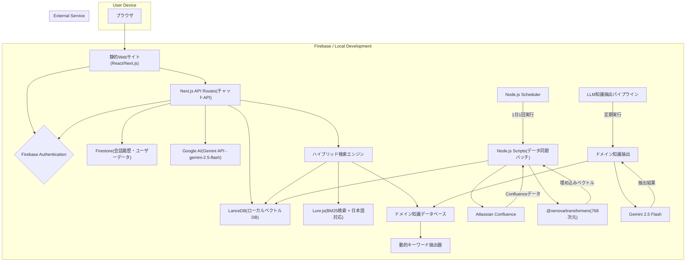

# 1. 概要

## 1.1 プロダクト名

Confluence仕様書要約チャットボット (仮称: Spec-Finder)

## 1.4 更新履歴

**2024年12月**: 現在の実装に合わせて仕様書を最新化
- 埋め込みモデル: paraphrase-multilingual-mpnet-base-v2（768次元）
- LLM: Gemini API (gemini-2.5-flash)
- ハイブリッド検索: ベクトル検索 + BM25検索 + キーワード検索 + 動的関連性スコアリング
- 日本語対応: Kuromojiトークナイザー使用
- AIフレームワーク: 現在は直接API呼び出し（Genkit統合予定）

## 1.2 背景と目的

社内のConfluenceには、多数のプロダクト仕様書が蓄積されているが、情報が分散しており、目的の仕様を探し出すのに時間がかかるという課題がある。また、仕様の全体像を把握したり、複数の仕様書を横断して確認したりすることが困難である。
本プロダクトは、Atlassian APIを通じてConfluence上の仕様書をAIに学習させ、自然言語による対話形式で仕様の検索・要約・深掘りを可能にすることで、開発者やプロダクトマネージャーの情報検索コストを大幅に削減し、開発効率を向上させることを目的とする。

## 1.3 開発環境

**Firebase Studio**
AIによる開発支援、各種Firebaseサービスとのシームレスな統合、ブラウザベースでの環境構築不要といった利点を活かし、迅速なプロトタイピングと開発を実現する。

# 2. 機能要件

## 2.1 ユーザー向け機能

| ID      | 機能名             | 機能概要                                                                                             | 優先度 |
| :------ | :----------------- | :--------------------------------------------------------------------------------------------------- | :----- |
| USR-001 | Googleアカウント認証 | Googleアカウントでログインできる。アクセス制御の基盤となる。                                           | 高     |
| USR-002 | チャットインターフェース | ユーザーが自然言語で質問を入力できるUIを提供する。                                                   | 高     |
| USR-003 | 仕様の検索・要約   | 入力された質問に対し、関連する仕様書を検索し、要約した回答を生成して表示する。                         | 高     |
| USR-004 | 参照元リンク表示   | 回答の生成元となったConfluenceのページURLを明記し、ユーザーが一次情報を確認できるようにする。            | 高     |
| USR-005 | 深掘り質問         | 提示された回答に対して、追加の質問を投げかけることで、会話の文脈を維持したまま詳細な情報を引き出せる。 | 中     |
| USR-006 | 会話履歴の表示     | 過去の質疑応答の履歴を一覧で確認し、特定の会話を呼び出すことができる。                                 | 中     |
| USR-007 | 関連ページ表示     | 検索結果に関連する他のConfluenceページを表示し、関連情報へのアクセスを容易にする。                     | 中     |

## 2.2 システム・管理機能

| ID      | 機能名                 | 機能概要                                                                                             |
| :------ | :--------------------- | :--------------------------------------------------------------------------------------------------- |
| SYS-001 | Confluenceデータ同期   | Atlassian APIを介して、指定されたConfluenceスペースから仕様書データを定期的に取得する。                |
| SYS-002 | ベクトルデータベース更新 | 取得した仕様書データを分割・ベクトル化し、LanceDBに保存・更新する。この処理は1日1回、夜間に自動実行される。 |
| SYS-003 | メタデータ一元管理     | 検索に必要なメタデータ（タイトル、スペースキー、ラベルなど）をLanceDBに統合して管理する。            |
| SYS-004 | ドメイン知識抽出・管理 | Confluence仕様書からLLMを使用してドメイン知識（ドメイン名、機能名、操作名、システム項目、システム用語、関連キーワード）を自動抽出し、検索精度向上を実現する。 |

# 3. 非機能要件

| 項目         | 要件                                                                                             |
| :----------- | :----------------------------------------------------------------------------------------------- |
| パフォーマンス | ユーザーの質問から3秒以内に回答を返すことを目標とする。ハイブリッド検索（ベクトル+キーワード+BM25+タイトル一致）は平均7-23msで完了する。日本語テキスト処理も最適化済み。      |
| セキュリティ | ユーザー認証を行い、許可されたユーザーのみが利用できるようにする。Atlassian APIキーなどの機密情報は適切に管理する。 |
| 可用性       | Firebaseのインフラに準拠し、安定したサービス稼働を目指す。                                         |
| 拡張性       | 最大10,000ページのConfluenceコンテンツに対応できるスケーラビリティを確保する。                    |

# 4. システムアーキテクチャ

Firebase Studioを開発環境とし、各種FirebaseサービスとLanceDBを連携させて構築する。

# 4.1 使用技術スタック

開発環境: Firebase Studio

フロントエンド: React (Next.js)

バックエンド: Next.js API Routes + Node.js Scripts

AIフレームワーク: 現在は直接API呼び出し（Genkit統合予定）

認証: Firebase Authentication

データベース (会話履歴・ユーザーデータ): Firestore

LLM / Embedding:
- LLM: Google AI - Gemini API (gemini-2.5-flash)
- Embedding: @xenova/transformers (Xenova/paraphrase-multilingual-mpnet-base-v2)
  - 768次元のベクトル生成
  - ローカル実行によるコスト削減
  - API依存なしでオフライン動作可能
  - 初回ロード後の高速な処理（8-14ms）
  - 日本語テキスト対応（Kuromojiトークナイザー使用）

ベクトルデータベース: LanceDB (ローカルベクトルDB)
- 高速なローカルベクトル検索
- 検索時間: 平均7-23ms
- メモリ効率: 低消費（100回の検索で約0.5MB増加）
- メタデータ統合管理: 検索結果に必要なメタデータを直接格納

検索エンジン: ハイブリッド検索システム
- ベクトル検索: 意味的類似性に基づく検索
- キーワード検索: LanceDBのLIKE句による部分一致検索
- BM25検索: Lunr.jsによる全文検索（BM25アルゴリズム）
- タイトル厳格一致検索: 完全一致による高精度検索
- スコアリング統合: 複数検索結果の重み付け統合
- ラベルフィルタリング: 議事録、アーカイブ等の除外機能
- 動的関連性スコアリング: クエリに応じた動的な結果ソート

ドメイン知識抽出システム:
- LLM知識抽出: Gemini 2.5 Flashを使用した高精度なドメイン知識抽出
- キーワードカテゴリ: ドメイン名、機能名、操作名、システム項目、システム用語、関連キーワード
- 重複削除機能: ページ内・ページ間の重複キーワードを自動削除
- 動的キーワード抽出: クエリに応じた動的なキーワード優先度調整
- 知識データベース: 8,122個のキーワードを管理（1,067ページから抽出）

自動化: Node.jsスクリプト + cron

外部API: Atlassian API

# 4.2 データフロー

1. **データ取得・処理フロー**
   - Confluenceからページデータを取得
   - HTMLからテキストを抽出
   - テキストをチャンク分割（1000文字程度、100文字オーバーラップ）
   - @xenova/transformersによる埋め込みベクトル生成（768次元、L2正規化）
   - LanceDBにベクトルとメタデータを保存

2. **ハイブリッド検索フロー**
   - ユーザークエリを@xenova/transformersで埋め込みベクトルに変換（768次元、L2正規化）
   - 並列実行による複数検索ソースの組み合わせ：
     - **ベクトル検索**: LanceDBで類似ベクトル検索（意味的類似性）
     - **キーワード検索**: LanceDBのLIKE句によるタイトル・コンテンツ検索
     - **BM25検索**: Lunr.jsによる全文検索（BM25アルゴリズム）
     - **タイトル厳格一致検索**: タイトルがクエリに完全一致する検索
   - 早期ラベルフィルタリング（議事録、アーカイブ等の除外）
   - 動的キーワード抽出（ドメイン知識データベースから関連キーワードを抽出）
   - スコアリング統合（キーワードスコア、ラベルスコア、ハイブリッドスコア）
   - 動的関連性スコアリング（クエリに応じた結果ソート）
   - 重複除去と結果統合
   - 関連ページの特定と表示
   - Gemini APIで回答生成

3. **ユーザーデータフロー**
   - Firebase Authenticationでユーザー認証
   - Firestoreでユーザー情報と会話履歴を管理

4. **ドメイン知識抽出フロー**
   - ConfluenceページデータをLLMに送信
   - Gemini 2.5 Flashでドメイン知識を自動抽出
   - 抽出結果を重複削除・統合
   - ドメイン知識データベースに保存
   - 検索時の動的キーワード抽出に活用