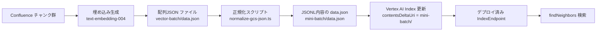

## Vertex AI Vector Search 取り込み・検索が成功した要因まとめ

- **原因の特定**
  - GCS のバッチ入力で、拡張子は `.json` だが「内容は JSONL（1行=1レコード）」が要件。配列JSONを置いていたため取り込みが失敗（invalid records）。
  - バッチルート（contentsDeltaUri）は「ファイルではなくディレクトリ URI（末尾 `/`）」を指定する必要がある。

- **修正ポイント（最重要）**
  - `mini-batch/data.json` の内容を JSONL 形式に正規化（1行= `{ "id": string, "embedding": number[], "restricts"?: [] }`）。
  - JSON のキーは公式の JSON 形式に合わせて `id` / `embedding`（JSONL 内容）を採用。
  - 変換・上書きスクリプトを追加: `src/scripts/normalize-gcs-json.ts`（配列JSON→JSONL、`datapointId`/`featureVector` も許容して正規化）
  - ミニバッチ作成スクリプトを修正: `src/scripts/make-mini-batch.ts`（拡張子は `.json` のまま、内容は JSONL を出力）

- **検証・運用フロー**
  1) 形式チェック（配列JSON向けの検証だが形の確認に使用）
     ```bash
     npx --yes tsx src/scripts/validate-gcs-batch.ts gs://<bucket>/mini-batch/data.json 768
     ```
  2) 正規化（配列JSON→JSONL／キー補正）
     ```bash
     npx --yes tsx src/scripts/normalize-gcs-json.ts gs://<bucket>/mini-batch/data.json
     ```
  3) インデックス更新（バッチルートはディレクトリ指定）
     ```bash
     # 必要に応じて環境変数で INDEX_ID を指定
     $env:VERTEX_AI_INDEX_ID="<INDEX_ID>"
     npx --yes tsx src/scripts/upload-to-vector-search.ts gs://<bucket>/mini-batch/
     ```
  4) 検索疎通（Public Endpoint）
     ```bash
     $env:VERTEX_AI_NUMERIC_PROJECT_ID="<NUMERIC_PROJECT_ID>"
     $env:VERTEX_AI_ENDPOINT_ID="<INDEX_ENDPOINT_ID>"
     $env:VERTEX_AI_DEPLOYED_INDEX_ID="<DEPLOYED_INDEX_ID>"
     $env:VERTEX_AI_PUBLIC_ENDPOINT_DOMAIN="<PUBLIC_DOMAIN>"
     npx --yes tsx src/scripts/test-vector-search-query.ts "クエリ" --filter "space_key=CLIENTTOMO,content_type=confluence_page"
     ```

- **確認結果**
  - インデックスの「密ベクトルの数」が 10 に反映。
  - `findNeighbors` で10件ヒット、Firestore メタデータの取得も正常。
  - フィルタ（`title`, `space_key`, `label`, `content_type`）付き検索も成功。

- **参考ドキュメント（必読）**
  - 入力データの前提条件・構造: [format-structure/prerequisite](https://cloud.google.com/vertex-ai/docs/vector-search/setup/format-structure?hl=ja#prerequisite)
  - データファイル形式（JSON の1行=1レコード要件）: [format-structure/data-file-formats](https://cloud.google.com/vertex-ai/docs/vector-search/setup/format-structure?hl=ja#data-file-formats)
  - インデックスの作成と管理: [create-manage-index](https://cloud.google.com/vertex-ai/docs/vector-search/create-manage-index?hl=ja)

- **再発防止のチェックリスト**
  - [ ] `contentsDeltaUri` はディレクトリ（末尾 `/`）。
  - [ ] ファイル拡張子は `.json`、内容は JSONL（1行=1レコード）。
  - [ ] 各行は `id`（string）と `embedding`（768次元の number[]）。
  - [ ] ベクトルは DOT_PRODUCT 用に L2 正規化して検索送信。
  - [ ] バッチルート直下に 5,000 ファイル以内、`delete/` 以外のサブフォルダは置かない。

---

### 処理フロー図（Mermaid）



### 実行ログ抜粋（取り込み）

```text
Starting batch update with URI: gs://confluence-copilot-ppjye-vector-search/mini-batch/
Import job created successfully
Operation name: projects/122015916118/locations/asia-northeast1/indexes/2764268989252108288/operations/2663148554112991232
Operation completed
Operation succeeded: IndexUpdateMethod=BATCH_UPDATE, dimensions=768, shardsCount=1
```

### 実行ログ抜粋（オペレーション照会）

```json
{
  "name": "projects/122015916118/locations/asia-northeast1/operations/6061114472964030464",
  "metadata": { "genericMetadata": { "state": "DONE" } },
  "done": true,
  "response": { "displayName": "confluence-embeddings-test-1757780609926" }
}
```

### 実行ログ抜粋（検索・フィルタ付き）

```text
Sending request to https://1964...vdb.vertexai.goog/v1beta1/...:findNeighbors
Request restricts: space_key=CLIENTTOMO, content_type=confluence_page
Response status: 200
Found 10 results
Top distance: 0.6845
Example ID: 640450787-0, Title: client-tomonokai-juku Home
```

### 代表的なデータ行（JSON だが中身は JSONL）

```json
{"id":"640450787-0","embedding":[0.1,0.2, ... 768 dims ...],"restricts":[{"namespace":"title","allow_list":["client-tomonokai-juku Home"]},{"namespace":"space_key","allow_list":["CLIENTTOMO"]},{"namespace":"content_type","allow_list":["confluence_page"]}]}
```


